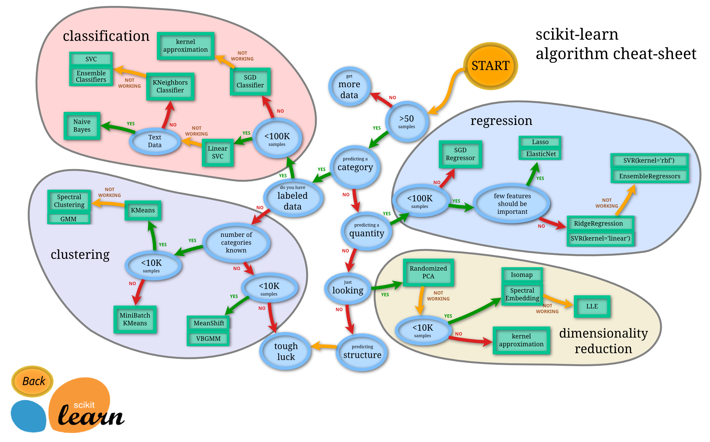

# ADSP

## 회귀분석의 이해

- 과대적합
  - Overfitting
  - 모델이 훈련 데이터에는 굉장히 적합하지만 일반성이 떨어지는 경우
  - 보통 다양성(분산)을 집중 및 존중해서 **일반화시키지 못한 경우**
- 과소적합
  - Underfitting
  - 과대적합의 반대로 모델이 너무 단순해서 데이터를 설명하기 힘든 경우
  - 보통 편향에 집중하여 **일반화의 오류**를 범하고 있는 경우
- 규제
  - 어떤 한도를 정하고 그 한도를 넘지 못하도록 제한하는 것 **가중치를 제약**하는 것
  - 규제의 대상 = 일반적인 선형 회귀에서는 **기울기(가중치)**, 다항회귀에서는 특정 차수


정규화항을 붙이는 회귀분석

- 회귀 계수(Weight)에 대한 제약 조건을 추가해서 모형의 과적합(Overfitting)을 막는 방법
- ==Lasso==
  - 가중치의 절대값의 합을 최소화
  - **L 1**

$$
cost = \sum e_i^2 + \lambda \sum |w_i|
$$


- ==Ridge==
  - 가중치들의 제곱합(squared sum of weights)을 최소화
  - **R 2**

$$
cost = \sum e_i^2 + \lambda \sum w_i^2
$$


- ==Elastic Net==
  - 가중치의 절대갑싀 합과 제곱합을 동시에 제약 조건으로 가지는 모형

$$
cost = \sum e_i^2 + \lambda_1 \sum |w_i| + \lambda \sum w_i^2
$$

| 구분      | 라쏘회귀                                       | 릿지회귀                                                     | 엘라스틱넷                             |
| --------- | ---------------------------------------------- | ------------------------------------------------------------ | -------------------------------------- |
| 설명      | 덜 중요한 특성의 가중치를 완전히 제거하려고 함 | 일반적으로 영향을 거의 미치지 않는 특성에 대하여 0에 가까운 가중치를 주게 됨 | 엘라스틱넷은 릿지와 라쏘를 절충한 모델 |
| 제약 조건 | 가중치의 절대값의 합을 최소화                  | 람다가 크면 정규화 정도가 커지고 가중치 값들이 작아짐 / 람다=0 >> 일반선형회귀 |                                        |
| 변수 선택 | 가능                                           | 불가능                                                       | 가능                                   |
| 장점      | 변수 간 상관관계가 높으면 성능이 떨어짐        | 변수 간 상관관계가 높아도 좋은 성능                          | 변수 간 상관관계를 반영한 정규화       |


## 데이터 마이닝

- 대용량 데이터에서 의미있는 데이터 패턴을 파악하거나 예측을 위해 데이터를 자동으로 분석해 의사결정에 활용하는 방법


- 홀드아웃 (hold-out)
  - 주어진 데이터를 무작위(random)로 학습용 데이터와 테스트 데이터를 구분, 테스트 데이터를 별도 분리하여 사용
  - 주로, 학습용과 시험용으로 분리하여 사용
- 교차확인(cross-validation) (==k-fold)
  - 데이터가 부족할 때
  - 주어진 데이터를 k개 하위 집단으로 구분
  - k-1개의 집단을 학습용, 나머지는 검증용으로 설정하여 학습
  - k번 반복 측정한 결과를 평균함 >> 최종값으로 사용


- 추진 단계
  - 목적 정의 
    - 데이터가 있어야 함. 
    - 10만개 이상이 되는 가
    - 전처리까지만 할건가, 머신러닝까지 할건가 
    - 알고리즘 기법
    - 목적에 따라 사용할 데이터마이닝 모델과 필요한 데이터를 정의
  - 데이터 준비
  - 데이터 가공
  - 데이터마이닝 기법 적용
  - 검증


- 데이터 분할
  - 데이터 양이 충분치 않거나, 사용하는 입력 변수에 대한 설명이 불충분할 경우
  - 훈련용 (Training) - 초기의 데이터마이닝 모델 만드는데 사용
  - 검정용(validation) - 구축된 모델의 과잉 또는 과소맞춤 등에 미세조정 절차 위해 사용
  - 시험용(test) - 데이터마이닝 추진 5단계에서 검증용으로 사용


## 의사결정나무

- 의사결정 규칙을 나무 구조로 나타내어 전체 자료를 몇 개의 소집단으로 분류하거나 예측을 수행하는 분석 방법
- 정지 규칙
  - 어떤 기준을 만족하면 새 가지가 더 이상 나오지 못하게 하는가?
  - 더 이상 분리가 일어나지 않고 현재의 마디가 끝마디가 되도록 하는 여러 가지 규칙으로 최대 나무의 깊이
  - 자식마디의 최소 관측치 수


1. 데이터 삽입
2. 학습(Train) / 실험(test) 데이터 설정
3. 의사결정나무 모형 설정

4. 분류실시

- 가지치기를 이용한 분류 실시 `prune()`

```python
# 분류실시 prune() 함수 이용 가지치기
ptree <- prune(tree_model, cp=0.2)
# prune() : 가지치기 함수
# cp(complexity parameter)
# 가지치기하려는 x 상대오차의 최댓값, 여기서는 0.2로 설정
plot(ptree)
test(ptree) # 라벨 붙이기
```


5. 성과분석

- predict(), confusionMatrix(예측값, 실제값)


party 패키지

- unbiased recursive partitioning based on permutation test(순열, 치환) 사용
- p-value를 이용하여 가지를 만들기 때문에 rpart 패키지 처럼 가지치기를 할 필요가 없음

1. 데이터 삽입
2. Train/Test 데이터 설정
3. 의사결정나무 모형 설정

```python
install.packages('tree')
library(party)
tree_modle2 <- ctree(Species~., data=train)
tree_model2
```

- `ctree(종속변수~기준변수, data=dataset)`  


# 선형대수

- 벡터 = 리스트(list)로 구현

```python
def v_add(u,v):
    '''
    벡터의 덧셈
    입력값 : 더하고자 하는 벡터 u, v
    출력값 : 벡터 u, v의 덧셉 결과 w
    '''
    n = len(u)
    w = []
    
    for i in range(0,n):
        val = u[i] + v[i]
        w.append(val)
    return w
```

- i=0 : val 1+4 >> w=[5]
- i=1 : val 2+5 >> w=[5,7]
- i=2 : val 3+6 >> w=[5,7,9]


행렬

- 덧셈

```python
def add(A,B):
    '''
    행렬의 덧셈
    입력값 : 행렬의 덧셉을 수행할 행렬 A, B
    출력값 : 행렬 A와 행렬 B의 덧셈 결과인 행렬 res
    '''
    
    n = len(A)
    p = len(A[0])
    
    res = []
    for i in range(0, n):
        row = []
        for j in range(0, p):
            val = A[i][j] + B[i][j]
            row.append(val)
        res.append(row)
    return res
```


- 행렬 곱

```python
def matmul(A,B):
    '''
    행렬의 행렬곱
    입력값 : 행렬곱을 수행할 행렬 A, B
    출력값 : 행렬 A와 행렬 B의 행렬곱 결과인 행렬 res
    '''
    
    n = len(A)
    p1 = len(A[0])
    p2 = len(B[0])
    
    res = []
    for i in range(0, n):
        row = []
        for j in range(0, p2):
            val = 0
            for k in range(0, p1):
            	val += A[i][j] * B[i][j]
            row.append(val)
        res.append(row)
    return res
```

```python
A = [[2,7],[3,4],[5,2]]
B = [[3,-3,5],[-1,2,-1]]
matmul(A,B)
```


- 전치 행렬

```python
def matmul(A,B):
    '''
    행렬의 전치행렬
    입력값 : 전치행렬을 구하고자 하는 행렬 A
    출력값 : 행렬 A의 전치행렬 At
    '''
    
    n = len(A)
    p = len(A[0])
    
    At = []
    for i in range(0, n):
        row = []
        for j in range(0, p):
            val = A[j][i]
            row.append(val)
        At.append(row)
    return At
```

```python
import numpy as np
A = np.array([[1,5],[3,4],[6,2]])
At = np.transpose(A)
```

```python
At = A.T
```


- 대각 행렬
  - `AD` >> 열에 영향
  - `DA` >> 행에 영향


- 항등행렬

```python
def identity(n):
    '''
    항등행렬 생성
    입력값 : 항등 행렬의 크기 n
    출력값 : nxn 항등 행렬 I
    '''
    I = []
    for i in range(0,n):
        row = []
        for j in range(0,n):
            if i==j:
                row.append(1)
            else:
                row.append(0)
        I.append(row)
    return I
```

```python
import numpy as np
I = np.identity(5)
```

```python
A = np.array([[1,2,3],[4,5,6],[7,8,9]])
I = np.identity(3)
AI = np.matmul(A,I)
IA = np.matmul(I,A)
```


- 영 행렬

```python
def zero_mat(n,p):
    '''
    영 행렬 생성
    입력값 : 생성하고자 할 영 행렬의 크기  n행, p열
    출력값 : nxp 영 행렬 Z
    '''
    Z = []
    for i in range(0,n):
        tmp_row = []
        for j in range(0,p):
            tmp_row.append(0)
        Z.append(tmp_row)
    return Z
```

```python
Z = np.zeros((3,2))
```


- 삼각 행렬

```python
def up_tri(A):
    '''
    상 삼각 행렬 변환
    입력값 : 상 삼각 행렬로 변환하고자 하는 행렬 A
    출력값 : 행럴 A를 상 삼각 행렬로 변환시킨 행렬 up_tri
    '''
    n = len(A)
    p = len(A[0])
    uptri = []
    
    for i in range(0,n):
        row = []
        for j in rnage(0,p):
            if i>j:
                row.append(0)
            else:
                row.append(A[i][j])
        uptri.append(row)
    return uptri
```

```python
Au = np.triu(A)
```


- 토플리츠 행렬
  - 시계열 분석시 사용 -> LSTM

$$
A = \begin{bmatrix}a & b & c & d & e \\f & a &b & c & d \\ g & f & a & b & c \\ h & g & f & a & b \\ i & h & g & f & a \end{bmatrix} 
$$


- 이중 대각 행렬

  - upper bidiagonal matrix

  $$
  A = \begin{bmatrix}1 & 3 & 0 & 0 \\0 & 2 & 2 & 0 \\ 0 & 0 & 3 & 5 \\ 0 & 0 & 0 & 0 \end{bmatrix}
  $$

  

  - lower bidiagonal matrix


- 하우스홀더 행렬
  - 벡터와 벡터의 연산으로 V.T 뒤에 붙으면 행렬  >> VV^T : 행렬
  - V.T 앞에 붙으면 스칼라 만드는 행렬 >> V^TV : 스칼라

$$
v =  \begin{bmatrix} v_1 \\ v_2 \\  \vdots  \\ v_n\end{bmatrix} \\
H = I - 2 \frac{VV^T}{V^TV}
$$


# 머신러닝

## 머신러닝

- 머신러닝이란?
  - 머신러닝 또능 기계학습은 인공지능의 한 분야로, 컴퓨터가 명시적 프로그래밍 없이 학습할 수 있도록 하는 알고리즘과 기술을 개발하는 분야
  - 머신러닝을 보다 형식화하여 정의하면 "환경(Environment, E)"과의 상호작용을 통해서 축적되는 경험적인 "데이터(Data, D)"를 바탕으로 학습하여, "모델(Model, M)"을 자동으로 구축하고 스스로 "성능(Performance, P)"을 향상시키는 시스템
  - Machine Learning : Data(D)  ---Performance(P) --> Model(M)


- 지도학습
  - 이미 정담을 알고 (레이블이 되어 있는 데이터) 있는 Training Data(학습 데이터)를 이용하여 머신 러닝 모델 학습시키는 방식
  - [X_i(공부시간) 2시간 = Y_i(시험성적) 80점]
  - ex. 시험 성적 예측, 주가 예측(Regression Model), Image Labeling, 스팸 메일 필터링 (Classification Model)
  - 분류된 데이터
  - 직접적인 피드백
  - 예측(추론) 결과 (미래)
- 비지도학습
  - 정답을 모르는 Training 데이터(즉 레이블 되어 있지 않은 데이터)를 이용, 학습하여 데이터에 내재된 유사한 특성, 패턴, 구조 등을 발견, 분석
  - ex. 구글 뉴스 그룹핑, Word clustering (Clustering Model), Security
  - 분류가 안됨(No labels)
  - 피드백 없음
  - 숨겨진 구조 찾기(특징, 패턴, 군집
- 강화학습
  - 주어진 문제의 답이 명확히 떨어지지 않지만, 알고리즘이 수행한 결과에 따라서 보상(Reward)과 손실(Penalty)이 주어져, 이를 통해 보상(Reward)을 최대화 하는 바향으로 진행하는 학습 방법
  - 시행착오(trial and error)적인 방법으로 적합한 행동을 탐색함
  - ex. 자율 주행 차, 게임, Robotics, 제어 전략
  - 의사결정 프로세스
  - 보상제도
  - 행동(Action) 시리즈 배우기


- 이상거래 탐지 시스템(FDS)
  - Anomaly Dtection (Security 분야)
  - 불법이라 단정(오탐 확률 존재)할 수 없으나 인출 패턴(이상 경향)이 이상 한 거래로 인식
  - 오탐(거래 중지)을 줄이고자, Protection 개념으로 보다 자세한 인출단계 요구 
  - 예 : '비밀번호' 외에 추가로 '주민번호' 입력 요


- 피처(Feature), 속성
  - 데이터 세트의 일반 속성
  - ==타겟 값을 제외한 나머지 속성==

- 레이블, 클래스, 타겟(값), 결정(값)
  - 타겟 값 또는 결정 값은 지도 학습 시 데이터의 학습을 위해 주어지는 정답 데이터
  - 지도 학습 중 분류의 경우에는 이 결정 값을 레이블 또는 클래스로 지칭

<br>

<br>

## 사이킷런

[사이킷런](https://scikit-learn.org/stable/)

- 기계학습 알고리즘
  - 지도학습 >> 목표변수 있음
    - 분류 (Y가 이산값)
      - KNN, Random Forest, Support Vector Machine, ANN
    - 추정(예측) (Y가 연속값)
      - Linear Regression, Regression Tree
  - 비지도학습 >> 목표변수 없음
    - 차원 축소 (Dimension Reduction)
      - PCA, MDS
    - 군집화 (Clustering)
      - Hierarchical clustering
    - 연관성 규칙 발견(Association Rule)


- 사이킷런 지도학습 (Supervised Machine Learning)
  - Model  << Training Data, Training Labels
    - `clf = RandomForestClassifier()`
    - `clf.fit(x_train, y_train)`
  - Prediction << Test Data
    - `y_pred = clf.predict(x_test)`
  - Evaluation << Test Labels
    - `clf.score(x_test, y_test)`


- 사이킷런 비지도 학습
  - Model << Traing Data
    - `pca = PCA()`
    - `pca.fit(x_Train)`
  - New View << Test Data
    - `x_new = pca.transform(x_test)`
  - 차원 축소, 클러스터링, 피처 추출
  - `fit()` : 입력 데이터의 형태에 맞춰 데이터를 변환하기 위한 사전 구조를 맞추는 작업
  - `transform()` : 입력 데이터의 차원 변환, 클러스터링, 피처 추출 등의 실제 작업

<br>

<br>

- 사이킷런 algorithm cheat-sheet




사이킷런 주요 모듈

- 예제 데이터
  - `sklearn.datasets`
- 데이터 분리, 검증 & 파라미터 튜닝
  - `sklearn.model_selection`
- 피처 처리
  - `sklearn.preprocessing`
  - `sklearn.feature_selection`
    - 알고리즘에 큰 영향을 미치는 피처를 우선순위 대로 셀렉션 작업 수행
  - `sklearn.feature_extraction`
    - 텍스트 데이터나 이미지 데이터의 벡터화된 피쳐 추출
    - 텍스트 데이터 - Count Vectorizer, tf-idf Vectorizer
    - 텍스트 데이터 피처 추출 :  sklearn.feature_extraction.text
    - 이미지 데이터 피처 추출 : sklearn.feature_extraction.img
- 피처 처리 & 차원 축소
  - `sklearn.decomposition`
    - PCA, NMF, Truncated SVD
- 머신러닝 알고리즘
  - `sklearn.ensemble` : 앙상블 알고리즘
  - `sklearn.linear_model` : 선형 회귀, 릿지, 라쏘 및 로지스틱 회귀
  - `sklearn.naive_bayes` : 나이아베이즈 알고리즘
  - `sklearn.neighbors` : 최근접 이웃 알고리즘 K-NN
  - `sklearn.svm` : 서포트 벡터 머신 알고리즘
  - `sklearn.tree` : 의사 결정 트리 알고리즘
- 평가
  - `sklearn.metrics`
- 유틸리티
  - `sklearn.pipeline`


사이킷런 내장 예제 데이터 셋

- datasets.load_boston() : 회귀 용도, 미국 보스턴의 집 피처들과 가격에 대한 데이터 세트
- datasets.load_breast_cancer() : 분류 용도, 유방암 피처들과 악성/음성 레이블 데이터 세트
- datasets.load_diabetes() : 회귀 용도, 당뇨 데이터 세트
- datasets.load_digits() : 분류 용도, 0에서 9까지 숫자의 이미지 픽셀 데이터 세트
- datasets.load_iris() : 분류 용도, 붓꽃에 대한 피처를 가진 데이터 세트


- `fit()` : 사이킷런 ML 모델 ==학습== ==fit==
- `predict()` : 학습된 모델 ==예측== ==predict==


## 홀드 아웃(Hold Out)

- 데이터를 훈련 데이터와 테스트 데이터로 나눔
- `train_test_split()`
- Train/Test 비율 7:3 8:2 ...

```python
X_train, X_test, y_train, y_test = train_test_split(iris_data.data,
                                                   iris_data.target,
                                                   test_size = 0.3,  # 테스트 세트 크기를 얼마로 샘플링 할 것인가, default = 0.25 (25%)
                                                   #shuffle=True   # default = True, 데이터를 분리하기 전에 데이터를 미리 섞을지 결정
                                                   random_state=42)  # 재현율을 보장받기 위해서는 옵션 설정
```


## 교차 검증(K-Fold Cross Validation)

- 총 데이터 개수가 적은 데이터 셋에 대하여 정확도를 향상시킬 수 있음

1. K-Fold 교차 검증
   - K개의 데이터 폴드 세트를 만들어서 K번만큼 각 폴드 세트에 학습과 검증 평가를 반복적으로 수행하는 방법

2. Stratified K-Fold

   - 불균형(inbalanced) 분포도를 가진 레이블(결정 클래스) 데이터 집합을 위한 K-폴드 방식

   - 원본 데이터의 레이블 분포를 고려한 뒤 이 분포와 동일하게 학습과 검증 데이터 세트에 분배

3. `cross_val_score()` 함수 이용하여 교차검증
   - 폴드 세트 추출, 학습/예측, 평가를 한번에 수행
   - estimator
     - `classifier(분류)` 가 입력되면 `Stratified K 폴드`방식으로 학습/테스트 세트 분할
     - `regressor(회귀)` 가 입력되면 `K 폴드 방식`으로 분할

```python
cross_val_score(estimator, X, y=None, groups=None, scoring=None, cv=None, n_jobs=None,
               verbose=0, fit_params=None, pre_dispatch='2*n_jobs', error_score=nan,)
```

<br>

<br>

## 데이터 분석 실수

과대적합(Overfitting)

- 모델이 훈련 데이터에 너무 잘 맞지만 일반성이 떨어진다는 의미
- 훈련 데이터 이외의 다양한 변수에는 대응하기 힘들어짐
- 해결방법
- 1) 훈련 데이터를 더 많이 모음
  2) 정규화(Regularization) - 규제(제약 조건), 드롭-아웃 등 다양한 방법 이용
  3) 훈련 데이터 잡음을 줄임(오류 수정과 이상치 제거)


과소적합(Underfitting)

- 모델이 너무 단순해서 데이터의 내재된 구조를 학습하지 못함
-  해결방법
- 1. 파라미터가 더 많은 복잡한 모델 선택
  2. 모델의 제약 줄이기 (제약 하이퍼 파라미터 값 줄이기)
  3. 조기종료 시점(overfitting 되기 전 시점)까지 충분히 학습


보간법

[참고](https://iskim3068.tistory.com/35)