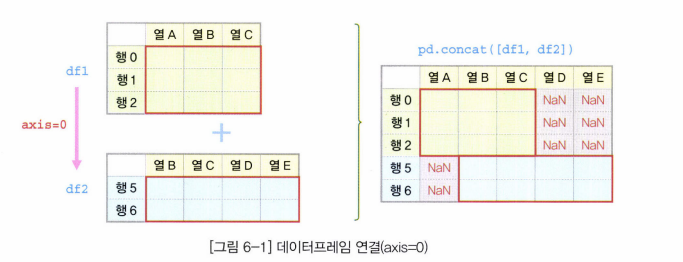
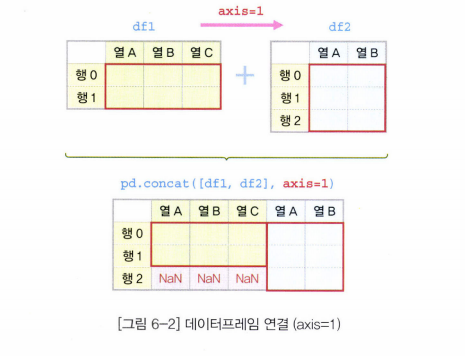

## 5. 데이터 사전 처리

### 6) 시계열 데이터

#### 6-1 다른 자료형을 시계열 객체로 변환

- 문자열을 Timestamp로 변환 :  ==to_datetime==
  - `to_datetime()`
  - 문자열 등 다른 자료형 >> 판다스 Timestamp (datetime64)

```python
df['new_Date'] = pd.to_datetime(df['Date']) # df에 새로운 열로 추가
```


- Timestamp를 Period로 변환 : ==to_period==
  - `to_period()`
  - Timestamp >> Period(일정한 기간을 나타내는 함수)
  - `to_period(freq='')` 
  - freq 옵션 : 기준이 되는 시간 

| freq 옵션 | 설명                    |
| --------- | ----------------------- |
| D         | day (1일)               |
| W         | week(1주)               |
| M         | month end(월말)         |
| Q         | quarter end(분기말)     |
| A         | year end(연말)          |
| B         | business day(휴일 제외) |


```python
pr_day = ts_dates.to_period(freq='D')
```


#### 6-2 시계열 데이터 만들기

- Timestamp 배열 : ==date_range==
  - `date_range()`
  - 여러 개의 날짜(Timestamp)가 들어 있는 배열 형태

```python
pd.date_range('2019-01-01',        # 날짜 범위 시작 지정
              end = None,          # 날짜 범위 끝 지정 (default : None)
              periods=6,           # 생성할 Timestamp 개수
              freq='MS',           # 시간 간격(MS : 월의 시작일)
              tz = 'Asia/Seoul')   # 시간대(timezone)
```

- Period 배열 : ==period_range==
  - `period_range()`
  - 여러 개의 기간(Period)가 들어 있는 시계열 데이터를 만듦

```python
pd.period_range(start = '2019-01-01',   # 날짜 범위 시작
              end = None,               # 날짜 범위 끝 (default : None)
              periods=3,                # 생설할 Period 개수
              freq='M')                 # 기간의 길이(frequency) 'M':월(Month)
```


#### 6-3 시계열 데이터 활용

- 날짜 데이터 분리
  - 연-월-일 날짜 데이터에서 일부를 추출할 수 있다.
  - 연-월-일 정보를 연, 월, 일 각각으로 구분
  - `dt`속성 이용

```python
df['year'] = df['new_date'].dt.year
df['month'] = df['new_date'].dt.month
df['day'] = df['new_date'].dt.day
```

```python
# Timestamp를 Period로 변환하여 연-월-일로 변경하기
df['date_yr'] = df['new_date'].dt.to_period(freq='A')
df['date_m'] = df['new_date'].dt.to_period(freq='M')
```

```python
# 데이터프레임의 행 인덱스로 지정
df.set_index('date_m', inplace=True)
```


- 날짜 인덱스 활용
  - Timestamp로 구성된 열을 행 인덱스로 지정하면 DatetimeIndex라는 고유 속성으로 변환
  - Period로 구성된 열을 행 인덱스로 지정하면 DatetimeIndex라는 고유 속성으로 변환
  - `to_datetime()` 메소드 이용
  - 행 인덱스로 지정 : `set_index()` 메소드

```python
# loc를 이용해 선택적으로 인덱싱
df_y = df['2018']
df_ym = df.loc['2018-07']
df_ymd = df.loc['2018-07-02']
```

```python
# 날짜 범위로 슬라이싱 추출
df['2018-06-20':'2018-06-25']  # 날짜 범위
```

```python
df_ym_cols = df.loc['2018-07', 'Start':'High'] # 열 범위 슬라이싱
```


- 날짜 인덱스 활용 - 두 날짜 사이의 시간 간격
  - Timestamp 객체로 표시된 두 날짜 사이의 시간 간격을 구할 수 있다.
  - 날짜 차이 계산 : **today - df.index**

```python
today = pd.to_datetime('2018-12-25')  # 기준일 생성
df['time_delta'] = today - df.index   # 날짜 차이 계산
df.set_index(df['time_delta'], inplace=True)
df['180 days':'189 days']             # 180~189일 사이의 값들만 선택
```


## 6. 데이터프레임의 다양한 응용

### 1) 함수 매핑

#### 1-1 개별 원소에 함수 매핑

- 시리즈 원소에 함수 매핑 : ==Series객체.apply(매핑 함수)==
  - `apply()`
  - **시리즈 모든 원소**
  - 시리즈 객체에 `apply()`메소드를 적용하면 인자로 전달하는 매핑 함수에 시리즈 모든 원소를 하나씩 입력하고 함수의 리턴값을 돌려받는다.
  - 시리즈 원소의 개수만큼 리턴값을 받아서 같은 크기의 시리즈 객체로 반환

```python
def add_10(n): # 10을 더해주는 함수
    return n+10

df['age'].apply(lambda x : add_10(x))
```


- 데이터프레임의 원소에 함수 매핑 : ==DataFrame 객체.applymap(매핑 함수)==
  - `applymap()`
  - **데이터 프레임의 개별 원소**
  - 매핑 함수에 데이터프레임의 각 원소를 하나씩 넣어서 리턴값으로 돌려받는다.
  - 원소의 원래 위치에 매핑 함수의 리턴값을 입력하여 동일한 형태의 데이터프레임이 만들어진다.

```python
def add_10(n): # 10을 더해주는 함수
    return n+10

df.applymap(add_10)
```


#### 1-2 시리즈 객체에 함수 매핑

- 데이터프레임의 각 열에 함수 매핑 : ==DataFrame 객체.apply(매핑 함수, axis=0)==
  - `apply(axis=0)`
  - **데이터프레임의 각 열**
  - 모든 열을 하나씩 분리하여 매핑 함수의 인자로 각 열(시리즈)이 전달됨
  - 시리즈를 입력받고 시리즈를 반환하는 함수를 매핑하면, 데이터프레임을 반환
  - `isnull()` 메소드 : 시리즈 객체에서 누락 데이터를 찾고 그 결과를 불린 시리즈 형태로 반환

```python
def missing_value(series):
    return series.isnull()  # boolean series 반환

df.apply(missing_value, axis=0)
```


- 데이터프레임의 각 열에 함수 매핑 : ==DataFrame 객체.apply(매핑 함수, axis=0)==
  - 시리즈를 입력받아서 하나의 값을 반환하는 함수를 매핑하면, 시리즈를 반환

```python
def min_max(x):
    return x.max() - x.min()
    
df.apply(min_max)
```


- 데이터프레임의 각 행에 함수 매핑 : ==DataFrame 객체.apply(매핑 함수, axis=1)==
  - `apply(axis=1)`
  - **데이터프레임의 각 행**
  - 데이터프레임의 행 인덱스가 매핑 결과르 반환되는 시리즈의 인덱스가 됨
  - 시리즈의 인덱스에 매칭되는 데이터 값에는 각 행의 데이터를 함수에 적용한 리턴값

```python
def add_tow_obj(a,b):  # 받은 인자 2개를 더해주는 함수
    return a+b

df['add'] = df.apply(lambda x : add_tow_obj(x['age'], x['ten']), axis=1)
```


#### 1-3 데이터프레임 객체에 함수 매핑

- 데이터프레임 객체에 함수 매핑 : ==DataFrame 객체.pipe(매핑 함수)==
  - `pipe()`
  - **데이터프레임 객체**
  - 데이터프레임을 반환하는 경우, 시리즈를 반환하는 경우, 개별 값을 반환하는 경우

```python
def missing_value(series):
    return series.isnull()  # boolean series 반환

# 각 열의 NaN 찾기 - 데이터프레임을 전달하면 데이터프레임 변환
def missing_value(x):
    return x.isnull()

# 각 열의 NaN 개수 반환 - 데이터프레임을 전달하면 시리즈 변환
def missing_count(x):
    return missing_value(x).sum()  # missing_value(x) >> 시리즈

# 데이터프레임의 총 NaN 개수 - 데이터프레임을 전달하면 값 반환
def total_number_missing(x):
    return missing_count(x).sum()
```

```python
# pipe() : df 에 적용됨

df.pipe(missing_value)
# >> 데이터프레임

df.pipe(missing_count)
# >> age     177
#    fare      0
#    dtype: int64

df.pipe(total_number_missing)
# 177
```


### 2) 열 재구성

#### 2-1 열 순서 변경

- 데이터프레임의 열 순서 변경 : ==DataFrame 객체[재구성한 열 이름의 리스트]==
  - 마지막 범위 값 포함

```python
df = titanic.loc[0:4, 'survived':'age']
```


- `list()` : 데이터프레임 열 >> 리스트

```python
df.columns
## index

df.columns.values
## 값들 >> array

list(df.columns.values)
# 리스트
```


- `sorted(columns 변수)` : 열 이름 >> 알파벳 순으로 정렬

```python
columns_sorted = sorted(columns)  # 열 이름을 알파벳 순으로 정렬
df_sorted = df[columns_sorted]
```


- `reversed(columns 변수)` : 기존 순서의 정반대 역순으로 정렬

```python
columns_reversed = list(reversed(columns))  # 정렬된 열 이름의 리스트 이용
df_reversed = df[columns_reversed]
```


- `columns_customed` : 임의의 순서로 열 이름 재배치
  - 임의의 순서로 열 이름을 재배치한 상태로 데이터프레임 df에서 각 열을 순서에 맞춰서 선택

```python
columns_customed = ['pclass', 'sex', 'age', 'survived']
df_customed = df[columns_customed]
```


#### 2-2 열 분리

- `astype()` 메소드 : 자료형 변경
  - '연월일' 열의 시간형 데이터를 문자열로 변경
  - ==df.str.split()==
  - 문자열을 split() 메소드를 분리

```python
df['연월일'] = df['연월일'].astype('str')  # 문자열 메소드 사용을 위해 자료형 변경
df['연월일'].str.split('-')  # 문자열을 split() 메소드로 분리
```


- 시리즈의 문자열 리스트 인덱싱 : ==Series 객체.str.get(인덱스)==
  - `str.get()` 
  - **문자열 리스트의 원소 선택**

```python
df['연'] = dates.str.get(0)
df['월'] = dates.str.get(1)
df['일'] = dates.str.get(2)
```


### 3) 필터링

#### 3-1 불린 인덱싱

- 참/거짓
- 시리즈 객체에 어떤 조건식을 적용하면 각 원소에 대해 참/거짓을 판별하여 불린(참/거짓) 값으로 구성된 시리즈를 반환


- 데이터프레임 불린 인덱싱 : ==DataFrame 객체[불린 시리즈]==

```python
# 나이가 10대(10~19세)만 추출하시오.
condition = (titanic.age >= 10) & (titanic.age < 20)

# 1번째 방법
titanic[condition]
```

```python
# 2번째 방법
titanic.loc[condition, :]
```


```python
# 나이가 10세 미만(0~9세) 또는 60세 이상인 승객의 age, sex, alone 열만 선택

condition = (titanic.age < 10) | (titanic.age >= 60)
titanic.loc[condition, ['age','sex','alone']]
```


#### 3-2 isin() 메소드 활용

- isin() 메소드를 활용한 필터링 : ==DataFrame의 열 객체.isin(추출 값의 리스트)==
  - `isin()` : 특정 값을 가진 행들을 따로 추출 가능 
  - **T/F 반환**

```python
# 함께 탑승한 형제 또는 배우자 수가 3, 4, 5 인 승객만 따로 추출하시오
mask_3 = titanic['sibsp'] == 3
mask_4 = titanic['sibsp'] == 4
mask_5 = titanic['sibsp'] == 5
condition = (mask_3) | (mask_4) | (mask_5)
titanic[condition]
```

```python
condition = titanic['sibsp'].isin([3,4,5])
titanic[condition]
```


### 4) 데이터프레임 합치기

#### 4-1 데이터프레임 연결

- 데이터프레임 연결 : ==Pandas.concat(데이터프레임의 리스트)==
  - `concat()` 
  - 이어 붙이듯 연결
  - 데이터프레임을 원소로 갖는 리스트를 전달하면 여러 개의 데이터프레임을 서로 연결
  - default : **axis=0** (행 방향으로 연결)
    - `axis=1` :  열 방향으로 연결
  - default : **join = 'outer'** (합집합)
    - `join = inner` : 교집합
  - `ignore_index = True` : 기존 행 인덱스를 무시하고 새로운 행 인덱스 설정







```python
pd.concat([df1,df2], axis=1, join='inner')
```

|      | a    | b    | c    | a    | b    | c    | d    |
| ---- | ---- | ---- | ---- | ---- | ---- | ---- | ---- |
| 2    | a2   | b2   | c2   | a2   | b2   | c2   | d2   |
| 3    | a3   | b3   | c3   | a3   | b3   | c3   | d3   |


#### 4-2 데이터프레임 병합

- 데이터프레임 병합 : ==Pandas.merge( df_left, df_right, how='inner', on=None)==
  - `merge()`
  - 어떤 기준에 의해 두 데이터프레임 병합
  - SQL join 명령과 비슷
  - 기준이 되는 열이나 인덱스를 키(key) - 양쪽 데이터프레임에 모두 존재해야 함
  - default : **on=None**  (공통으로 속하는 모든 열을 기준(key)으로 병합)
    - `on='id'` : 공통 열 중 'id' 열을 키로 병합
  - default : **how='inner'**  (교집합일 경우에만 추출)
    - `how='outer'` : 기준 데이터가 데이터프레임 중 어느 한쪽에만 속하더라도 포함
    - `how='left'` : 왼쪽 데이터프레임의 키 열에 속하는 데이터 값을 기준으로 병합
      - `left_on`, `right_on` 옵션으로 좌우 데이터프레임에 각각 다르게 키를 지정 가능
    - 어느 한 쪽이라도 데이터가 없는 열에는 NaN값

```python
pd.merge(df1, df2, how='left', left_on='stock_name', right_on = 'name')
```


#### 4-3 데이터프레임 결합

- 행 인덱스 기준으로 결합 : ==DataFrame1.join(DataFrame2, how='left')==
  - 두 데이터프레임의 행 인덱스를 기준으로 결합
  - `on=keys`옵션을 설정하면 행 인덱스 대신 다른 열을 기준으로 결합
  - `index_col`옵션을 적용하여 행 인덱스 설정 가능
  - default : **how='left'** (왼쪽 df의 행 인덱스를 기준으로 결합)
    - `how='inner'` : 두 데이터프레임에 공통으로 존재하는 행 인덱스 기준으로 추출

```python
df1.join(df2, how='inner')
```


### 5) 그룹 연산

- 1단계) 분할(split) : 데이터를 특정 조건에 의해 분할
- 2단계) 적용(apply) : 데이터 집계, 변환, 필터링하는데 필요한 메소드 적용
- 3단계) 결합(combine) : 2단계의 처리 결과를 하나로 결합


#### 5-1 그룹 객체 만들기(분할 단계)

- 그룹 연산(분할) : ==DataFrame 객체.groupby(기준이 되는 열)==
  - 데이터프레임의 특정 열을 기준으로 데이터프레임을 분할하여 그룹 객체를 반환
  - `get_group()` 메소드를 적용하면 특정 그룹만을 선택할 수 있다.

```python
df = titanic.loc[:,['age','sex','class','fare','survived']]
grouped = df.groupby(['class'])
```

```python
grouped.get_group('Third')  # 특정 그룹만 선택
```

```python
grouped.mean() # mean() : 평균
grouped.std()  # std() : 표준편차
```


- 그룹 연산(분할) : ==DataFrame 객체.groupby(기준이 되는 열의 리스트)==
  - 여러 개의 기준 값을 사용
  - 반환되는 그룹 객체의 인덱스는 다중 구조를 갖음

```python
grouped_two = df.groupby(['class','sex'])
grouped_two.get_group(('Third','female'))  # 특정 그룹만 선택
grouped_two.mean() # >> 멀티 인덱스
```


#### 5-2 그룹 연산 메소드(적용 - 결합 단계)

- 표준편차 데이터 집계(내장 함수) : ==group 객체.std()==
  - 데이터 집계 (aggreagation)
  - mean(), max(), min(), sum(), count(), size(), var(), std(), describe(), info(), first(), last()


- agg() 메소드 데이터 집계 : ==group 객체.agg(매핑 함수)==

```python
def min_max(x):
    return x.max() - x.min()

grouped.agg(min_max)
```


- 모든 열에 여러 함수 매핑 : ==group 객체.agg([함수1, 함수2, 함수3, ... ])==

```python
grouped.agg(['min','max'])
# sex는 범주형 데이터라 min_max 안됨
```


- 각 열마다 다른 함수를 매핑 : ==group 객체.agg({'열1' : 함수1, '열2' : 함수2, ...})==

```python
grouped.agg({'fare':['min','max'],
            'age':'mean'})
```


- 데이터 변환 연산 : ==group 객체.transform(매핑 함수)==
  - `transform()`
  - 그룹 별로 구분하여 각 원소에 함수를 적용하지만 그룹별 집계 대신 각 원소의 본래 행 인덱스와 열 이름을 기준으로 연산 결과를 반환
  - 그룹 연산의 결과를 원본 데이터프레임과 같은 형태로 변형하여 정리

```python
# 그룹 객체의 age 열을 iteration으로 z-score를 계산하여 출력
for key, group in grouped.age:
    group_zscore = (group - grouped.age.mean().loc[key]) / grouped.age.std().loc[key]
```


```python
# z-score 계산하는 사용자 함수 정의
def z_score(x):
    return (x-x.mean()) / x.std()

age_zscore = grouped.age.transform(z_score)
```

`z-score` 계산하는 사용자 함수 정의, `transform()` 메소드의 인자로 전달


- 그룹 객체 필터링 : ==group 객체.filter(조건식 함수)==
  - `filter()`
  - 조건이 참인 그룹의 데이터만 추출

```python
# 데이터 개수가 200개 이상인 것만 추출
grouped_filter = grouped.filter(lambda x : len(x) >= 200)
```


- 범용 메소드 : ==group 객체.apply(매핑 함수)==
  - `apply()` (메소드)
  - 판다스 객체의 개별 원소를 특정 함수에 일대일로 매핑
  - 사용자가 원하는 대부분의 연산을 그룹 객체에도 적용할 수 있음
  - default : **axis=0**

```python
age_grouped = grouped.apply(lambda x: x.describe())
```


```python
# z-score 계산을 apply()로 해볼까요?

def z_score(x):
    return (x-x.mean()) / x.std()

age_zscore = grouped.age.apply(z_score)  # default : axis=0
```


```python
# 필터링 : age 열의 데이터 평균이 30보다 작은 그룹만을 필터링하여 출력

age_filter = grouped.apply(lambda x: x.age.mean() < 30)

for x in age_filter.index:
    if age_filter[x] == True:
        print(grouped.get_group(x))
        print('\n')
```

