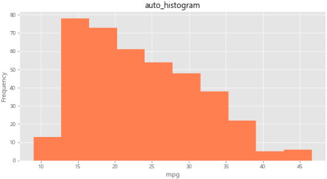

# 4. 시각화 도구

## 1) Matplotlib - 기본 그래프 도구

### 1-1 선 그래프

- 기본 사용법
  - `matplotlib.pyplot as plt`
  - `df.fillna(method='ffill')`
    - 누락 데이터가 들어 있는 행의 바로 앞에 위치한 행의 데이터 값으로 채움
  - `plt.plot(x축, y축)`
  - `plt.plot(시리즈 or 데이터프레임 객체)`

```python
df = df.fillna(method='ffill')
# 서울에서 다른 지역으로 이동한 데이터만 추출 
condition = (df['전출지별'] == '서울특별시') & (df['전입지별'] != '서울특별시')
df_seoul = df[condition]
df_seoul.drop(['전출지별'], axis=1)
df_seoul.rename({'전입지별':'전입지'}, axis=1, inplace=True)
df_seoul.set_index('전입지', inplace=True)
```

<br>

- 차트 제목, 축 이름 추가
  - `plt.title()` : 차트 제목 추가
  - `plt.xlabel()` : x축 이름
  - `plt.ylabel()` : y축 이름

<br>

<br>

#### Matplotlib 한글 폰트 오류 해결

```python
# matplotlib 한글 폰트 오류 문제 해결
from matplotlib import font_manager, rc
font_path = "C:\Windows\\Fonts\\malgun.ttf"   #폰트파일의 위치
font_name = font_manager.FontProperties(fname=font_path).get_name()
rc('font', family=font_name)
```

<br>

<br>

#### 그래프 꾸미기

- `plt.figure(figsize=(가로,세로))` : 그림틀 사이즈
- `plt.xticks()` : x축 눈금 라벨을 반시계 방향으로 회전
  - `plt.xticks(rotation='vertical')`: 반시계방향으로 90도 회전
- `plt.style.use('ggplot')` : ggplot 스타일 서식 지정
  - `plt.style.available` >> 스타일 리스트
- `plt.plot(marker='o', markersize=10)` : 원 모양의 점 마커로 표시, 마커 사이즈

```python
plt.figure(figsize=(10,6))
plt.plot(sr_one.index, sr_one.values, marker='o', markersize=10)  # 마커 표시 # 마커 사이즈
plt.title('서울 >> 경기 인구 이동')   # 차트제목
plt.xlabel('기간')
plt.ylabel('이동 인구수')
plt.legend(labels=['서울 >> 경기'], loc='best', fontsize=15)
plt.xticks(rotation = 90)
plt.show()
```

<br>

- `annotate()` : 그래프에 대한 설명을 덧붙이는 주석
  - `arrowprops` 옵션 : 화살표 표시

```python
plt.figure(figsize=(10,6))
plt.plot(sr_one.index, sr_one.values, marker='o', markersize=10)
plt.title('서울 >> 경기 인구 이동')# 제목
plt.xlabel('기간')
plt.ylabel('이동 인구수')
plt.legend(labels=['서울 >> 경기'], loc='best', fontsize=15)
plt.xticks(rotation = 90)

# 주석 남기기
# y축 범위 지정 (최소값, 최대값)
plt.ylim(50000, 800000)

# 주석 표시 - 화살표
plt.annotate('',
             xy=(20, 620000),       #화살표의 머리 부분(끝점)
             xytext=(2, 290000),    #화살표의 꼬리 부분(시작점)
             xycoords='data',       #좌표체계
             arrowprops=dict(arrowstyle='->', color='skyblue', lw=5), #화살표 서식
             )

plt.annotate('',
             xy=(47, 450000),       #화살표의 머리 부분(끝점)
             xytext=(30, 580000),   #화살표의 꼬리 부분(시작점)
             xycoords='data',       #좌표체계
             arrowprops=dict(arrowstyle='->', color='olive', lw=5),  #화살표 서식
             )

# 주석 표시 - 텍스트
plt.annotate('인구이동 증가(1970-1995)',  #텍스트 입력
             xy=(10, 550000),            #텍스트 위치 기준점
             rotation=25,                #텍스트 회전각도
             va='baseline',              #텍스트 상하 정렬
             ha='center',                #텍스트 좌우 정렬
             fontsize=15,                #텍스트 크기
             )

plt.annotate('인구이동 감소(1995-2017)',  #텍스트 입력
             xy=(40, 560000),            #텍스트 위치 기준점
             rotation=-11,               #텍스트 회전각도
             va='baseline',              #텍스트 상하 정렬
             ha='center',                #텍스트 좌우 정렬
             fontsize=15,                #텍스트 크기
             )

plt.show()
```


<br>

<br>

#### 화면 분할하여 그래프 여러 개 그리기 - ==axe 객체 활용==

- `fig.add_subplot()` 메소드 : 그림틀 여러 개로 분할 >> 각 부분을 `axe` 객체라 부름
  - fig.add_subplot(2,1,1) : 2행 1열 1번째 부분

```python
sr_one = df_seoul.loc['경기도'][1:]

# 스타일 서식 
plt.style.use('ggplot') 

# 그래프 객체 생성(2개의 sub plot 생성) 
fig = plt.figure(figsize=(10,10)) 
ax1 = fig.add_subplot(2,1,1)
ax2 = fig.add_subplot(2,1,2)

# axe 객체에 plot 함수로 그래프 출력 
ax1.plot(sr_one, marker='o', markersize=10)
ax2.plot(sr_one, marker='o', markerfacecolor='green', markersize=10, 
        color='olive', linewidth=2, label='서울 >> 경기')
ax2.legend(loc='best')

# y축 범위 지정 
ax1.set_ylim(50000, 800000)
ax2.set_ylim(50000, 800000)

# 축 눈금 라벨 지정
ax1.set_xticklabels(sr_one.index, rotation=75)
ax2.set_xticklabels(sr_one.index, rotation=75)

plt.show()
```

<br>

- 선 그래프 꾸미기 옵션

| 꾸미기 옵션             | 설명                                |
| ----------------------- | ----------------------------------- |
| 'o'                     | 선 그래프가 아니라 점 그래프로 표현 |
| marker='o'              | 마커 모양(예 : 'o', '+', '*', '.')  |
| markerfacecolor='green' | 마커 배경색                         |
| markersize=10           | 마커 크기                           |
| color='olive'           | 선의 색                             |
| linewidth=2             | 선의 두께                           |
| label='서울 -> 경기'    | 라벨 지정                           |

<br>

<br>

#### 동일한 그림(axe 객체)에 여러 개의 그래프 추가

```python
# 전출지별에서 누락값(NaN)을 앞 데이터로 채움 (엑셀 양식 병합 부분)
df = df.fillna(method='ffill')

# 서울에서 다른 지역으로 이동한 데이터만 추출하여 정리
condition = (df['전출지별'] == '서울특별시') & (df['전입지별'] != '서울특별시') 
df_seoul = df[condition]
df_seoul = df_seoul.drop(['전출지별'], axis=1)
df_seoul.rename({'전입지별':'전입지'}, axis=1, inplace=True)
df_seoul.set_index('전입지', inplace=True)

# 서울에서 '충청남도','경상북도', '강원도'로 이동한 인구 데이터 값만 선택
col_years = list(map(str, range(1970, 2018)))
df_3 = df_seoul.loc[['충청남도','경상북도', '강원도'], col_years]

# 스타일 서식 지정
plt.style.use('ggplot') 

# 그래프 객체 생성 (figure에 1개의 서브 플롯을 생성)

# plt.figure(figsize=(20, 5)) 

fig = plt.figure(figsize=(20, 5))   
ax = fig.add_subplot(1, 1, 1)

# axe 객체에 plot 함수로 그래프 출력
ax.plot(col_years, df_3.loc['충청남도',:], marker='o', markerfacecolor='green', 
        markersize=10, color='olive', linewidth=2, label='서울 -> 충남')
ax.plot(col_years, df_3.loc['경상북도',:], marker='o', markerfacecolor='blue', 
        markersize=10, color='skyblue', linewidth=2, label='서울 -> 경북')
ax.plot(col_years, df_3.loc['강원도',:], marker='o', markerfacecolor='red', 
        markersize=10, color='magenta', linewidth=2, label='서울 -> 강원')

# 범례 표시
ax.legend(loc='best')

# 차트 제목 추가
ax.set_title('서울 -> 충남, 경북, 강원 인구 이동', size=20)

# 축이름 추가
ax.set_xlabel('기간', size=12)
ax.set_ylabel('이동 인구수', size = 12)

# 축 눈금 라벨 지정 및 90도 회전
ax.set_xticklabels(col_years, rotation=90)

# 축 눈금 라벨 크기
ax.tick_params(axis="x", labelsize=10)
ax.tick_params(axis="y", labelsize=10)

plt.show()  # 변경사항 저장하고 그래프 출력
```

<br>

<br>

#### 화면 4분할 그래프

```python
# 전출지별에서 누락값(NaN)을 앞 데이터로 채움 (엑셀 양식 병합 부분)
df = df.fillna(method='ffill')

# 서울에서 다른 지역으로 이동한 데이터만 추출하여 정리
condition = (df['전출지별'] == '서울특별시') & (df['전입지별'] != '서울특별시') 
df_seoul = df[condition]
df_seoul = df_seoul.drop(['전출지별'], axis=1)
df_seoul.rename({'전입지별':'전입지'}, axis=1, inplace=True)
df_seoul.set_index('전입지', inplace=True)

# 서울에서 '충청남도','경상북도', '강원도'로 이동한 인구 데이터 값만 선택
col_years = list(map(str, range(1970, 2018)))
df_4 = df_seoul.loc[['제주특별자치도','충청남도','경상북도', '강원도'], col_years]

# 스타일 서식 지정
plt.style.use('ggplot') 

# 그래프 객체 생성 (figure에 1개의 서브 플롯을 생성)
fig = plt.figure(figsize=(20, 10))   

ax1 = fig.add_subplot(2, 2, 1)
ax2 = fig.add_subplot(2, 2, 2)
ax3 = fig.add_subplot(2, 2, 3)
ax4 = fig.add_subplot(2, 2, 4)

# axe 객체에 plot 함수로 그래프 출력
ax1.plot(col_years, df_4.loc['제주특별자치도',:], marker='o', markerfacecolor='orange', 
        markersize=10, color='olive', linewidth=2, label='서울 -> 제주')
ax2.plot(col_years, df_4.loc['충청남도',:], marker='o', markerfacecolor='green', 
        markersize=10, color='olive', linewidth=2, label='서울 -> 충남')
ax3.plot(col_years, df_4.loc['경상북도',:], marker='o', markerfacecolor='blue', 
        markersize=10, color='skyblue', linewidth=2, label='서울 -> 경북')
ax4.plot(col_years, df_4.loc['강원도',:], marker='o', markerfacecolor='red', 
        markersize=10, color='magenta', linewidth=2, label='서울 -> 강원')

# 범례 표시
ax1.legend(loc='best')
ax2.legend(loc='best')
ax3.legend(loc='best')
ax4.legend(loc='best')

# 차트 제목 추가
ax1.set_title('서울 -> 제주특별자치도 인구 이동', size=15)
ax2.set_title('서울 -> 충남 인구 이동', size=15)
ax3.set_title('서울 -> 경북 인구 이동', size=15)
ax4.set_title('서울 -> 강원 인구 이동', size=15)

# 축이름 추가
ax.set_xlabel('기간', size=12)
ax.set_ylabel('이동 인구수', size = 12)

# 축 눈금 라벨 지정 및 90도 회전
ax1.set_xticklabels(col_years, rotation=90)
ax2.set_xticklabels(col_years, rotation=90)
ax3.set_xticklabels(col_years, rotation=90)
ax4.set_xticklabels(col_years, rotation=90)

# 축 눈금 라벨 크기
ax.tick_params(axis="x", labelsize=10)
ax.tick_params(axis="y", labelsize=10)

plt.show()  # 변경사항 저장하고 그래프 출력
```

<br>

- Matplotlib에서 사용할 수 있는 색의 종류

```python
colors={}
for name, hex in matplotlib.colors.cnames.items():
    colors[name] = hex
colors
```

<br>

<br>

<br>

### 1-2 면적 그래프

- `plot(kind='area')` : 면적 그래프(area plot)
  - `alpha` : 투명도 (0~1 범위)
  - `stacked=True` : 그래프를 누적할지 여부
    - `stacked=False` : 누적되지 않고 서로 겹치도록 표시됨

```python
# 서울에서 '충청남도','경상북도', '강원도'로 이동한 인구 데이터 값만 선택
col_years = list(map(str, range(1970, 2018)))
df_4 = df_seoul.loc[['제주특별자치도','충청남도','경상북도', '강원도'], col_years]
tdf_4 = df_4.T

# 데이터프레임의 인덱스를 정수형으로 변경(x축 눈금 라벨 표시)
tdf_4.index = tdf_4.index.map(int)

# 면적 그래프 그리기
tdf_4.plot(kind='area', stacked=True, alpha=0.2, figsize=(20, 10))

plt.title('서울 -> 타시도 인구 이동', size=30, color='brown', weight='bold')
plt.ylabel('이동 인구 수', size=20, color='blue')
plt.xlabel('기간', size=20, color='blue')
plt.legend(loc='best', fontsize=20)

plt.show()

# stacked=True 
# 선 그래프가 서로 겹치지 않고 위 아래로 데이터가 누적(stacked)되는 면적 그래프 
# stacked=False (반대임)
```

- stacked=True (그래프 누적)


- Stacked=False (그래프 겹침)


<br>

<br>

### 1-3 막대 그래프

- `plot(kind='bar')` : 막대 그래프 (bar plot)
  - 세로형 막대 그래프 : 시간적으로 차이가 나는 두 점에서 데이터 값 차이를 잘 설명함
  - 시계열 데이터 표현하는 데 적합
  - `color` : 막대 색상을 다르게 설정

```python
tdf_4.plot(kind='bar', figsize=(20,10), width=0.7,
         color=['orange','green','skyblue','yellow'])

plt.ylabel('이동 인구 수', size=20)
plt.xlabel('기간', size=20)
plt.ylim(5000, 30000)
plt.legend(loc='best', fontsize=15)

plt.show()
```


<br>

- 가로형 막대 그래프 : 각 변수 사이 값의 크기 차이를 설명하는 데 적합
  - `plot(kind='barh')`

```python
# 인구 수 합계하여 새로운 열로 추가
df_4['합계'] = df_4.sum(axis=1)

# 가장 큰 값부터 정렬
df_total = df_4[['합계']].sort_values(by='합계', ascending=True) 
# ascending=True 오름차순
# ascending=False 내림차순

# 스타일 서식 지정
plt.style.use('ggplot')

# 수평 막대 그래프 그리기
df_total.plot(kind='barh', color='cornflowerblue', width=0.5, figsize=(10,5))
plt.title('서울 -> 타시도 인구 이동')
plt.ylabel('전입지')
plt.xlabel('이동 인구 수')

plt.show()

```


<br>

- 2축 그래프 그리기
  - `shift()` : 데이터를 1행씩 뒤로 이동
  - `ax.twinx()` : ax 객체의 쌍둥이 객체를 만들고, 쌍둥이 객체를 ax2에 저장
  - `ls='--'` : 선 스타일(line style) 점선으로 설정하는 명령

```python
# 증감률(변동률) 계산
df = df.rename(columns={'합계':'총발전량'})
df['총발전량 - 1년'] = df['총발전량'].shift(1)
df['증감율'] = ((df['총발전량'] / df['총발전량 - 1년']) - 1) * 100 
```


```python
# 2축 그래프 그리기
ax1 = df[['수력','화력']].plot(kind='bar', figsize=(20, 10), width=0.7, stacked=True)  
# 수력, 화력 bar graph

ax2 = ax1.twinx()  # ax2 : 증감율 그래프 
ax2.plot(df.index, df.증감율, ls='--', marker='o', markersize=20, 
         color='green', label='전년대비 증감율(%)')  

ax1.set_ylim(0, 500)
ax2.set_ylim(-50, 50)

ax1.set_xlabel('연도', size=20)
ax1.set_ylabel('발전량(억 KWh)')

ax2.set_ylabel('전년 대비 증감율(%)')

plt.title('북한 전력 발전량 (1990 ~ 2016)', size=30)
ax1.legend(loc='best')

plt.show()
```


<br>

<br>

### 1-4 히스토그램

- `plot(kind='hist')` : 히스토그램(histogram)
  - `plot(kind='hist', bins=10)` : 10개 구간으로 나눔
  - x축을 같은 크기의 여러 구간으로 나누고 각 구간에 속하는 데이터 값의 개수(빈도)를 y축에 표시

```python
df['mpg'].plot(kind='hist', bins=10, color='coral', figsize=(10,5))
plt.title('auto_histogram')
plt.xlabel('mpg')
plt.show()
```



<br>

<br>

### 1-5 산점도

- `plot(kind='scatter')` : 산점도(scatter plot)

  - 서로 다른 두 변수 사이의 관계를 나타냄

  - 각 변수는 연속되는 값

  - 정수형(int64) 또는 실수형(float64)

  - 2개의 연속 변수를 각각 x축과 y축에 하나씩 놓고, 데이터 값이 위치하는 (x,y) 좌표를 찾아서 점으로 표시

  - `c` = 점의 색상(color)

  - `s` = 점의 크기(size)

```python
# scatter plot 
df.plot(kind='scatter', x='weight', y='mpg', c='coral', s=10, figsize=(10,5))
plt.title('scatter_plot_auto')
plt.show()
```


<br>

- `plot(kind='scatter')` : 버블(bubble) 차트
  - 실린더 개수를 나타내는 정수를 그대로 쓰는 대신, 해당 열의 최대값 대비 상대적 크기를 나타내는 비율 
  - 0~1 범위의 실수 값 배열(시리즈)
  - `s` = 해당 열의 최댓값 대비 상대적 크기를 나타내는 비율 >> 점의 크기 

```python
# cylinders 개수의 상대적 비율을 계산하여 시리즈 생성
cylinder_size = df.cylinders / df.cylinders.max() * 100

# 3개의 변수로 산점도 그리기
df.plot(kind='scatter', x = 'weight', y='mpg', c='blue', s=cylinder_size,
       figsize=(10,5), alpha=0.3)
plt.title('bubble_chart: mpg - weight - cylinders')
plt.show()
```


#### 그래프를 그림 파일로 저장

- `transparent=True` : 그림 배경을 투명하게 지정
- `plt.savefig()`  : 그림 파일 저장
- `marker='+'` : 점의 모양을 십자(+)로 표시
- `c` 옵션으로 값에 따라 다른 색상으로 표현
- `cmap = viridis` : 색상을 정하는 컬러맵(cmap) 

```python
cylinder_size = df.cylinders / df.cylinders.max() * 100

# 3개의 변수로 산점도 그리기 
df.plot(kind='scatter', x='weight', y='mpg', marker='+', figsize=(10, 5),
        cmap='viridis', c=cylinder_size, s=50, alpha=0.3)
plt.title('Scatter Plot: mpg-weight-cylinders')

plt.savefig("./scatter.png")   
plt.savefig("./scatter_transparent.png", transparent=True)   
# transparent=True 그림의 배경을 투명하게 해줄까요? True
plt.show()
```

<br>

<br>

### 1-6 파이 차트

- `plot(kind='pie')` : 파이 차트(pie chart)
  - 원을 파이 조각처럼 나누어서 표현
  - 조각의 크기는 해당 변수에 속하는 데이터 값의 크기에 비례
  - `%1.1f%%` : 숫자를 퍼센트(%)로 나타내는데, 소수점 이하 첫째자리까지 표기

```python
df_origin['count'].plot(kind='pie', 
                       figsize = (7,5), 
                       autopct = '%1.1f%%',  # percent 표시
                       startangle=90, 
                       colors=['chocolate', 'bisque', 'red']
                       ) 

plt.title('Auto_model Origin', size=20)
plt.axis('equal')
plt.legend(labels = df_origin.index, loc='best')
plt.show()
```


<br>

<br>

### 1-7 박스 플롯


- `axe.boxplot()` : 박스플롯(box plot)
  - `figure(figsize=(가로,세로))` : 그림틀 가로, 세로 설정
  -  `add_subplot()` : `axe` 객체로 분할
  - `labels` : 각 열을 나타내는 라벨 정의
  - `vert=False` 수평 박스 플롯

```python
# boxplot()

# 스타일 서식 지정
plt.style.use('seaborn-poster')
plt.rcParams['axes.unicode_minus']=False # 마이너스 부호 출력 설정

fig = plt.figure(figsize=(10,6))
ax1 = fig.add_subplot(1,2,1)
ax2 = fig.add_subplot(1,2,2)

# axe 객체에 boxplot 메소드로 그래프로 출력 

ax1.boxplot(x = [df[df['origin'] == 1]['mpg'],
                 df[df['origin'] == 2]['mpg'],
                 df[df['origin'] == 3]['mpg'],
                ], labels=['USA','EU','KOREA'])

ax2.boxplot(x = [df[df['origin'] == 1]['mpg'],
                 df[df['origin'] == 2]['mpg'],
                 df[df['origin'] == 3]['mpg'],
                ], labels=['USA','EU','KOREA'],
                vert=False) # vert >> veritical 수직의 

ax1.set_title('제조국적별 연비 분포(수직)')
ax2.set_title('제조국적별 연비 분포(수평)')

plt.show()
```


[파이썬 그래프 갤러리](https://www.python-graph-gallery.com/) 여기 참고

<br>

<br>

<br>

## 2) Seaborn 라이브러리 - 고급 그래프 도구

- `import seaborn as sns`

#### 회귀선이 있는 산점도

- `regplot()` : 회귀선이 있는 산점도
  - 서로 다른 2개의 연속 변수 사이의 산점도를 그리고 선형회귀분석에 의한 회귀선을 함께 나타냄
  - `fit_reg=False` : 회귀선 안 보이게

```python
fig = plt.figure(figsize=(15,5))
ax1 = fig.add_subplot(1,2,1)
ax2 = fig.add_subplot(1,2,2)

# 선형회귀선 표시(regplot)
sns.regplot(x='age',
            y='fare',
            data=titanic,
            ax = ax1)


sns.regplot(x='age',
            y='fare',
            data=titanic,
            ax = ax2,
            fit_reg=False) # 회귀선 미표시


plt.show()
```


<br>

#### 히스토그램/커널 밀도 그래프

- `sns.histplot()` : 히스토그램/커널 밀도 그래프
  - 단변수(하나의 변수) 데이터의 분포를 확인
  - `hist=False` : 히스토그램이 표시되지 않음
  - `kde=False` : 커널 밀도 그래프를 표시하지 않음

```python
# histplot()

# 그래프 객체 생성 (figure에 3개의 서브 플롯을 생성)
fig = plt.figure(figsize=(15, 5))   
ax1 = fig.add_subplot(1, 2, 1)
ax2 = fig.add_subplot(1, 2, 2)

sns.histplot(titanic['fare'],ax=ax1)
sns.histplot(titanic['fare'],kde=True, ax=ax2) 
# kde : kernel density estimation >> 정규분포

ax1.set_title('titanic_fare_kde_None')
ax2.set_title('titanic_fare_kde')

plt.show()
```


<br>

#### 히트맵

- `sns.heatmap()` : 히트맵(heatmap)
  - 2개의 범주형 변수를 각각 x, y축에 놓고 데이터를 매트릭스 형태로 분류
  - 데이터프레임을 피벗테이블로 정리할 때 한 변수를 행 인덱스로, 나머지 변수를 열 이름으로 설정
  - `aggfunc='size'` : 데이터 값의 크기를 기준으로 집계
  - `cbar=False` : 컬러 바 표시X
    - `cbar=True` : 컬러 바 표시 O

```python
# heatmap

table= titanic.pivot_table(index=['sex'],
                       columns=['class'],
                       aggfunc='size') # aggfunc='mean' (default)


sns.heatmap(table,              # df에서 pivot_table 로 추출한 데이터 
            annot=True,         # 데이터 값 표시 여부(정수형)
            cmap = 'plasma',    # 컬러맵
            linewidth=.5,       # 구분 선
            cbar = True       # 컬럼바 표시여부
           )
plt.show()

```


<br>

#### 범주형 데이터의 산점도

- `sns.stripplot()`: 범주형 데이터의 산점도
- `sns.swarmplot()` : 데이터의 분산까지 고려하여 데이터 포인트가 서로 중복되지 않도록 그림

```python
# 범주형 데이터 산점도 

# Seaborn 제공 데이터셋 가져오기
titanic = sns.load_dataset('titanic')
 
# 스타일 테마 설정 (5가지: darkgrid, whitegrid, dark, white, ticks)
sns.set_style('whitegrid')

# 그래프 객체 생성 (figure에 2개의 서브 플롯을 생성)
fig = plt.figure(figsize=(15, 5))   
ax1 = fig.add_subplot(1, 2, 1)
ax2 = fig.add_subplot(1, 2, 2)
 
# 이산형 변수의 분포 - 데이터 분산 미고려 (중복 O)
sns.stripplot(x="class",      #x축 변수
              y="age",        #y축 변수           
              data=titanic,   #데이터셋 - 데이터프레임
              ax=ax1)         #axe 객체 - 1번째 그래프 

# 이산형 변수의 분포 - 데이터 분산 고려 (중복 X) 
sns.swarmplot(x="class",      #x축 변수
              y="age",        #y축 변수
              data=titanic,   #데이터셋 - 데이터프레임
              ax=ax2)         #axe 객체 - 2번째 그래프        

# 차트 제목 표시
ax1.set_title('Strip Plot')
ax2.set_title('Strip Plot')

plt.show()
```


<br>

#### 막대 그래프

- `sns.barplot()` : 막대 그래프

```python
# 막대 그래프 

# 그래프 객체 생성 (figure에 3개의 서브 플롯을 생성)
fig = plt.figure(figsize=(15, 5))   
ax1 = fig.add_subplot(1, 3, 1)
ax2 = fig.add_subplot(1, 3, 2)
ax3 = fig.add_subplot(1, 3, 3)

sns.barplot(x='sex', y='survived', data=titanic, ax=ax1)
sns.barplot(x='sex', y='survived', hue='class', data=titanic, ax=ax2) 
# hue='class' : 색상('등급_class') 별로 구분해서 표시

sns.barplot(x='sex', y='survived', hue='class', dodge=False, data=titanic, ax=ax3) 
# dodge: 누적 출력

# 차트 제목 표시
ax1.set_title('titanic survived - sex')
ax2.set_title('titanic survived - sex/class')
ax3.set_title('titanic survived - sex/class(stacked)')

plt.show()
```


<br>

#### 빈도 그래프

- `sns.countplot()` : 빈도 그래프
  - 각 범주에 속하는 데이터 개수를 막대 그래프로 나타냄
  - `dodge=False` : 축 방향으로 분리하지 않고 누적 그래프 출력

```python
# countplot()

# 그래프 객체 생성 (figure에 3개의 서브 플롯을 생성)
fig = plt.figure(figsize=(15, 5))   
ax1 = fig.add_subplot(1, 3, 1)
ax2 = fig.add_subplot(1, 3, 2)
ax3 = fig.add_subplot(1, 3, 3)

# 기본 설정
sns.countplot(x='class', palette='Set1', data=titanic, ax=ax1)
# hue 옵션에 'who' 추가
sns.countplot(x='class', hue='who', palette='Set2', data=titanic, ax=ax2)
# dodge=False 옵션 추가
sns.countplot(x='class', hue='who', palette='Set3', dodge=False, data=titanic, ax=ax3)


# 차트 제목 표시
ax1.set_title('titanic class')
ax2.set_title('titanic class - who')
ax3.set_title('titanic class - who(stacked)')

plt.show()
```


<br>

#### 박스 플롯/바이올린 그래프

- `sns.boxplot()`, `sns.violinplot()` : 박스 플롯/바이올린 그래프
  - 데이터가 퍼져 있는 분산의 정도를 정확하게 알기 어려움
  - 커널 밀도 함수 그래프를 y축 방향에 추가

```python
# box violin

# 그래프 객체 생성 (figure에 4개의 서브 플롯을 생성)
fig = plt.figure(figsize=(15, 10))   
ax1 = fig.add_subplot(2, 2, 1)
ax2 = fig.add_subplot(2, 2, 2)
ax3 = fig.add_subplot(2, 2, 3)
ax4 = fig.add_subplot(2, 2, 4)

# 박스 그래프 - 기본값
sns.boxplot(x='alive', y='age', data=titanic, ax=ax1) 

# 색상(hue) 별로 구분, boxplot 그리기 
sns.boxplot(x='alive', y='age', hue='sex', data=titanic, ax=ax2) 

# 박스 그래프 - 기본값
sns.violinplot(x='alive', y='age', data=titanic, ax=ax3) 

# 바이올린 그래프 - hue 변수 추가
sns.violinplot(x='alive', y='age', hue='sex', data=titanic, ax=ax4) 

plt.show()
```


<br>

#### 조인트 그래프

- `sns.jointplot()` : 조인트 그래프
  - 산점도를 기본으로 표시하고, x-y축에 각 변수에 대한 히스토그램 동시에 보여줌
  - 두 변수의 관계와 데이터가 분산되어 있는 정도를 한눈에 파악하기 좋음

```python
# Seaborn 제공 데이터셋 가져오기
titanic = sns.load_dataset('titanic')
 
# 스타일 테마 설정 (5가지: darkgrid, whitegrid, dark, white, ticks)
sns.set_style('whitegrid')

# 조인트 그래프 - 산점도(기본값)
j1 = sns.jointplot(x='fare', y='age', data=titanic) 

# 조인트 그래프 - 회귀선
j2 = sns.jointplot(x='fare', y='age', kind='reg', data=titanic) 

# 조인트 그래프 - 육각 그래프
j3 = sns.jointplot(x='fare', y='age', kind='hex', data=titanic) 

# 조인트 그래프 - 커널밀도함수
j4 = sns.jointplot(x='fare', y='age', kind='kde', data=titanic) 

# 차트 제목 표시
j1.fig.suptitle('titanic fare - scatter', size=15)
j2.fig.suptitle('titanic fare - reg', size=15)
j3.fig.suptitle('titanic fare - hex', size=15)
j4.fig.suptitle('titanic fare - kde', size=15)

plt.show()
```


<br>

#### 조건을 적용하여 화면을 그리드로 분할하기

- `sns.FacetGrid()` 
  - 행, 열 방향으로 서로 다른 조건을 적용하여 여러 개의 서브 플롯 만듦
  - 각 서브 플롯에 적용할 그래프 종류를 `map()` 메소드를 이용하여 그리드 객체에 전달

```python
# 조건을 적용, 화면 그리드 분할 

plt.style.use('ggplot')

g = sns.FacetGrid(data=titanic, col='who', row='survived') # 조건
g.map(plt.hist, 'age')
plt.show()
```


<br>

#### 이변수 데이터의 분포

- `sns.pairplot()` : 이변수 데이터의 분포
  - 인자로 전달되는 데이터프레임의 열(변수)을 두 개씩 짝을 지을 수 있는 모든 조합

```python
titanic_pair = titanic[['age', 'pclass','fare']]
sns.pairplot(titanic_pair)
plt.show()
```


<br>

<br>

<br>

## 3) Folium 라이브러리 - 지도 활용

- `Map()`
  - 지도 객체를 만들 수 있음
  - 지도 화면 - 줌(zoom) 기능, 화면 이동(scroll)
  - 웹 기반 지도 >> 웹 환경에서만 지도를 확인할 수 있음
  - `save()` 메소드를 적용하여 HTML 파일로 저장 > 웹브라우저에서 파일을 열어서 확인해야 함
  - Jupyter Notebook 웹 기반 IDE에서는 바로 확인 가능

```python
import folium 

seoul_map = folium.Map(location=[37.55, 126.98], zoom_start=12)
seoul_map.save('./seoul.html')
```

<br>

#### 지도 스타일 적용하기

- `Map(tiles='')` : 지도에 적용하는 스타일 변경하여 지정 가능
- `folium.Map(tiles='Stamen Terrain')`
  - 산악 지형 등의 지형이 선명하게 드러남

```python
# 서울 지도 만들기
seoul_map_terrain = folium.Map(location=[37.55,126.98], 
                               tiles='Stamen Terrain', 
                               zoom_start=12)
seoul_map_terrain
```


<br>

- `folium.Map(tiles='Stamen Toner')`
  - 흑백 스타일로 도로망을 강조해서 보여줌

```python
seoul_map_toner = folium.Map(location=[37.55,126.98], 
                               tiles='Stamen Toner', 
                               zoom_start=12)
seoul_map_toner
```


<br>

<br>

#### 지도에 마커 표시하기

- `folium.Marker()` : 위도, 경도 정보 전달
- `popup` 마커를 클릭했을 때 팝업창에 표시해주는 텍스트 넣을 수 있음

```python
for name, lat, lon in zip(df.index, df.위도, df.경도):
    print(name, lat, lon)
    folium.Marker([lat, lon], popup=name).add_to(seoul_map_terrain)
seoul_map_terrain
```


<br>

<br>

```python
# 대학교 위치정보를 CircleMarker로 표시
for name, lat, lng in zip(df.index, df.위도, df.경도):
    folium.CircleMarker([lat, lng],
                        radius=10,         # 원의 반지름
                        color='brown',         # 원의 둘레 색상
                        fill=False,
                        fill_color='white',    # 원을 채우는 색
                        fill_opacity=0.8, # 투명도    
                        popup=name
    ).add_to(seoul_map)

seoul_map
```


<br>

<br>

#### 지도 영역에 단계구분도(Choropleth Map) 표시하기

```python
# 단계구분도

import json

file_path = '경기도인구데이터.xlsx'
df = pd.read_excel(file_path, index_col='구분')
df.columns = df.columns.map(str)

# 경기도 시군구 경계 정보 geo-json 파일 불러오기
geo_path = '경기도행정구역경계.json'
geo_data = json.load(open(geo_path, encoding='utf-8'))

# 경기도 지도 만들기
g = folium.Map(location=[37.5502,126.982], 
          tiles='Stamen Terrain',
          zoom_start=10)

# 출력할 연도
year = '2017'

# Choropleth 클래스로 단계구분도 표시하기 
folium.Choropleth(geo_data=geo_data,            # 지도 경계
                  data=df[year],                # 설정한(표시하고자 하는) 데이터
                  columns=[df.index, df[year]], # 열 지정 
                  fill_color='PuBu',
                  fill_opacity=0.7,
                  line_opacity=0.3,
                  threshold_scale=[10000,100000,300000,500000,700000], 
                  key_on='feature.properties.name'
                 ).add_to(g)
g
```

