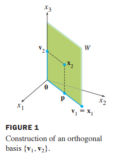
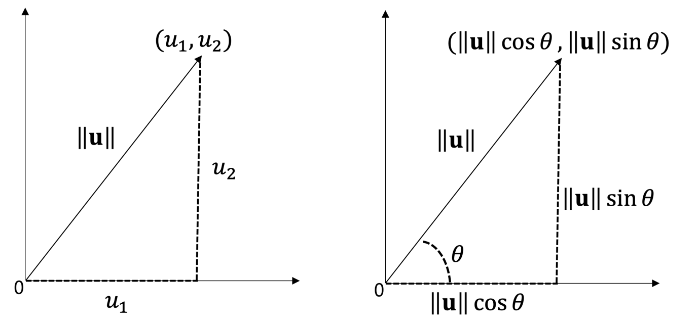
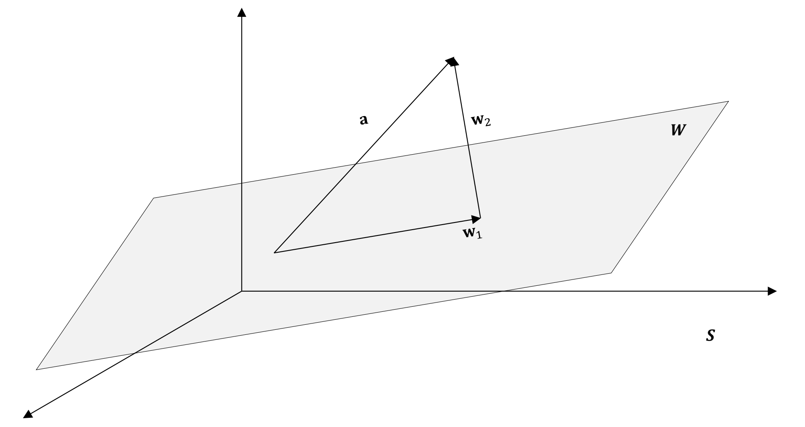

# QR Decomposition (QR 분해)

## Prerequisites

### 벡터 공간 (vector space)

벡터의 덧셈과 스칼라 곱이 정의된 공간


- 벡터 공간

1) 공간 V에 속하는 벡터 u, v 에 대해 두 벡터의 합인 u+v도 공간 v에 속한다
2) a가 임의의 스칼라이고, 벡터 u 가 공간에 속할 때 au도 공간 V에 속함


- 부분 공간 (subspace)

기저 벡터 S = {s1, s2}

S는 부분 공간, W를 span한다

W = Span{x_1, x_2}



- 선형 조합 (linear combination)

$$
w = a_1u_1 + a_2u_2 + ... + a_nu_n
$$

- 선형 독립 : 선형 조합으로 표현할 수 없다
- 선형 종속 : 선형 조합으로 표현할 수 있다.


- **기저(basis)** : 벡터 공간을 생성하는<span style='color:red'> <u>선형 독립인 벡터</u></span>
  - 패턴 인식/분류 시, 기저벡터를 활용, 신호(signal)와 소음(noise) 구분
  - 기저의 조건
  - 1. {s1, s2, ..., sn}가 공간 S를 생성
    2. s1, s2,..., sn는 선형 독립(linearly independent)


- 차원(Dimenstion) : 해당 공간을 구성하는 <span style='color:red'><u>기저 벡터의 개수</u></span>
- 랭크(Rank) : 행 공간과 열 공간의 공통 차원
  - 랭크로 인해 3개의 벡터지만 2차원으로 표현됨


- Full rank : 행렬이 가질 수 있는 최대 크기의 랭크(rank)

- 영 공간(null space) : Ax=0을 만족하는 모든 벡터 X의 집합
  - 널리티(nullity) : 영 공간의 차원


- 행공간과 열 공간의 성질

1. 기본 행 연산은 행렬 영 공간 을 변화시키지 않음
2. 기본 행 연산은 행렬 행 공간을 변화시키지 않음
3. <u>행렬 A의 행 공간과 열 공간의 차원은 동일</u> (***)

<br>

<br>

<br>

-----------------

### 내적 (Inner product)

- 내적 공간

1. <u,v> = <v,u> = u^Tv      >> 스칼라
2. <u+v,w> = <u,v> + <v,w>
3. <au,v> = a<u,v>
4. <u,v> >= 0


$$
u = \begin{bmatrix}u_1 \\u_2 \\ u_3 \end{bmatrix} 
v = \begin{bmatrix}v_1 \\v_2 \\ v_3 \end{bmatrix} \\
<u,v> = u^Tv = \begin{bmatrix}u_1 & u_2 & u_3 \end{bmatrix} \begin{bmatrix}v_1 \\v_2 \\ v_3 \end{bmatrix} 
= u_1v_1 + u_2v_2 + ... + u_nv_n
$$

- 내적

물건을 움직인 거리

**내**적이 **크**다는 것은 **내**가 **가**고자 하는 **방**향으로 가기 때문에 theta가 작다

**(내크 내가방)**
$$
\vec{a} · \vec{b} = |\vec{a}||\vec{b}|cos\theta
$$


#### 내적 python

```python
def inner_product(a,b):
    '''
    벡터의 내적
    입력값 : 내적할 벡터 리스트 a,b
    출력값 : 벡터 a,b의 내적 결과 res
    '''
    n = len(a)
    res = 0
    for i in range(0,n):
        res += a[i]*b[i]
    return res
inner_product(a,b)
```

```python
import numpy as np
a = np.array
b = np.array
res = np.inner(a,b)
print(res)
```

```python
import numpy as np
res = np.dot(a,b)
res
```


> inner = dot
>
> 동일하게 동작
>
> dot은 행렬 곱셈을 지원하지만, inner는 1차원 배열 (2d 배열에는 잘 안됨)


- 내적의 성질
  1. 내적 >0 이면, 두 벡터 사이의 각도 < 90
  2. 내적 <0 이면, 두 벡터 사이의 각도 > 90
  3. <u>내적 = 0 이면, 두 벡터 사이의 각도 = 90</u>

<br>

<br>

<br>

--------------------

### 정사영

#### 벡터의 길이(norm)

$$
u = (u_1, u_2, ..., u_n)\\
||u|| = \sqrt{u_1^2 + u_2^2 + ...+ u_n^2}
$$




$$
u · v = ||u||||v|| cos\theta \\
cos\theta = \frac{u · v}{||u|| ||v||}
$$
(cos*θ* 는 x좌표, sin*θ*는 y좌표)


#### 정사영 벡터

$$
\parallel proj_vu \parallel = \parallel u \parallel \mid cos\theta \mid
\\
\\
<u,v> = ||u||||v||cos\theta\\
      = (||v||) (||u||cos\theta)\\
      = (length\ of\ vector\ v) \times (length\ of\ vector\ proj_vu)
$$

즉, 같은 직선 상에 있는 2개의 벡터를 곱한 것

<br>

<br>

#### 정규 직교 (orthonormal)

벡터 공간 S = {u1,u2,u3}을 구성하는 벡터 u1,u2,u3가 다음과 같다면 벡터 공간 S는 직교

<u1,u2> = 0

<u1,u3> = 0

<u2, u3> = 0


- 정규 직교 벡터는 v1, v2이 1인 벡터

- 자신의 길이(크기)만큼 나누면 >> 1 (norm)

$$
v = \frac{1}{\parallel u \parallel} u
$$

- 유닛벡터 (unit vector) : 정규 직교(orthonormal) 기저벡터

$$
\parallel v \parallel = \parallel \frac{1}{\parallel u \parallel}u \parallel = \frac{1}{\parallel u \parallel} = 1
$$


- **정규 직교** 벡터를 활용한 좌표 표현

(c1,c2,c3) 이 있을 때
$$
a = <a,v_1>v_1 + <a,v_2>v_2 + .. + <a,v_n>v_n
\\
a = c_1v_1 + c_2v_2+ .. + c_nv_n
$$
<br>

> 증명
>
> 정규 직교 벡터 내적 : 0
> $$
> <a,vi> = <c_1v_1 + c_2v_2 + ... + c_nv_n, v_i>
> \\
> = <c_1v_1, v_i> + <c_2v_2, v_i> + ... +<c_nv_n, v_i>
> 
> \\          = <c_iv_i, v_i>
> 
> \\          = c_iv_i^Tv_i
> 
> \\          = c_i
> $$
>
> $$
> <a, v_i> = c_i
> $$


- **직교** 벡터를 활용한 좌표 표현

$$
a = \frac{<a,u_1>}{\parallel u_1 \parallel^2} u_1 + \frac{<a,u_2>}{\parallel u_2 \parallel^2} u_2 + ... + \frac{<a,u_n>}{\parallel u_n \parallel^2} u_n
$$


## Gram-Schmidt 과정 (그램 슈미트 과정)

- 정사영 정리 (projection theorem)

벡터 공간 S의 부분 공간 w가 존재할 때 벡터 공간 S에 속하는 임의의 벡터 a는
$$
a = w_1 + w_2
$$
이때 w1는 부분 공간 w에 속하며 w2는 부분 공간 w의 직교 공간에 속함




- 그램 슈미트 과정

"linearly independent한 벡터들이 주어졌을 때 기저 벡터{s1, s2, ..., sn}을 직교 기저(orthogonal basis) 벡터 {u1, u2, ..., un}로 변환하는 과정"

즉, 직교가 아닌 것을 직교로 바꾸는 과정


1. $$
   u_1 = s_1
   $$

2. $$
   u_2 = s_2 - \frac{<s_2, u_2>}{\parallel u_1 \parallel^2}u_1
   $$

3. $$
   u_3 = s_3 - \frac{<s_3, u_1>}{\parallel u_1 \parallel^2}u_1 - \frac{<s_3, u_2>}{\parallel u_2 \parallel^2}u_2
   $$


$$
u_n = S_n - \frac{<S_n,u_1>}{\parallel u_1 \parallel^2}u_1 - \frac{<S_n,u_2>}{\parallel u_2 \parallel^2}u_2 - ... - \frac{<S_n,u_{n-1}>}{\parallel u_{n-1} \parallel^2}u_{n-1}
$$


## QR분해

선형 독립(linearly independent)인 nxp 행렬이고, 풀 랭크(full column rank)인 행렬 A는 A = QR로 분해될 수 있다

**Q =  정규 직교 벡터**

**R  = 가역 상 삼각 행렬**
$$
A = QR
\\
Q = (v_1 \ v_2 \ ... \ v_n)
\\
R = \begin{bmatrix}<a_1,v_1> & <a_2, v_1> & \ldots & <a_n,v_1> \\0 & <a_2, v_2> & \ldots & <a_n,v_2> \\  \vdots  &  \vdots &  \ddots  &  \vdots \\ 0 & 0 & \ldots & <a_n,v_n> \end{bmatrix} 
$$

```python
import numpy as np
A = np.array([[1,0,1],[0,1,1],[1,2,0]])
Q, R = np.linalg.qr(A)
```

