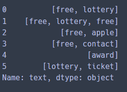

모두의 인공지능 기초 수학 Chapter 14 복습


# 확률

## 확률 기본 용어

- 사건의 확률과 확률의 성질
  - 어떤 실험에서 사건 A가 일어날 가능성을 수로 나타낸 것 : 확률 P(A)

$$
P(A) = \frac{A가 일어나리라 예상되는 횟수}{전체 실험의 횟수}
$$

$$
P(A) = \frac{n(A)}{n(S)}
$$

- 1) 임의의 사건 A에 대해 확률 P(A)는 0<=P(A)<=1
  2) 반드시 일어나는 사건 S에 대해 확률 P(S) = 1
  3) 절대로 일어나지 않는 사건 P() = 0


- 독립사건
  - 독립사건 : 두 사건 A와 B에서 한 사건의 결과가 다른 사건의 영향을 주지 않을 떄 A와 B

$$
P(B|A) = P(B|A^c) = P(B)\\
P(A\cap B) = P(A)P(B|A) = P(A)P(B) (단 P(A)>0, P(B)>0)
$$

- 종속사건
  - 종속사건 : 두 사건 A와 B에서 한 사건의 결과가 다른 사건에 영향을 줄 때 A와 B

$$
P(B|A) \neq P(B|A^c) \neq P(B)
$$

- 조건부 확률
  - conditional probability
  - 어떤 사건 A가 일어났다는 조건 하에 다른 사건 B가 일어날 확률
  - P(B|A)
  - A 조건 하에 B가 일어날 조건부 확률

$$
P(B|A) = \frac{P(A \cap B)}{P(A)}\\
P(A,B) = P(AB) = P(A \cap B) : 함께\ 동시에\ 일어날\ 결합\ 확률
$$


## 베이지안 확률

- 빈도 확률

  - 그 사건이 반복되는 빈도를 다룸
  - 모든 것은 실험으로만 알 수 있다.
  - 여러 번 반복 실험으로 얻은 객관적인 정보

- 베이지안 확률

  - 두 확률변수의 사전 확률과 사후 확률 간 관계
  - 실험하지 않아도 주어진 정보들을 이용해서 확률적으로 표현할 수 있다

  $$
  P(A|B) = \frac{A(B|A)P(A) }{P(B)}
  $$

  

  - P(A), 사전 확률 (prior probability)
    - 결과가 나타나기 전에 결정된 원인(A)의 확률
  - P(B|A), 우도 확률(likelihood probability)
    - 원인(A)이 발생했다는 가정하에 결과(B)가 발생할 확률
  - P(A|B), 사후 확률(posterior probability)
    - 결과(B)가 발생했다는 가정하에 원인(A)이 발생했을 확률
  - P(B), 주변 우도(marginal probability)
    - 사건(B)의 발현 확률


$$
P(A|B) = \frac{A(B|A)P(A) }{P(B)}\\
\\
P(B) = P(B \cap A) +P(B \cap A')\\
\\
P(A|B) = \frac{P(B|A)P(A)}{P(B|A)P(A)+P(B|A')P(A')}
$$


## 베이지안 이론


- 스팸메일 필터

\- 메일본문(입력 테스트)을 이용하여 메일이 스팸인지 구분하는 예시를 살펴보자


- 메일의 스팸 유무

$$
P(정상메일 | 메일본문) = 메일본문이 정상일 확률\\
P(스팸메일 | 메일본문) = 메일본문이 스팸일 확률
$$


- 나이브베이즈
  - 베이즈 모델 :

$$
P(A|B) = \frac{P(B|A)P(A)}{P(B)}
$$

   이 조건부 확률을 이용 (B가 있을 때 A일 확률)

   A를 문서 카테고리, B를 문서라고 가정했을 때, 해당 문서가 있을 때, 해당 카테고리일 확률

   P(A1|B)와 P(A2|B)를 비교해서 확률이 더 높은 값을 분류하기 위함

   

   이런 비교 계산을 하기 위해 공통되는 P(B) 제거하면

   
$$
P(A|B) = P(B|A)P(A)
$$


   A 카테고리일 때, W1, W2, ..., Wn 단어가 있다고 가정하면


$$
P(A|B) = P(W1,W2,...,Wn|C)P(C)
$$
   \>> **Naive Bayes** : 각각의 단어가 A 카테고리에 독립적이라는 나이브한 가정을 둠으로써 계산


$$
P(C|D) = P(W1|C)P(W2|C)...P(Wn|c)P(C) =  \prod P(W|C)P(C)
$$


\- 나이브 베이즈를 이용하여 정리하면
$$
P(정상메일 | 메일본문) = \frac{ P(메일본문 | 정상메일) X P(정상메일)}{P(메일본문)}\\
\\
P(스팸메일 | 메일본문) = \frac{ P(스팸본문 | 정상메일) X P(정상메일)}{P(스팸본문)}
$$


  입력 텍스트가 주어졌을 때, P(정상메일|메일본문)이 P(스팸메일|메일본문)보다 크면 정상, 그렇지 않으면 스팸

  본문에 단어가 두 개 있다고 가정했을 때 단어를 W1, W2라고 하고,

  이 식을 간단히 하면


$$
P(정상메일 | 메일본문) = P(W1 | 정상메일)\ X\ P(W2 | 정상메일)\ X\ P(정상메일)\\
\\
P(스팸메일 | 메일본문) = P(W1 | 스팸메일)\ X\ P(W2 | 스팸메일)\ X\ P(스팸메일)
$$


스팸메일 필터 예시

\- 입력 테스트 "my free lottery" 있다고 하면
$$
P(정상메일 | 메일본문) = P(my | 정상메일) X P(free | 정상메일) X P(lottery | 정상메일) X P(정상메일)
\\
P(스팸메일 | 메일본문) = P(my | 스팸메일) X P(free | 스팸메일) X P(lottery | 스팸메일) X P(스팸메일)
$$


\- P(정상메일) = P(스팸메일) = 총 메일여섯 개 중 세 개 = 0.5

 \>> 두 식 확률 같으므로 생략 가능
$$
P(정상메일 | 메일본문) = P(my | 정상메일) X P(free | 정상메일) X P(lottery | 정상메일) 
\\
P(스팸메일 | 메일본문) = P(my | 스팸메일) X P(free | 스팸메일) X P(lottery | 스팸메일)
$$


\- P(my | 정상메일)을 구하는 방법
$$
\frac{정상메일에서 my가 등장한 총 빈도수}{정상메일에 등장한 모든 단어의 빈도수 총합}
$$


\- 이런 원리로 "my free lottery"를 분류해보면
$$
P(정상메일 | 메일본문) = \frac{0}{10} \times \frac{2}{10} \times \frac{0}{10} = 0
\\
P(스팸메일 | 메일본문) = \frac{1}{10} \times \frac{3}{10} \times \frac{3}{10} = 0.009
$$


  \>> "my free lottery" 는 스팸메일


```python
# 라이브러리 호출
import numpy as np
import pandas as pd
from nltk.corpus import stopwords
import string
import nltk

# corpus : 말뭉치
# stopwords : 불용어

df = pd.read_csv('spam.csv')
```


\>> 라이브러리 호출하고 csv 파일을 불러온다


\>> `from nltk.corpus import stopwords` :

   데이터에서 유의미한 단어 토큰만 선별하기 위해서는 큰 의미가 없는 토큰을 제거하는 작업이 필요. 

   ' I, my, me, over, 조사, 접미사' 같은 단어들은 실제 의미 분석하는데 거의 기여X

   \>> 이런 단어들을 불용어(stopword)


```python
def process_text(text):
    # text에서 구두점(punctuation) 삭제
    nopunc = [char for char in text if char not in string.punctuation]
    nopunc = ''.join(nopunc)
    
    # text에서 불용어(접미사, 조사 등) 삭제
    cleaned_words = [word for word in nopunc.split()
    if word.lower() not in stopwords.words('english')]
    
    return cleaned_words
```

\>> process_text를 정의하여 데이터 프레임 'df'에 있는 'text'를 토큰화 시키고자 함


\>> 1. text에서 구두점(punctuation) 삭제

   `string.punctuaion` : 영어로 구두점으로 간주되는 모든 문자를 포함

   이 목록을 제외함으로써 문자열에서 모든 구두점을 제외 할 수 있음


   text에서 string.punctuation이 아닌 char만 char에 넣고 nopunc라고 해줘

   join() 함수를 이용해서 nopunc를 정제해서 nopuc에 저장해줘


\>> 2. text에서 불용어 삭제

   `stopwords.words('english')` : 영어사전에서 제공하는 영어의 불용어 리스트

   이 리스트를 제외하고 소문자로 만들어 리스트에 넣음 


   punctuation이 없는 정제된 nopunc에서 word를 불러오는데 불용어(stopwords)가 없는 것만 뽑아서 word에 넣어줘 대신

   lower(소문자)로 만들어서 리스트에 저장해줘. 

   process_text에 text에 넣고 반환


 


```python
df['text'].apply(process_text)
```



\>> 정의한 process_text의 text 결과

   punctuation과 불용어가 삭제됨


```python
# text를 토큰화한 뒤, 토큰 수의 행렬 변환

from sklearn.feature_extraction.text import CountVectorizer
messages_bow = CountVectorizer(analyzer = process_text).fit_transform(df['text'])
```


\>> Scikit-Learn의 서브 패키지 feature_extraction에서 CountVectorizer 클래스 호출 

   문서 집합에서 단어 토큰을 생성하고 각 단어의 수를 세어 BOW 인코딩 벡터를 만드는 클래스

   (BOW 인코딩 : 문서를 숫자 벡터로 변환하는 방법)


  \1. 문서를 토큰 리스트로 변환

  \2. 각 문서에서 토큰의 출현 빈도를 셈

  \3. 각 문서를 BOW 인코딩 벡터로 변환 


  analyzer 인수로 사용할 토큰 생성기를 'process_text'로 함

 ` fit_transform()` 은 fit()과 transform()을 한번에 처리할 수 있게 하는 메서드

`fit()`은 데이터를 학습시키는 메서드이고, `transform()`은 실제로 학습시킨 것을 적용하는 메서드


 ` CountVectorizer 클래스`를 이용해 process_text로 단어 토큰을 생성하고 각 단어의 수를 셈

  이때, 학습시키고 적용할 문서는 df['text']

  단어의 수를 행렬로 변환시켜서 messages_bow라고 함


```python
# train data, test data 8:2 비율로 구분

from sklearn.model_selection import train_test_split 
X_train, X_test, y_train, y_test = train_test_split(messages_bow, df['label_num'], test_size = 0.2, random_state = 42)
# test_size는 0.2 train size는 자동적으로 0.8
# 랜덤하게 섞은것 중에 여러 세트가 있는데 42번으로 했을 떄 제일 잘 나옴
# 랜덤하게 섞은 데이터로 다른 알고리즘으로 적용해보고 싶을 때 random_state를 꼭 해줘야함
```

\>> Scikit-Learn의 서브 패키지 model_selection에서 train_test_split 클래스 호출 


\>> train / test를 분리하는 이유는 머신러닝 모델에 train 데이터를 100% 학습시킨 후 test데이터에 모델을 적용했을 떄 성능이 생각보다 않나오는 경우가 많음 >> overfitting

   모델이 내가 가진 학습 데이터에 너무 과적합되도록 학습한 나머지, 이를 조금이라도 벗어난 케이스는 예측률이 현저히 떨어지기 때문

   \>> overfitting을 방지하기 위해 validation set으로 모델 평가


\>> test_size를 0.2, train_size를 0.8로 지정

   random_state : 세트를 섞을 때 해당 int 값을 보고 섞는데, 이 값을 고정해야 매번 데이터 셋이 변경되지 않음


\>> x_train : train data set의 feature

   x_test : test data set의 feature

   y_train : train data set의 label

   y_test : test data set의 label


   messages_bow를 feature 부분으로, df['label_num']을 label 부분으로 하여 test와 train 비율을 2:8로 하여 모델 학습


   (label_num = spam mail 이면 1, 정상메일이면 0)


```python
# 나이브 베이즈 모델 적용, 훈련
# 훈련(train)>> 모델 생성

from sklearn.naive_bayes import MultinomialNB
classifier = MultinomialNB()
classifier.fit(X_train, y_train) # 훈련시, 반드시 train data 사용
```

\>> Scikit-Learn의 서브 패키지 naive_bayes에서 MultinomialNB 클래스 호출


\>> MultinomialNB 모델을 classifier에 저장하고 X_train, y_train 데이터를 학습


```python
# 훈련용 데이터로 예측해서 비교해 봄
classifier.predict(X_train) # 예측값

y_train.values  # 실제값
```


\>> predict를 사용하면 0과 1만 반환하는데 0은 정상메일 1은 스팸메일이다.


\- 학습 데이터셋에서 모델의 정확도를 표현해보자

```python
# 학습 데이터셋에서 모델의 정확도 표현하기

from sklearn.metrics import classification_report
from sklearn.metrics import confusion_matrix, accuracy_score

pred = classifier.predict(X_train)

# metrics pkg >> prescision(정밀도), recall(재현율), f1 score(f1 스코어) 점수 구하기
print(classification_report(y_train, pred))
```


\>> Scikit-Learn의 matrics 패키지에서 classification_report를 보면

   y_train(실제값)과 classifier.predict(X_train) (예측값)을 비교했을 때 정밀도, 재현율, f1 스코어 모두 1로 높은 값으로 나왔다.


```python
# 혼동행렬(confusion matrix)

print('confusion Matrix: \n', confusion_matrix(y_train, pred))
print()
print('Accuracy: ', accuracy_score(y_train, pred))
```


\>> 혼동행렬

   

| 실제\예측 | N    | P    |
| --------- | ---- | ---- |
| N         | TN   | FP   |
| P         | FN   | TP   |


\* 정상메일 = 0, 스팸메일 = 1

TN = True Negative, 정상메일을 정상메일으로 예측 (정답) 3

FP = False Positive, 정상메일이 아닌 것을 정상메일이라고 예측 0

FN = False Negative, 정상메일을 정상메일이 아니라고 예측 0

TP = True Positive, 정상메일이 아닌 것을 정상메일이 아니라고 예측(정답) 1


\>> 1) precision = 정밀도

Positive 라고 예측한 샘플(TP + FP) 중 실제로 Positive인 샘플(TP) 비율

'예측값' 기준 '정답인 예측값'


$$
precision = \frac{TP}{TP+FP}
$$


\>> 2) Recall = 재현율

실제 Positive인 샘플(TP+FN) 중 Positive라고 예측한 샘플(TP) 비율

'실제값' 기준 '정답인 예측값'


$$
Recall = \frac{TP}{TP+FN}
$$


\>> 3) Accuracy = 정확도

전체 샘플 중 맞게 예측한 샘플의 비율


$$
Accuracy = \frac{TP+TN}{TN+TP+FN+FP}
$$


\>> 4) F1-score

F-score 란 precision과 recall의 가중 조화평균


$$
F_\beta = \frac{(1+ \beta ^2)(precision \times recall)}{\beta^2 precision + recall}
$$


이때 가중치를 1인 경우를 F1-score


$$
 F_1 = \frac{(1+ 1^2)(precision \times recall)}{1^2 precision + recall}
$$


\>>


$$
F_1 = \frac{(2)(precision \times recall)}{precision + recall}
$$


\>> 5) support = 각 라벨의 실제 샘플 개수

4개의 샘플 중 라벨이 0 (정상메일)인 샘플은 3개


\+ 민감도(Sensitivity)
$$
Sensitivity = \frac{True Positive}{True Positives + False Negatives}
$$


\+ 특이도 (Specificity)
$$
Specificity = \frac{True Negatives}{True Negatives + False Positives}
$$


\>> 6) macro avg : 단순 평균


\>> 7) weight avg : 가중 평균


\- test data에 적용

```python
# test data에 적용 (모델의 성능)
classifier.predict(X_test)  # 예측값

print('Actual value: ',y_test.values) # 실제값
```


\>> train 데이터와 달라짐


```python
from sklearn.metrics import classification_report
from sklearn.metrics import confusion_matrix, accuracy_score

pred = classifier.predict(X_test)
print(classification_report(y_test, pred))

print(confusion_matrix(y_test,pred))

accuracy_score(y_test, pred)
```


\>> 실제 test 데이터에 적용했을 때는 precision, recall, f1-score 모두 0으로 나옴