# 통계

## 확률변수와 확률분포

### 확률변수

#### 확률 변수

- 확률 변수

  - 확률 변수 : 실험 결과에 따라 표본 공간의 각 원소에 실수 값 하나를 대응
  - 표본 공간 : 실험의 결과 하나 하나를 모두 모은 것
  - 확률변수 : 표본 공간을 정의역(domain), 실수를 공역(co-domain)으로 가지는 함수로 정의

  

- 이산확률변수
  - 확률변수 X가 어느 구간의 모든 실수 값을 택하지 않고 0,1,2,... 등 고립된 값만 택할 때
- 연속확률변수
  - 정밀히 측정할 수 없는 키, 몸무게 같은 값

$$
P(177<X<179)
$$


- 확률함수
  - 확률질량함수(Probability Mass Function, PMF)
    - 이산확률변수의 확률분포를 나타내는 함수
    - 각 이산점의 확률 크기를 표현하는 함수
    - 불연속한 값에 대한 확률을 나타내는 함수

$$
f(x)=P[X=x]
$$


실험의 표본 공간 --------------> 실수 공간 ---------------> 확률

​                              확률변수(x)                  확률함수(f(x))


#### 확률질량함수 pmf

- 파이썬 `SciPy` 라이브러리 - `stats` 서브패키지
  - 확률질량함수 : `binom` 클래스로 구현

```python
# stats 서브패키지를 호출합니다
# 한글 깨짐을 방지하는 코드
import matplotlib as mpl
import matplotlib.pyplot as plt
from matplotlib import font_manager

font_fname = 'C:\Windows\\Fonts\\gulim.ttc'
font_family = font_manager.FontProperties(fname=font_fname).get_name()

plt.rcParams["font.family"] = font_family
```

```python
import scipy as sp
import seaborn as sns
import numpy as np
import matplotlib as mpl
import matplotlib.pyplot as plt
%matplotlib inline

# 확률질량함수 (이산형 확률분포)
n = 10  # 전체 시도 횟수
mu = 0.6  # 베르누이 확률분포 기댓값

rv = sp.stats.binom(n, mu)
xx = np.arange(n + 1)

# 그래프 표현
plt.bar(xx,rv.pmf(xx), align="center") # pmf : 확률질량함수 기능
plt.xlabel('표본 값')
plt.ylabel('$P(x)$')
plt.title('확률질량함수 pmf')
plt.show()
```

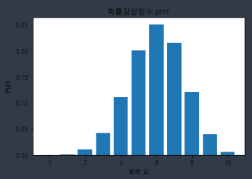


#### 확률밀도함수

- 연속확률변수 

  - 확률변수가 취할 수 있는 값이 연속적이며 무한하기 때문에 분포로 표현하는 것이 불가능함

  - 확률밀도함수 >> 특정 구간에 속할 확률

  - '특정 구간에 속한 넓이' = '특정 구간에 속할 확률'

  - 연속형 데이터의 확률을 표현하는 함수

  - 1. 모든 x값에 대해 f(x) >= 0

    ​       즉, 모든 실수 값에 대해 확률밀도함수는 0 이상

    2. x의 모든 가능한 값의 확률은 적분 
       $$
       \int_  {- \infty} ^ \infty  f(x) dx
       $$
       로 구함, 이 값은 항상 1임

    3. 구간 (a,b)의 확률은

    $$
    \int_  a ^ b  f(x) dx
    $$

    ​       즉, 구간 (a,b)에 대한 x의 확률은 해당 구간에서 확률밀도함수 f(x)로 만들어지는 면적의 크기


확률 밀도함수 (Probability Density Function, PDF)

```python
# 연속 확률분포
# 기댓값 1, 표준편차 2 정규분포 객체 생성하라

rv = sp.stats.norm()  # 정규분포(normal distribution)
rv = sp.stats.norm(loc = 1, scale = 2)

# 확률분포 객체의 메소드 중 확률밀도함수 기능 >> pdf

x = np.linspace(-8,8,100)   # x축이 start = -8, stop = 8, 그 사이를 100개의 일정한 간격으로
pdf = rv.pdf(x)
plt.plot(x, pdf)
plt.show()
```

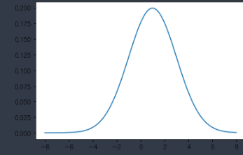


### 확률분포의 유형

- 확률 분포의 유형

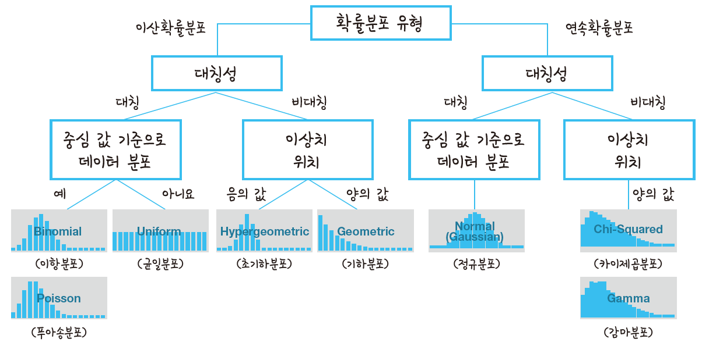


#### 정규분포와 표준 정규분포

- 정규분포

  - 가우시안분포(Gaussian distribution)

  - 평균에 가까울수록 발생할 확률이 높고, 평균이 멀어질수록 발생할 확률이 낮음

  - 평균 $$\mu$$, 표준편차 $$\sigma$$ 인 연속확률분포

  - 표준편차가 클수록 퍼진 종 모양

  - 표준편차가 작을수록 평균이 집중되어 뾰족하게 생긴 종 모양

  - 1. 직선 X = $\mu$(평균)에 대칭
    2. 전체 면적은 1
    3. $\mu$(평균)이 일정할 때, 표준편차가 커질수록 그래프 폭은 넓어짐
    4. 표준편차가 일정할 떄, 평균이 클수록 오른쪽으로 이동

    

- 표본정규분포

  - Standard normal distribution
  - 모수 값(평균, 표준편차)이 다른 정규분포를 가진 집단을 서로 비교하기 위해 정규분포를 표준화
  - 정규분포 평균 '0'으로 만들고, 평균편차 '1'로 만들어서 표준화
  - Z-score (표준화 점수)

  $$
  Z = \frac{X - \mu}{\sigma}
  $$


- `plt.hist`로 샘플
- `plt.plot()`로 정규분포의 모양으로 출력

```python
import numpy as np
import matplotlib.pyplot as plt

mu, sigma = 0, 0.1  # 평균, 표준편차 정의

# 평균 0, 표준편차 0.1, 샘플 개수 1000개
s = np.random.normal(mu, sigma, 1000)

# 샘플들의 histogram
# (s: 배열 혹은 배열들로 구성된 시퀀스,
# 30 : 해당 막대의 영역(bin)을 얼마나 채우는지 결정하는 변수)
count, bins, ignored = plt.hist(s,30,density=True, stacked=True)

# 샘플들을 이용해서 정규분포의 모양으로 출력
# (plot(x축 데이터, y축 데이터)꼴로 사용)
plt.plot(bins, 1/(sigma*np.sqrt(2*np.pi))*np.exp(-(bins-mu)**2/(2*sigma**2)),
        linewidth=2, color = 'r')
plt.show()
# 1/sigma*root2pie
```

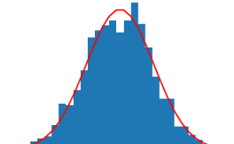


#### 카이제곱분포

- 카이제곱분포
  - chi-squared distribution (X^2 분포)
  - 집단의 분산을 추정하고 검정할 때 많이 사용
  - 양의 값만 존재함 cf. 정규분포는 양과 음의 값
  - 직접 확률 구할 때 사용하는 분포가 아니라, 주로 신뢰구간과 가설 검정, 독립성 검정 등에 사용


- `scipy.stats`의 `chi2`호출
- x = `linspace(시작, 끝, 구간 개수)` : 시작~끝 사이 몇 개의 구간으로 구분
- y = `chi2(df).pdf(x)` : 자유도 df의 카이제곱분포(chi2)의 확률밀도함수(pdf) 

```python
# NumPy와 SciPy 라이브러리 호출
from numpy import linspace
from scipy.stats import chi2

df=2  # df(degree of freedom, 자유도_미지수의 개수)

x = linspace(0,20,100)  # 0~20 사이 100 구간 구분
y = chi2(df).pdf(x)  # 카이제곱분포의 확률밀도 함수 구하기

# 샘플들을 이용해서 그래프로 출력
plt.figure(figsize=(10,6))
plt.plot(x,y,'b-')
plt.xlabel('x')
plt.ylabel('p(x)')
plt.grid()
plt.title('카이제곱 분포')
plt.show()
```

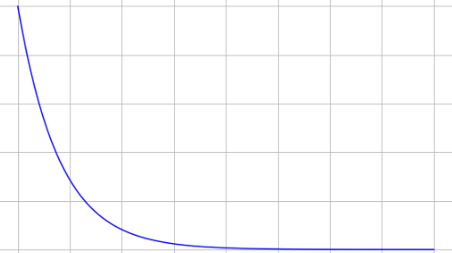


#### 이항분포

- Binomial distribution

- 베르누이 분포 기반

  - 베르누이 실험 (bernoulli experiment) >> '예'나 '아니오'처럼 결과가 두 가지인 확률 실험
  - 성공 확률 : `p`
  - 베르누이 시행 (bernoulli trial) : 베르누이 실험을 독립적으로 반복하는 것

- 1. 각 실험 결과는 상호 배타적인 두 사건
  2. 각 실험에서 결과가 성공할 확률은 `p = P(S)`

  ​       결과가 실패할 확률은 `q = P(F) = 1-p`

  ​       `p+q = 1`

  3. 각 실험은 독립적

     즉, 한 실험 결과는 다음 실험 결과에 영향을 주지 않음

- 베르누이 확률변수(Bernoulli random variable)

  - 0과 1 두가지 값만 가질 수 있음 >> 이산확률변수

- 베르누이 분포(bernoulli distribution)

  - 실험 횟수가 1회, 실험 결과가 오직 두가지인 분포
  - `f(1) = p` , `f(0) = 1-p`

<br>

- 이항 분포
  - n번의 시행에 대한 p 확률을 가진 사건의 발생 확률
  - 베르누이 시행의 반복 횟수 : `n`
  - 각 시행에서 성공할 확률 : `p`
  - n번 시행 중 성공 횟수 : `X`
  -  **X-Bin(n,p)**
  - 발생할 확률과 발생하지 않을 확률을 이용하여 예측할 때 유용

```python
# 이항분포를 무작위 표본 추출

from numpy import random
import matplotlib.pyplot as plt
import seaborn as sns

# n : 적용할 범위 (동전 : 앞/뒤 >> 0/1)
# p : 각 n에 대해 나올 확률
# size : 횟수(배열 크기)
# kde : kernel density estimation >> 정규분포
# distplot : distribution plot = distplot (이산확률분포)

sns.distplot(random.binomial(n=10, p=0.5, size=1000), hist=True, kde=False)

plt.show()
```


#### 푸아송분포

- Poisson distribution
- 확률론에서 단위 시간 안에 어떤 사건이 몇 번 발생할 지를 표현하는 이산확률분포
- 이항분포에서 `n -> 무한`, `p -> 무한` 일 때의 극한을 푸아송분포
- 이항분포에서 시행 횟수가 충분히 많고 확률이 충분히 작을 때 >> 푸아송분포

```python
import numpy as np
import matplotlib.pyplot as plt

# np.random.poisson >> 특정 사건의 평균 횟수
# 포아송 분포에서 lambda(상수)는 평균 값

s = np.random.poisson(5, 1000)  # 평균=5, 난수 1000개

count, bins, ignored = plt.hist(s, 14, color='r')
plt.show()
```


<br>

<br>

<br>

## 통계적 추정

### 평균, 중앙값, 최빈값

- 대표값
  - 데이터가 무엇을 의미하는지가 중요한데, 이를 효과적으로 표현할 수 있는 것
  - 평균, 중앙값, 최빈값

<br>

- 평균

$$
평균 = \frac{표본의 총합}{표본의 개수}
$$

<br>

- 중앙값
  - 주어진 값들을 크기대로 정렬했을 때 가장 중앙에 위치하는 값

$$
전체\ 데이터\ 개수(n)가\ 홀수일\ 때 : \frac{n+1}{2}\ 번째\ 값\\
전체\ 데이터\ 개수(n)가\ 짝수일\ 때 : \frac{n}{2}, (\frac{n}{2}+1)번째\ 값들의\ 평균
$$

<br>

- 최빈값
  - 가장 많이 관측되는 수, 즉 주어진 값 중에서 가장 자주 나오는 값
  - 대소 관계가 의미 없는 질적 자료에 많이 사용

<br>

<br>

### 모집단분포와 확률분포

- 모집단과 모수
- 모집단
  - 어떤 통계적 실험의 대상이 되는 모든 대상물
  - 모집단을 구성하는 데이터가 이루는 확률 분포 : **모집단분포**(population distribution)
- 확률표본
  - 모든 데이터가 뽑힐 가능성(확률)을 동등하게 부여하고, '객관적으로 ==무작위==(랜덤) 추출'한 표본
  - 모집단의 모수(특성)를 알 수 있는 방법 >> 표본 추출해서 추정

<br>

<br>

### 회귀 분석

- 독립변수와 종속변수
  - `y=f(x)`
  - x를 독립변수, y를 종속변수
  - 독립변수 : 연구자 의도에 따라 변하는 변수
  - 종속변수 : 연구자가 변화시키는 독립변수에 따라 어떻게 변하는지 알고 싶어 하는 변수
- 회귀분석
  - 독립변수와 종속변수는 ==인과 관계==가 있음
  - [원인] 독립변수 (연속형 변수 - 공변량(covariate), 범주형 변수 - 요인(factor))
  - [결과] 종속변수
- 회귀식, 회귀분석
  - ''평균으로의 회귀''
  - 회귀분석은 변수 간의 함수 관계를 분석하는 방법 중 하나로, 좀 더 수학적으로 표현한다면 독립변수와 종속변수 간의 1차 선형적 관계를 도출하여 독립변수가 종속변수에 미치는 영향 혹은 예측 정도를 분석하는 방법
  - `회귀(regression)` : 두 변수 관계가 일반화된 선형 관계의 평균으로 돌아감
  - `선형성(linearity)` : 두 변수 관계를 직선(1차 방정식 : `Y = aX + b`) 하나의 형태를 설명할 수 있음
  - 선형 관계 :
    - 선형 회귀식을 이용하여 파라미터 추정, 예측 값과 실제 관측값 간 차이(잔차)의 합이 최소가 되는 직선으로 `최소제곱법`

<br>

#### 선형회귀식

- `Y = aX + b`
- X, Y 는 데이터, a, b는 두 데이터의 관계를 설명하는 파라미터(parameter)
- 앞의 수식에서 ε 평균이 0이 되는 조건을 만족하는 β0과 βi의 관계식이 선형회귀식이며, 이것으로 선형 모델을 도출함(ε 평균이 최소가 되도록 파라미터(β0, βi)의 값을 좁혀 가기 때문에 회귀라고 함)

$$
Y_i = \beta_0 + \beta_iX_i + \varepsilon_i\\
\\
Y_i : 종속(응답)변수\\
\beta_0 : Y 절편\\
\beta_i : 기울기\\
X_i : 독립(설명)변수\\
\varepsilon_i : 무작위 에러(노이즈)
$$

<br>

- 잔차와 오차
  - 잔차 = 표본집단의 회귀식에서 예측된 값 - 실제 관측 값
  - 오차 = 모집단의 회귀식에서 예측된 값 - 실제 관측 값

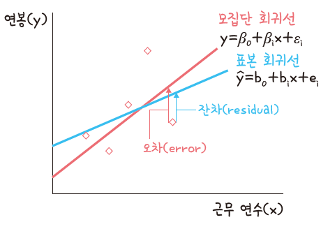

<br>

- 회귀분석 유형
  - 상관 분석 : A변수와 B변수 사이의 선형 관계
  - 단순선형 회귀분석 : 독립변수와 종속 변수의 인과관계
  - 다중선형 회귀분석 : 독립변수 A, B, C 와 종속 변수의 인과관계

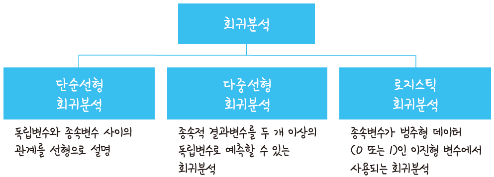

<br>

#### 선형함수와 비선형함수

- 선형함수
  - 회귀계수(regression coefficient) : 선형 결합으로 표현할 수 있는 모델
  - 즉, 독립변수가 일차식인지, 이차식인지, 로그함수인지가 중요한 것이 아니라 추정할 대상인 파라미터가 어떻게 생겼느냐의 문제
  - 회귀계수 `a`를 기준으로 생각

$$
y = a_0 + a_1x_1 +a_2x_1^3 + ...
$$

- 비선형함수
  - 파라미터를 선형 결합식으로 표현할 수 없는 모델

$$
y = \frac{a_2x_1}{a_1+x_2}
$$

- 로지스틱 회귀 모델의 식 자체는 비선형이지만, 로그 변환으로 계수가 선형적인 성질을 갖도록 하기 때문에 일반화된 선형 모델
  - 종속변수가 범주형일 때만 사용 가능

<br>

<br>

### 최소제곱법

- 최소제곱법 (Least Square Method, LSM)
  - 수치 해석, 회귀분석처럼 자료 사이에서 패턴을 도출할 때 사용함
  - 오차(실제 관측 값 - 예측 값, 잔차) 제곱의 합(Residual Sum of Squares, RSS)이 최소가 되는 해를 미분으로 찾음

$$
\varepsilon_1^2 + \varepsilon_2^2 + \varepsilon_3^2 + ... + \varepsilon_n^2\\
LS\ min\sum_{i=1}^6  \varepsilon _i^2 =  \varepsilon_1^2 + \varepsilon_2^2 + ...+ \varepsilon_6^2
$$

<br>

<br>

### 통계적 가설 검정

- 통계적 추론
  - 표본에서 미지의 모수에 대한 특성을 추정하고 가설을 검증하는 도구로 통계를 사용함
- 통계적 가설 검정 절차
  - statistical hypothesis test
  - 모집단의 실제 관측 값이 어느 정도일 것이라는 가설에 근거하여 표본 정보를 사용해서 가설의 합당성 여부를 판정하는 과정
  - 해당 가설과 관찰 값이 일치한다면 기본 가설을 기각하지 않고, 가설과 관찰값이 불일치한다면 기본 가설을 기각함

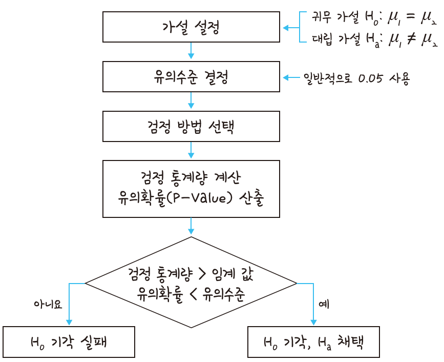

<br>

#### 가설 설정

- 가설을 설정하지 않는다면 모델(알고리즘)이 완성되고, 분석을 완료하더라도 유의미한 데이터인지 판단할 수 없기 때문에 가설 설정은 매우 중요함
- `H0` : 귀무 가설 - 입증하고자 하는 가설 (같다, 차이가 없다)
- `H1` : 대립 가설 - 귀무 가설과 대립되는 가설 (다르다, 차이가 있다)

<br>

- 귀무 가설
  - 귀무 가설 `H0, null hypothesis`
  -  입증하고자 하는 가설, 증명하고 싶은 가설
  - '~와 차이가 없다', '~의 효과는 없다', '~와 같다'

<br>

- 대립 가설
  - 대립 가설 `H1, alternative, hypothesis`
  - '다르다', '~와 차이가 있다', '~의 효과는 있다', '~와 다르다'

<br>

- 오류의 종류
  - 1종 오류 : '귀무 가설이 참인데도 귀무 가설을 기각하는 오류'
    - 실제로 효과가 없는데도 효과가 있다고 하는 것
  - 2종 오류 : '대립 가설이 참인데도 대립 가설을 기각하는 오류'
    - 실제로 효과가 있는데 효과가 없다고 하는 것

| 검정 결과 | H0 (귀무 가설)이 참                  | H0 (귀무 가설)이 거짓                          |
| --------- | ------------------------------------ | ---------------------------------------------- |
| 채택      | 참, 확률 = 1-a                       | 거짓(제2종 오류), 확률 = $\beta$($\beta$ 위험) |
| 기각      | 거짓(제1종 오류), 확률 = a(유의수준) | 참, 확률 = 1-$\beta$                           |


- 1종 오류가 2종 오류 보다 더 위험함
  - 기존의 명제, 귀무가설에 대해 반대의 가설이 맞다고 판단하기 때문
  - 실제로 효과가 없는데도 효과가 있다고 판단 >> 손해 발생 가능성 높음

<br>

#### 유의수준 결정

- 유의수준
  - 유의수준(알파(α)) : 가설 검정에서 귀무 가설을 기각시키고 대립 가설을 채택할 확률 
  - 유의수준은 표본에서 구한 통계량 값을 귀무 가설이 옳다는 전제하에서 어느정도로 얻기 힘든 값인지를 나타내는 확률수준을 의미
  - 유의수준(α)을 0.05로 정했을 때 계산된 유의확률(P-Value)이 0.05보다 적게 나와야 실험자는 귀무 가설을 기각하고 자신이 주장하고자 했던 대립 가설을 채택할 수 있음
  - 유의수준 : 0.05 (alpha : 5%)
  - 유의수준(p-value) >= 0.05(alpha) : 귀무 가설 채택
  - 유의확률 < 0.05 : 대립 가설 채택


<br>

<br>

#### 신뢰구간과 신뢰수준

- 신뢰구간
  - 모수가 포함될 것이라고 예상되는 구간, 모수가 어느 범위 안에 있는지를 확률적으로 보여 주는 방법
  - 95%의 신뢰수준으로 평균이 μ ± a 다.
  - 95%의 신뢰구간 안에 모집단(조사 대상)의 평균이 있다는 의미


#### 검정 방법 선택

- 가설 검정 : 표본 정보를 사용해서 가설의 합당성 여부를 판정
- 귀무 가설을 기각 여부를 결정하는 기준 : 기각역, 임계(threshold)

- 양측 검정
  - 귀무 가설을 기각하는 영역(기각역)이 양쪽에 있는 검정
  - '대립 가설이 아니다(크거나 작다)'라면 양측 검정(two-sided test)
- 단측 검정
  - 귀무 가설을 기각하는 영역(기각역)이 한쪽 끝에 있는 검정
  - '대립 가설이 ~보다 작다', '대립 가설이 ~보다 크다' >> 단측 검정(one-sided test)
  - 대립 가설의 주장이 방향성을 가지면 단측검정
  - 방향성을 갖지 않으면 양측 검정
- 우측 검정
  - 단측 검정, 귀무 가설을 기각하는 영역(기각역)이 오른쪽에 있는 검정
  - "대립 가설이 ~보다 크다"
- 좌측 검정
  - 단측 검정 중, 귀무 가설을 기각하는 영역(기각역)이 왼쪽에 있는 검정
  - "대립 가설이 ~보다 작다"


- 검정 통계량 계산(표본 추출)

| 가설 검정     | 검정 통계량     |
| ------------- | --------------- |
| z-검정        | z-통계량        |
| t-검정        | t-통계량        |
| 분산 분석     | F-통계량        |
| 카이제곱 검정 | 카이제곱 통계량 |


- 통계적 가설 검정
  - 모집단 분산(표준편차)을 알고 있다면 >> `z-검정`
    - 모집단 평균의 차이를 검정하는 용도
    - 표본 크기 큼(30개 이상)
  - 모집단 표준편차를 모를 때 >> `t-검정`
    - 두 집단 간 평균을 비교하는 검정 용도
    - 표본 크기 작음(30개 이하)
  - 대부분 t-검정
  - 1) 표본에 대해 t-검정 통계량 값 계산
    2) 값이 t-분포 그래프의 양 끝에 속할수록 모집단과 평균이 다르다는 것을 보여줌
    3) 지정한 유의확률(%)을 사용하여 유의 값을 선정하고 검정함


- 검정 통계량

- $$
  검정 통계량 = \frac{표본평균 - 모평균}{표본표준편차}
  $$

- 자유도

  - x값이 가질 수 있는 값의 범위를 의미
  - 자유도가 주어지지 않는다면 자유도 = 표본 수(n) - 1

<br>

#### 통계적 가설 검정 python

- `np.random.normal()` 정규분포
- t검정 : `scipy.stats`의 `ttest_1samp` 메서드 사용

```python
# 대한민국 20세 이상 남성 평균 키 : 173cm
# 귀무가설 : 멀티캠퍼스 남학생의 평균 키는 173cm이다
# 대립가설 : 멀티캠퍼스 남학생의 평균 키는 173cm 아니다

# 통계적 가설 검정
import numpy as np
from scipy import stats

# 난수 발생을 위한 시드(seed) 1을 줍니다(코드를 실행할 때마다 똑같은 난수 생성)
np.random.seed(1)

# 평균 178, 표준편차 5로 임의의 높이 20개를 생성
heights = [178 + np.random.normal(0,5) for _ in range(20)]

# t-검정 수행
tTestResult = stats.ttest_1samp(heights, 173)

# 결과 출력
print("The T-statistic is %.3f and the p-value is %3.f" % tTestResult)

# 결과해석
# p_value가 0.00004 < 0.05(alpha, 유의수준)보다 작으므로 귀무가설 기각, 대립가설 채택
# 즉, 멀티캠퍼스 남학생의 평균은 178(표준편차=5)은 대한민국 20세 이상 남학생 키 평균과 차이가 있다.
```

<br>

<br>

### 성능평가

####  혼동행렬

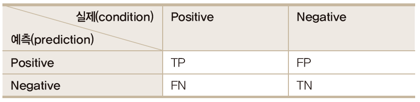

- TP(True Positive): 맞는 것을 맞다고 예측한 것
- TN(True Negative): 아닌 것을 틀리다고 예측한 것
- FP(False Positive): 아닌 것을 맞다고 예측한 것
- FN(False Negative): 맞는 것을 틀리다고 예측한 것

<br>

#### 성능 평가

- 정밀도 : 암환자로 예측한 사람 중에 진짜 암환자로 결과가 나온 사람의 비율

$$
정밀도(Precision) = \frac{TP}{TP+FP}
$$

- 재현율 : 진짜 암환자 중에 진단 결과 암환자라고 나온 사람의 비율

$$
재현율(Recall) = \frac{TP}{TP+FN}
$$

- 정확도 : 전체 암환자 중에 암환자라고 나온 사람의 비율

$$
정확도(Accuracy) = \frac{TP+TN}{TP+FP+TN+FN}
$$

- F1 스코어
  - 정밀도와 재현율의 조화평균

$$
F_1 = 2*\frac{정밀도X재현율}{정밀도+재현율}
$$

#### 혼동행렬 python

- `conf usion_matrix(y,p)` 
  - `[2 0]` `[2 2]` : 첫 행 실제로 0인 데이터 두 개를 정확하게 0으로 예측했다는 의미

```python
import numpy as np
import sklearn.metrics as metrics

# 0 : 정상(암 없음)  1 : 암환자
y = np.array([1,1,1,1,0,0])  # 실제 관측값
p = np.array([1,1,1,0,0,0])  # 예측 값

# 정확도, 정밀도, 재현율, f1 score
# 정확도
print('accuracy:',metrics.accuracy_score(y,p))
# 정확도는 0.83 (83%)

# 정밀도
print('precision', metrics.precision_score(y,p))
# 정밀도는 1.0 (100%)

# 재현율
print('recall', metrics.recall_score(y,p))
# 재현율은 0.75 (75%)

# f1-score
print('f1', metrics.f1_score(y,p))
# f1-score는 0.857 (86%)

# 정확도, 정밀도 재현율, f1-score 한 번에 출력(****)
print(metrics.classification_report(y,p))
print(metrics.confusion_matrix(y,p))

# acc
(2+3) / (2+0+1+3)

# precision (기준 : predict >> True)
2/2

# recall (기준 : actual >> True)
2 / (1+3)
```

<br>

<br>

#### ROC 커브

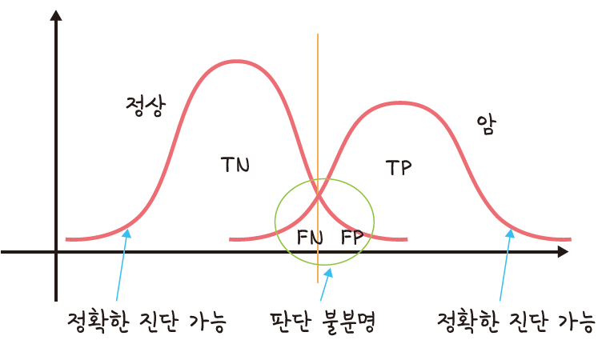

- 판단 불분명 구간을 최소화한 것이 ROC  커브
- ROC 커브의 y축 : 민감도(TPR, True Positive Rate)
- x축 : 특이도(FPR, False Positive Rate)
- 아래 면적 : AUC(Area Under the Curve), AUC 면적이 넓을수록 좋은 커브
- 민감도 : 맞는 것을 맞다고 예측
- 특이도 : 틀린 것을 틀리다고 예측
- AUC : 그래프 아래 면적, 계산 결과를 수치화하여 성능을 간단히 비교할 수 있음

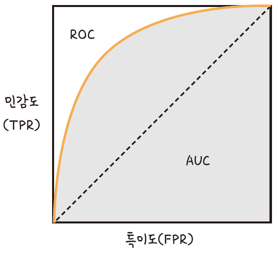


#### ROC커브 pyton

- ROC Curve

  - 특이도 (x축, False Positive Rate : FPR) : 틀_린 것을 틀_렸다고 예측하는 것 (틀틀틀 >> x)

  - 민감도 (y축, 재현율, True Positive Rate : TPR) : 맞_은 것을 맞_다고 예측  (민맞맞 >> y)

```python
import numpy as np
import pandas as pd
import matplotlib.pyplot as plt
import seaborn as sns

from sklearn.datasets import make_classification
from sklearn.neighbors import KNeighborsClassifier
from sklearn.ensemble import RandomForestClassifier
from sklearn.model_selection import train_test_split
from sklearn.metrics import roc_curve
from sklearn.metrics import roc_auc_score

# roc curve 함수 정의
def plot_roc_curve(fpr, tpr):
    plt.plot(fpr, tpr, color='orange', label='ROC')
    plt.plot([0,1],[0,1], color='darkblue', linestyle='--')
    plt.xlabel('False Positive Rate(특이도)')
    plt.ylabel('True Positive Rate(민감도)')
    plt.title('Receiver Operating Characteristic (ROC) Curve')
    plt.legend()
    plt.show()
    
# 샘플 데이터 1000건 생성
data_X, class_label = make_classification(n_samples=1000, n_classes=2,
                                         weights=[1,1], random_state=42)
train_X, test_X, train_y, test_y= train_test_split(data_X, class_label,
                                                   test_size=0.3, random_state=42)

# 모델링(학습 데이터를 앙상블 모형 중 랜덤포레스트 모델에 적용)

model = RandomForestClassifier()
model.fit(train_X, train_y)
# fit : 모델을 학습하기 적합하게 만들어 >> 모델 생성
# 반드시 모델 구축시에는 train data 사용해야 함

# 예측 값(확률) >> test data로 예측

probs = model.predict_proba(test_X)
# probs

# positive class만 유지하고자 함

probs = probs[:,1]
# 행(데이터 레코드) 다 가져오고 class가 1(positive)인 것만 추출

# AUC (Area Under Curve)
auc = roc_auc_score(test_y, probs)
# test data (실제 데이터)와 예측 데이터(probs)의 비교
# auc

# ROC 곡선 확보
fpr, tpr, tresholds = roc_curve(test_y, probs)

# 정의된 함수를 사용하여 ROC 곡선 생성
fpr, tpr, tresholds = roc_curve(test_y, probs)
plot_roc_curve(fpr, tpr)
```

roc curve를 그림그려 fpr특이도 tpr: 민감도 재현도

하나는 data고, 하나는 class_label (0,1)

train은 7:3

예측은 test data로 해야된다

probs에서 데이터 다가지고 오고, labeling이 postive 1

실제 데이타 testy 예측한 probs를 roc 커브의 auc 계산

특이도 fpr x축,  y축 민감도 tpr 로 treshold로 만들어서

정의하고 roccruve를 만듦
