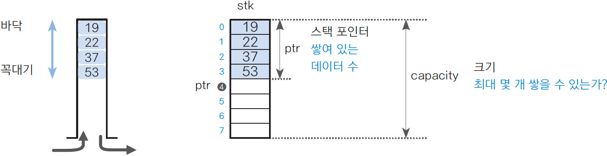

# ALGORITHM_doit_04 스택과 큐1

<Doit! 자료구조와 함께 배우는 알고리즘 입문 파이썬편> 공부중입니다.


## 04-1 스택이란?

### 스택 알아보기

* 스택<sup>stack</sup>
  * 데이터를 임시 저장할 때 사용하는 구조
  * 데이터 입력과 출력 순서는 후입선출<sup>LIFO</sup>방식  (=선입후출<sup>FILO</sup>)
  * 
  * 푸시(push) : 스택에 데이터를 넣는 작업
  * 팝(pop) : 스택에서 데이터를 꺼내는 작업
  * 꼭대기(top) : 푸시하고 팝하는 윗부분
  * 바닥(bottom) : 푸시하고 팝하는 아랫부분


### 스택 구현하기1

* 스택 배열 : stk
  * 푸시한 데이터를 저장하는 스택 본체인 list형 배열
  * 인덱스가 0인 원소를 스택의 바닥이라고 함
  * 가장 먼저 푸시하여 데이터를 저장하는 곳은 stk[0]
* 스택 크기 : capacity
  * 스택의 최대 크기를 나타내는 int형 정수
  * 이 값은 배열 stk의 원소 수인 len(stk)와 일치
* 스택 포인터 : ptr
  * 스택 포인터(stack pointer) : 스택에 쌓여 있는 데이터의 개수를 나타내는 정숫값
  * 스택이 비어 있으면 ptr의 값은 0이 되고, 가득 차 있으면 capacity와 같은 값


### 스택 구현하기2

```Python
# 고정 길이 스택 클래스 FixedStack 구현하기

from typing import Any

class FixedStack:
    '''고정 길이 스택 클래스'''
    
    class Empty(Exception):
        '''비어 있는 FixedStack에 팝 또는 피크할 때 내보내는 예외 처리'''
        pass
    
    clas Full(Exception):
        '''가득 찬 FixedStack에 푸시할 때 내보내는 예외 처리'''
        pass
    
    def __init__(self, capacity: int=256) -> None:
        '''스택 초기화'''
        self.stk = [None] * capacity   # 스택 본체 >> capacity 개수만큼 None이 있음
        self.capacity = capacity       # 스택의 (최대) 크기
        self.ptr = 0				   # 스택 포인터 (스텍에 쌓여 있는 데이터 개수)
```

* `Empty` : 예외 처리 클래스
  * pop() 함수 또는 peek() 함수를 호출할 때 스택이 비어 있으면 내보내는 예외 처리
* `Full` : 예외 처리 클래스
  * push() 함수를 호출할 때 스택이 가득 차 있으면 내보내는 예외 처리
* `__init__()` : 초기화하는 함수
  * 스택 배열을 생성하는 등의 준비 작업을 수행
  * 매개변수 capacity로 전달 받아 원소 수가 capacity이고 모든 원소가 None인 리스트형 stk를 생성
  * 스택이 비어 있으므로 스택 포인터 ptr는 0


```python
def __len__(self) -> int:
    '''스택에 쌓여 있는 데이터 개수를 반환'''
    return self.ptr

def is_empty(self) -> bool:
    '''스택이 비어 있는지 판단'''
    return self.ptr <= 0

def is_full(self) -> bool:
    '''스택이 가득 차 있는지 판단'''
    return self.ptr -> self.capacity
```

* `__len__()` : 쌓여 있는 데이터 개수를 알아내는 함수
  * 스택에 쌓여있는 데이터 개수 반환(ptr값 반환) 

* `is_empty()` : 스택이 비어 있는지를 판단하는 함수
  * 데이터가 하나도 쌓여 있지 않은 상태, 즉 스택이 비어 있는지 판단
  * `self.ptr`이 0보다 작거나 같은지 판단
  * 스택이 비어 있으면 True, 아니면 False 반환
* `is_full()` : 스택이 가득 차 있는지를 판단하는 함수
  * 더 이상 데이터를 푸시할 수 없는 상태, 즉 스택이 가득 차 있는지 판단
  * `self.ptr`이 `self.capacity`로 변환 되는지(같은 값인지) 판단
  * ptr == capacity 이면 full인 상태
  * 스택이 가득 차 있으면 True, 아니면 False 반환


```python
def push(self, value: Any) -> None:  # 스택에 value를 푸시(데이터를 넣음)
    '''스택에 value를 푸시(데이터를 넣음)'''
    if self.is_full():               # 스택이 가득 차 있는 경우
        raise FixedStack.Full        # 예외 처리 발생
    self.stk[self.ptr] = value
    self.ptr += 1
```

* `raise + 예외처리 이름` : 이미 파이썬에서 에러로 사용하고 있는 키워드를 넣을 수 있음
* `push()` : 데이터를 푸시하는 함수
  * 스택에 데이터를 추가
  * 스택이 가득 차서 더 이상 푸시할 수 없는 경우에는 FixedStack.Full을 통하여 예외 처리를 내보냄
  * Class FixedStack class Full >> pass
  * `self.stk`의 `self.ptr` 위치에 value값 반환
  * `self.ptr`를 다음으로 이동 (+1)


```python
def pop(self) -> Any:                # 스택에서 데이터를 팝(꼭대기 데이터를 꺼냄)
    '''스택에서 데이터를 팝(꼭대기 데이터를 꺼냄)'''
    if self.is_empty():              # 스택이 비어 있는 경우
        raise FixedStack.Empty       # 예외 처리 발생
    self.ptr -= 1
    return self.stk[self.ptr]
```

* `pop()` : 데이터를 팝하는 함수
  * 스택의 꼭대기에서 데이터를 꺼내서 그 값을 반환
  * 스택이 비어서 팝할 수 없는 경우에는 FixedStack.Empty를 통하여 예외 처리를 내보냄
  * Class FixedStack class Empty >> pass
  * `self.ptr`를 한 칸 전으로 이동
  * `self.stk`의 `self.ptr`위치의 value값 반환
  * -> 마지막 값이 반환


```python
def peek(self) -> Any:
    '''스택에서 데이터를 피크(꼭대기 데이터를 들여다봄)'''
    if self.is_empty():
        raise FixedStack.Empty
    return self.stk[self.ptr - 1]
```

* `peek()` : 데이터를 들여다 보는 함수
  * 스택의 꼭대기 데이터를 들여다 봄
  * 스택이 비어 있는 경우에는 FixedStack.Empty를 통하여 예외처리를 내보냄
  * 데이터의 입출력이 없으므로 스택 포인터는 반환하지 않음
  * `self.stk`의 `sel.ptr`의 -1 값 반환
  * 밑의 사진에서 ptr이 4번 위치라면 그 전의 3번 위치를 봐야 하므로 ptr -1




```python
def clear(self) -> None:
    '''스택을 비움(모든 데이터를 삭제)'''
    self.ptr = 0
```

* `clear()` : 스택의 모든 데이터를 삭제하는 함수
  * 스택에 쌓여 있는 데이터를 모두 삭제하여 빈 스택을 만듦
  * 스택 포인터 ptr값을 0으로 하면 끝!


```python
def fine(self, value: Any) -> Any:
    '''스택에서 value를 찾아 인덱스를 반환(없으면 -1을 반환)'''
    for i in range(self.ptr -1, -1, -1):   # 꼭대기 쪽부터 선형 검색
        if self.stk[i] == value:
            return i                       # 검색 성공
    return -1                              # 검색 실패
```

* `find()` : 데이터를 검색하는 함수
  * 스택 본체의 배열 stk 안에 value와 값이 같은 데이터가 포함되어 있는지 확인하고,
  * 포함되어 있다면 배열의 어디에 들어 있는지 검색
  * `self.ptr`-1 위치 부터 위치 0까지 거꾸로 탐색
  * `self.stk[i]` == value >> i 값 (배열 위치) 반환
  * 포함된 값이 없다면 -1 반환


```python
def count(self, value: Any) -> bool:
    '''스택에 있는 value의 개수를 반환'''
    c = 0
    for i in range(self.ptr):      # 바닥 쪽부터 선형 검색
        if self.stk[i] == value:   # 검색 성공
            c += 1
    return c
```

* `count()` : 데이터 개수를 세는 함수
  * 스택에 쌓여 있는 데이터(value)의 개수 반환
  * `self.stk[i]` == value >> c를 +1 해줌 >> 최종 c 값 반환


```python
def __contains__(self, value: Any) -> bool:
    '''스택에 value가 있는지 판단'''
    return self.count(value)

def dump(self) -> None:
    '''덤프(스택 안의 모든 데이터를 바닥부터 꼭대기 순으로 출력)'''
    if self.is_empty():      # 스택이 비어 있음
        print('스택이 비어 있습니다.')
    else:
        print('self.stk[:self.ptr]')
```

* `__contains__()` : 데이터가 포함되어 있는지 판단하는 함수
  * 스택에 데이터(value)가 있는지 판단
  * 있으면 True, 없으면 False를 반환
  * 예) 스택 s에 데이터 x가 포함되어 있는지 판단하기
  * 예) `s.__contains__(x)`
  * `self.count(value)`값 반환 >> `self.stk[i]`== x 를 만족하는 c 값 반환
* `dump()` : 스택의 모든 데이터를 출력하는 함수
  * 스택에 쌓여 있는 ptr개의 모든 데이터를 바닥부터 꼭대기까지 순서대로 출력
  * 스택이 비어 있으면 '스택이 비어 있습니다.'를 출력
  * `self.is_empty`가 아니라면 `self.stk[:self.ptr]` 출력되는데,
  * 0부터 self.ptr-1 까지 (바닥부터 꼭대기 까지) 차례로 출력


### 스택 프로그램 만들기

```python
from enum import Enum


Menu = Enum('Menu', ['push', 'pop', 'peek', 'find', 'dump', 'clear', 'exit'])#열거형 자료형으로 변환


def select_menu() -> Menu:
    s = [f'({m.value}){m.name}' for m in Menu]#['(1)push', '(2)pop', '(3)peek', '(4)find', '(5)dump', '(6)clear', '(7)exit']
    while True:
        print(*s, sep = '   ', end='') #s의 모든 값을 '  '띄우고 끝을 붙혀준다 
        n = int(input(': '))           # input을 받아준 후 int로 변환해 준다
        if 1 <= n <= len(Menu):        # 입력받은 값이 1~ 메뉴의 길이 (7) 사이의 값이라면 Menu(그숫자)를 리턴  
            return Menu(n)
        else:
            print()
            print('다시 입력하세요.(1~7사이)')
        
s = FixedStack(64)

while True:
    print()
    print('ㅡ'*20)
    print(f'현재 데이터 개수: {len(s)} / {s.capacity}') #s현재길이/s의 용량크기
    menu = select_menu() #menu를 받아온다
 

    if menu == Menu.push:
        x = int(input('데이터를 입력하세요.: '))
        try:
            s.push(x)
        except FixedStack.Full:
            print('스택이 가득 차 있습니다.')
    
    elif menu == Menu.pop:
        try:
            x = s.pop()
            print(f'팝한 데이터는 {x}입니다.')
        except FixedStack.Empty:
            print('스택이 비어있습니다.')

    elif menu == Menu.peek:# 스택의 꼭대기의 데이터를 출력
        try:
            x = s.peek()
            print(f'피크한 데이터는 {x}입니다.')
        except FixedStack.Empty:
            print('스택이 비어있습니다.')

    elif menu == Menu.find:
        x = int(input('검색할 데이터를 입력하세요.: '))
        if x in s:
            print(f'{s.count(x)}개 포함되고, 맨 앞의 위치는 {s.find(x)}입니다.')
        else:
            print('검색한 값을 찾을 수 없습니다.')

    elif menu == Menu.dump:#전부출력
        s.dump()

    elif menu == Menu.clear:#전부비우기
        s.clear()

    else:
        break
```

