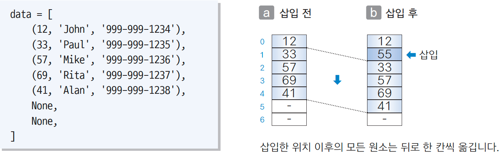
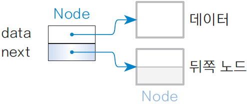
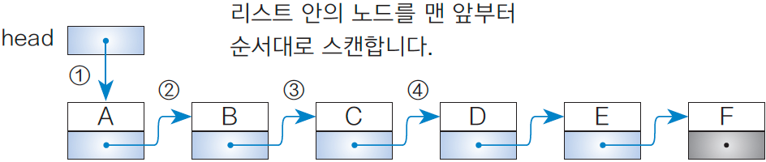
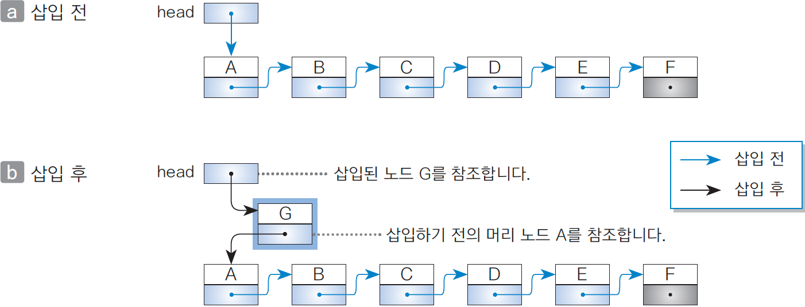
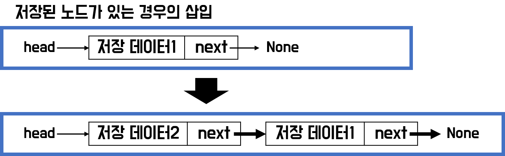
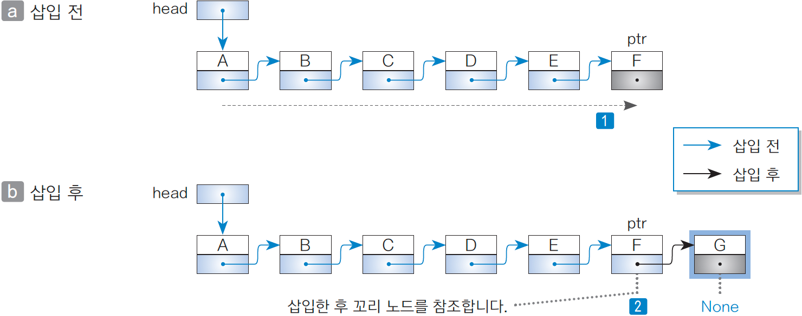

# ALGORITHM_doit_08 리스트1

<Doit! 자료구조와 함께 배우는 알고리즘 입문 파이썬편> 공부중입니다.


## 08-1 연결 리스트

### 연결 리스트 알아보기

* 리스트(list)
  * 데이터에 순서를 매겨 늘어놓은 자료 구조
  * 선형 리스트(linear list) 또는 연결 리스트(linked list)는 구조가 단순한 리스트
  * 리스트는 순서가 있는 데이터를 나열한 구조
  * (리스트에는 노드가 value로서 구현되어 있음)
* 연결 리스트(linked list)
  * 노드(node)
    * 각각의 원소(element)
    * 데이터와 뒤쪽 노드를 가리키는(참조하는) 포인터(pointer)를 가짐
  * 맨 앞에 있는 노들르 머리 노드(head node), 맨 끝 노드를 꼬리(tail node)라고 함
  * 각 노드에서 바로 앞에 있는 노드를 앞쪽 노드(predecessor node), 바로 뒤에 있는 노드를 뒤쪽 노드(successor node)라고 함


### 배열로 연결 리스트 만들기

* 배열 리스트와 연결 리스트 차이
* 배열리스트
  * 배열과는 다르게 사이즈 변경이 가능하여 데이터 삽입 및 삭제가 가능
  * 구조는 배열처럼 따닥 붙어있어서 너무 크면 메모리 할당이 힘들 수 있다.
  * 따닥 붙어있는데 삽입 삭제는 가능한 구조다보니 다차원을 구현할 수 없다.


* 연결리스트
  * 속도는 배열리스트보다는 느리지만, 삽입 삭제 등의 연산과 다차원 구조가 가능
  * 필요한 메모리를 띄엄띄엄 둘 수 있어서 메모리 할당의 어려움도 없다.
  * 데이터의 삽입 삭제 연산이 잦고, 크기의 유동 폭이 큰 경우에는 이 연결리스트를 사용


* 연결 리스트 구현 예
  * 회원 번호, 이름, 전화번호가 있는 리스트에서 '55'번 회원을 삽입하는 경우




* 어떤 회원 그룹의 데이터를 나타내는 튜플
  * int형 회원 번호
  * str형 이름, 전화번호
* 뒤쪽 노드 꺼내기
  * 배열의 각 원소에는 연락할 순서대로 데이터 저장됨
  * 연락하는 데 필요한 '뒤쪽 노드 꺼내기'는 인덱스 값이 1만큼 큰 원소에 접근 하여 얻을 수 있음
* 노드의 삽입과 삭제
  * 예) 회원 번호가 55인 회원이 새로 가입하여 그 데이터를 회원 번호와 12와 33사이에 삽입해야 한다면?
  * 삽입한 원소 이후의 모든 원소가 하나씩 뒤로 이동해야 함(삭제하는 경우에도 배열 안의 일부 원소를 모두 이동해야 함)
  * 데이터를 삽입, 삭제함에 따라 데이터를 옮겨야 하므로 효율적이지 않음


## 8-2 포인터를 이용한 연결 리스트

### 포인터로 연결 리스트 만들기

* 자기 참조(slef-referential)
  * 자신과 같은 형의 인스턴스를 참조하는 필드가 있는 구조
  * Node 클래스는 데이터용 필드 data와는 별도로 자신과 같은 클래스형의 인스턴스를 참조하기 위한 참조용 필드 next를 가짐




* data : 데이터에 대한 참조 (저장 데이터)
* next : 노드에 대한 참조 (뒤쪽 노드가 없는 꼬리 노드는 뒤쪽 포인터 값이 None)
* ​           다음 노드와 떨어져 있어서 뒤에 연결된 노드를 가르켜줄 변수


### 실습1 Node

```python
# 포인터로 연결 리스트 구현하기

from __future__ import annotations
from typing import Any, Type

class Node:
    '''연결 리스트용 노드 클래스'''
    
    def __init__(self, data: Any = None, next: Node = None):
        '''초기화'''
        self.data = data   # 데이터
        self.next = next   # 뒤쪽 포인터
```

* 필드
  * `data` : 데이터 (데이터에 대한 참조 : 임의의 형)
  * `next` : 뒤쪽 포인터 (뒤쪽 노드에 대한 참조 : Node 형)
* `__init()__` : 초기화하는 함수
  * 전달 받은 data와 next를 해당 피드에 대입
  * __는 변수 은닉화


```python
class Linkedlist:
    '''연결 리스트 클래스'''
    
    def __init__(self) -> None:
        '''초기화'''
        self.no = 0          # 노드의 개수
        self.head = None     # 머리 노드
        self.current = None  # 주목 노드
        
    def __len__(self) -> int:
        '''연결 리스트의 노드 개수를 반환'''
        return self.no
```

* 필드
  * `no` : 리스트에 등록되어 있는 노드의 개수
  * `head` : 머리 노드에 대한 참조
  * `current`
    *  현재 주목하고 있는 노드에 대한 참조 (주목 포인터)
    * 리스트에서 노드를 검색하여, 그 노드를 주목한 직후에 노드를 삭제하는 등의 용도
* `__init__()` : 초기화하는 함수
  * 노드가 하나도 없는 빈 연결 리스트 생성
  * head >> None(노드를 참조하지 않음)
* `__len__()` : 노드 개수를 반환하는 함수
  * 연결 리스트의 노드 개수를 반환하는 함수(no값)


### 연결 리스트 길이 구하기

* 빈 연결 리스트
  * 연결 리스트가 비어 있을(노드가 하나도 존재하지 않을 때 head값은 None)

```python
head is None  # 연결 리스트가 비어 있는지 확인
```

* 노드가 1개인 연결 리스트
  * Node형 필드인 head가 참조하는 곳은 머리 노드 A
  * A는 꼬리 노드이기도 하므로 뒤쪽 포인터의 값은 None

```python
head.next is None # 연결 리스트 노드가 1개인지 확인
```

* 노드가 2개인 연결 리스트
  * 머리 노드 A, 꼬리 노드 B

```python
head.next.next is None  # 연결 리스트의 노드가 2개인지 확인
```

* 꼬리 노드의 판단
  * Node형인 변수 p가 리스트에 있는 노드를 참조할 때, p의 next가 None이면 p는 꼬리 노드

```python
p.next is None  # p가 참조하는 노드가 꼬리 노드인지 확인
```


### 실습2 search()

```python
def search(self, data: Any) -> int:
    '''data와 값이 같은 노드를 검색'''
    cnt = 0    # 몇 번째 노드인지 기록
    ptr = self.head   # 처음은 head를 지정. 이후부터는 현 노드의 next를 지정
    while ptr is not None:  
        # ptr이 다음으로 넘어갈 수 없을 때 까지(>>꼬리 노드일 때까지)
        # 내가 찾는 노드인지 확인
        if ptr.data == data: 
            self.current = ptr   # 주목 노드 = ptr
            return cnt
        cnt += 1
        ptr = ptr.next
    # 여기까지 왔다 == 해당 data값을 가진 노드가 없다.
    return -1

def __contains__(self, data: Any) -> bool:
    '''연결 리스트에 data가 포함되어 있는지 확인'''
    return self.search(data0) >= 0
```

* `search()` : 검색을 수행하는 함수

  * 인수로 주어진 데이터 data와 값이 같은 노드를 검색하는 함수
  * 검색 알고리즘은 선형 검색 사용 (목적 노드를 만날 때까지 머리 노드부터 순서대로 스캔)
  * `cnt` = 0 으로 초기화 해주고, 몇 번째 노드인지 기록할 변수
  * `ptr` = self.head 로 포인터 처음은 head로 지정하고, 이후부터는 현 노드의 next를 지정하는 포인터 변수
  * `ptr` 는 노드의 next를 지정하는 변수이므로 노드의 next가 비어 있지 않다면 while문을 도는데 선형 검색으로 목적 노드를 만날 때 까지 머리 노드부터 순서대로 스캔

  ​       ptr is not None  >> 꼬리 노드일 때까지

  * (종료조건1) ptr로 지정한 노드의 data가 내가 찾는 data라면 주목 노드로 설정하고 ptr로 재지정하고, `cnt`로 몇 번 째 노드인지 반환
  * 내가 찾는 노드가 없다면 cnt(위치값)을 1씩 증가하고, 포인터를 현 위치 노드의 next로 지정해줌, while문을 계속 돌다가 끝까지 돌아도 없다면
  * 즉, 검색 조건을 만족하는 노드를 발견하지 못하고 꼬리 노드에 도달한다면, -1을 반환

  * 예) 연결 리스트에서 노드 D를 선형 검색하는 과정
  * 1. ptr = head = A
    2. ptr = ptr.next = B
    3. ptr = ptr.next = C
    4. ...
    5. if ptr.data == data >> D를 만나면 cnt 3? 반환



* 검색 종료 조건
  * 종료 조건 1 : 검색 조건을 만족하는 노드를 발견하지 못하고 꼬리 노드에 도달
  * 종료 조건 2 : 검색 조건을 만족하는 노드 발견
* `__containes__()` : 데이터 포함 여부를 판단하는 함수
  * 리스트에 data와 값이 같은 노드가 포함되어 있는지를 판단하는 함수
  * 포함되어 있으면 True, 그렇지 않으면 False 반환
  * `self.search(data)` 의 값이 cnt인데 0보다 같거나 크다면 True 없다면 -1이므로 False


### 실습3 add_first()

```python
def add_first(self, data: Any) -> None:
    '''맨 앞에 노드를 삽입'''
    ptr = self.head  # 삽입하는 전의 머리 노드
    self.head = self.current = Node(data, ptr)
    self.no += 1
```

* `add_first()` :머리에 노드를 삽입하는 함수
  * 리스트의 맨 앞에 노드를 삽입하는 함수
  * 삽입하기 전에 머리 노드 A를 참조하는 포인터를 ptr에 저장하고, 삽입할 노드 G 생성
  * 기존 노드는 밀려나는 식으로 새로운 노드가 들어옴
  * 1. ptr을 self.head로 찍어주고
    2. self.head값을 주목 노드로 설정해 주고 연결 리스트용 노드를 넣어줌
    3. 기존 head에 저장된 노드는 새로 생성할 노드의 next로 저장
  * G는 ptr을 참조하고 head는 G를 참조하도록 업데이트






### 실습4 add_last()

```python
def add_last(self, data: Any):
    '''맨 끝에 노드를 삽입'''
    if self.head is None:  # 리스트가 비어 있다면
        self.add_first(data)  # 맨 앞에 노드를 삽입
    else:
        ptr = self.head
        while ptr.next is not None:
            ptr = ptr.next
        ptr.next = self.current = Node(data, None)
        self.no += 1
```

* `add_last()` : 꼬리에 노드를 삽입하는 함수

  * 리스트의 맨 끝에 노드를 삽입하는 함수

  * 리스트가 비어 있을 때

    * 맨 앞에 노드를 삽입하는 것과 같음. `add_first()`함수 호출

  * 리스트가 비어 있지 않을 때

  * 1. ptr를 head로 넣고, 이후부터는 현 노드의 next로 지정
    2. ptr.next가 None이 아닐 때까지(꼬리 노드일 때 까지)
    3. ptr를 현 노드의 next로 이동 시켜주다가
    4. 끝 노드까지 도달했을 때 ptr.next를 현재 주목 노드로 설정해주고, 그 노드의 next 노드를 새 노드로 지정

    * 리스트의 맨 끝에 노드 G를 삽입




### 실습5 remove_first()

```python
def remove_first(self) -> Node:
    '머리 노드를 삭제'
    if self.head is not None: # 리스트가 비어 있지 않으면
        self.head = self.current = self.head.next
    slef.no -= 1
```

* `remove_first()` : 머리 노드를 삭제하는 함수
  * 리스트가 비어 있지 않을 때(head is not None)만 성립
  * 노드 B에 대한 참조인 head.next를 머리 노드에 대한 참조인 head에 대입함으로써 head가 참조하는 곳을 노드 B로 업데이트
  * 삭제하기 전의 머리 노드 A는 어디서도 참조되지 않음
  * self.head is not None >> 리스트가 비어 있지 않으면
  * head값을 head 노드의 next 노드로 지정
  * 그럼 삭제하기 전 head 노드는 참조되지 않기 때문에 자연스럽게 삭제됨


### 실습6 remove_last()

```python
def remove_last(self):
    '''꼬리 노드를 삭제'''
    if self.head is not None:
        if self.head.next is None:  # 노드가 1개 뿐이라면
            self.remove_first()     # 머리 노드를 삭제
        else:
            ptr = self.head   # 스캔 중인 노드
            pre = self.head   # 스캔 중인 노드의 앞쪽 노드
            
           	while ptr.next is not None:
                pre = ptr.next
                
            pre.next = None      # pre는 삭제 뒤 꼬리 노드
            self.current = pre
            self.no -= 1
```

* `remove_last()` : 꼬리 노드를 삭제하는 함수
  * 리스트가 비어 있지 않을 때만 성립
  * 리스트에 노드가 하나만 존재할 때
    * 머리 노드를 삭제하는 것이므로 remove_first() 함수 호출
  * 리스트에 노드가 2개 이상 존재할 때
    * 리스트의 맨 끝에서 노드 F 삭제
    * `ptr`을 스캔 중인 노드, `pre`를 스캔 중인 노드의 앞 노드
    * 꼬리 노드 전까지 ptr.next를 수행하다가 꼬리 노드 전 노드(E)가 pre
    * pre.next 즉 노드 F를 None 처리 해주고, 주목노드를 pre로 >> 꼬리 노드는 E


### 실습7 remove()

```python
def remove(self, p: Node) -> None:
    '''노드 p를 삭제'''
    if self.head is not None:
        if p is self.head:  # p가 머리 노드이면
            self.remove_first()  # 머리 노드를 삭제
        else:
            ptr = self.head
            
            while ptr.next is not p: # ptr.next가 p일 때까지
                ptr = ptr.next
                if ptr is None:
                    return        # ptr은 리스트에 존재하지 않음
                
            ptr.next = p.next
            self.current = ptr
            self.no -= 1
```

* `remove()` : 임의의 노드를 삭제하는 함수
  * 리스트가 비어 있지 않고 인수로 주어진 노드 p가 존재 할 때
  * p가 머리 노드일 때
    * 머리 노드를 삭제하는 것이므로 remove_first() 함수 호출
  * p가 머리 노드가 아닐 때
    * 리스트에서 p가 참조하는 노드 D를 삭제
    * `ptr` 스캔 중인 노드
    * ptr.next가 노드 p를 만족하기 전까지 ptr.next를 수행해주고
    * 만약 ptr is None 노드가 없으면 skip
    * `ptr.next`는 노드 p의 앞 노드의 next이고, 노드 `p`의 next로 설정
    * 즉, ptr이 C일 때, next를 노드 p의 next인 노드 E로 바꿔주는 것
    * 그럼 노드 p는 참조되지 않으므로 삭제


### 실습8 remove_current_node, clear, next

```python
def remove_current_node(self) -> None:
    """주목 노드를 삭제"""
    self.remove(self.current)

def clear(self) -> None:
    """전체 노드를 삭제"""
    while self.head is not None:  # 전체가 비어 있게 될 때까지
        self.remove_first()       # 머리 노드를 삭제
    self.current = None
    self.no = 0

def next(self) -> bool:
    """주목 노드를 한 칸 뒤로 진행"""
    if self.current is None or self.current.next is None:
        return False  # 진행할 수 없음
    self.current = self.current.next
    return True
```

* `remove_current_node()` : 주목 노드를 삭제하는 함수
  * 현재 주목하고 있는 노드를 삭제하는 함수
  * 주목 포인터 current를 remove() 함수에 전달하여 처리
* `clear()` : 모든 노드를 삭제하는 함수
  * 연결 리스트가 비어 있을 때까지 머리 노드의 삭제를 반복하여 모든 노드 삭제
  * 주목 노드와 노드 개수도 0으로 초기화
* `next()` : 주목 노드를 한 칸 뒤로 이동시키는 함수
  * 리스트가 비어 있지 않고 주목 노드에 뒤쪽 노드가 존재할 때만 성립
  * 주목 포인터 current를 current.next로 업데이트
  * 주목 노드를 이동시키면 True, 그렇지 않으면 False 반환
  * 주목 노드가 None이거나 주목노드의 next 노드가 None이면 False


### 실습9 print()

```python
def print_current_node(self) -> None:
    """주목 노드를 출력"""
    if self.current is None:
        print('주목 노드가 존재하지 않습니다.')
    else:
        print(self.current.data)

def print(self):
    # 데이터가 없을 때
    if self.head is None:
        print('저장된 데이터가 없음')
        return
    else:
        print('<현재 리스트 구조>', end = '\t')  
        ptr = self.head  # 처음은 head, 이후부터는 현 노드의 next를 지정
            
        while ptr.next is not None:
            print(ptr.data, '->', end=' ')
            ptr = ptr.next  # ptr를 현 위치 노드의 next로 변경
        print(ptr.data)
```

* `print_current_node()` : 주목 노드를 출력하는 함수
  * 주목 포인터 current가 참조하는 곳의 노드 데이터인 current.data를 출력
  * 주목 노드가 존재하지 않는 경우에는 '주목 노드가 존재하지 않습니다.'출력
* `print()` : 모든 노드를 출력하는 함수
  * 리스트 순서대로 모든 노드의 데이터를 출력하는 함수


### 실습10 LinkedListIterator

```python
def __iter__(self) -> LinkedListIterator:
    """이터레이터(반복자)를 반환"""
    return LinkedListIterator(self.head)
```

```python
class LinkedListIterator:
    """클래스 LinkedList의 이터레이터(반복자)용 클래스"""

    def __init__(self, head: Node):
        self.current = head

    def __iter__(self) -> LinkedListIterator:  # 이터레이터
        return self

    def __next__(self) -> Any:  # 탐색
        if self.current is None:
            raise StopIteration
        else:
            data = self.current.data
            self.current = self.current.next
            return data
```

* `LinkedListInterator()` >> 이터레이터를 사용자가 정의한 클래스
  * `__init__()` : 현재 주목 노드를 head로 지정
  * `__iter__()` :  LinkedListIterator 객체를 구하는 메소드
  * `__next__()` : 내부의 요소를 하나씩 가져오기 위한 메소드
  * 현재 주목 노드가 없다면 StopIteration 처리 >> 반복 stop하는 예외처리
  * 반복을 할 때 특정 조건을 만나면 멈추는 기능이 필요한데 StopIteration이 그 기능
  * 주목 노드를 next 노드로 지정하고 (다음 노드로 이동) 주목 노드의 data로 반환
  * 이터레이터(Iterator)는 for문이나 while 루프처럼 반복 탐색하는 함수
  * 리스트나 Dictionary, 문자열 에서 for문을 써서 하나씩 꺼내 어떤 처리를 수행하는데, 이들을 Iterable 객체(Iterable Object)라고 함 (반복가능한 객체)


## 포인터 버전의 연결 리스트 클래스인 LinkedList를 사용하는 프로그램

```python
# [Do it! 실습 8-2] 포인터로 이용한 연결 리스트 클래스 LinkedList 사용하기

from enum import Enum
from linked_list import LinkedList

Menu = Enum('Menu', ['머리에노드삽입', '꼬리에노드삽입', '머리노드삭제',
                     '꼬리노드삭제', '주목노드출력', '주목노드이동',
                     '주목노드삭제', '모든노드삭제', '검색', '멤버십판단',
                     '모든노드출력', '스캔', '종료',])

def select_Menu() -> Menu:
    """메뉴 선택"""
    s = [f'({m.value}){m.name}' for m in Menu]
    while True:
        print(*s, sep='  ', end='')
        n = int(input(': '))
        if 1 <= n <= len(Menu):
            return Menu(n)


lst = LinkedList()  # 연결 리스트를 생성

while True:
    menu = select_Menu()  # 메뉴 선택

    if menu == Menu.머리에노드삽입:  # 맨 앞에 노드 삽입
        lst.add_first(int(input('머리에 넣을 값을 입력하세요.: ')))

    elif menu == Menu.꼬리에노드삽입:  # 맨 끝에 노드 삽입
        lst.add_last(int(input('꼬리에 넣을 값을 입력하세요.: ')))

    elif menu == Menu.머리노드삭제:  # 맨 앞 노드 삭제
        lst.remove_first()

    elif menu == Menu.꼬리노드삭제:  # 맨 끝 노드 삭제
        lst.remove_last()

    elif menu == Menu.주목노드출력:  # 주목 노드 출력
        lst.print_current_node()

    elif menu == Menu.주목노드이동:  # 주목 노드를 한 칸 뒤로 이동
        lst.next()

    elif menu == Menu.주목노드삭제:  # 주목 노드 삭제
        lst.remove_current_node()

    elif menu == Menu.모든노드삭제:  # 모든 노드를 삭제
        lst.clear()

    elif menu == Menu.검색:  # 노드를 검색
        pos = lst.search(int(input('검색할 값을 입력하세요.: ')))
        if pos >= 0:
            print(f'그 값의 데이터는 {pos + 1}번째에 있습니다.')
        else:
            print('해당 데이터가 없습니다.')

    elif menu == Menu.멤버십판단:  # 멤버십 판단
        print('그 값의 데이터는 포함되어' + (' 있습니다.' if int(input('멤버십 판단할 값을 입력하세요.: ')) in lst else ' 있지 않습니다.'))

    elif menu == Menu.모든노드출력:  # 모든 노드 출력
        lst.print()

    elif menu == Menu.스캔:  # 모든 노드 스캔
        for e in lst:
            print(e)

    else:  # 종료
        break
```


참고 : 파이썬 자료구조 알고리즘