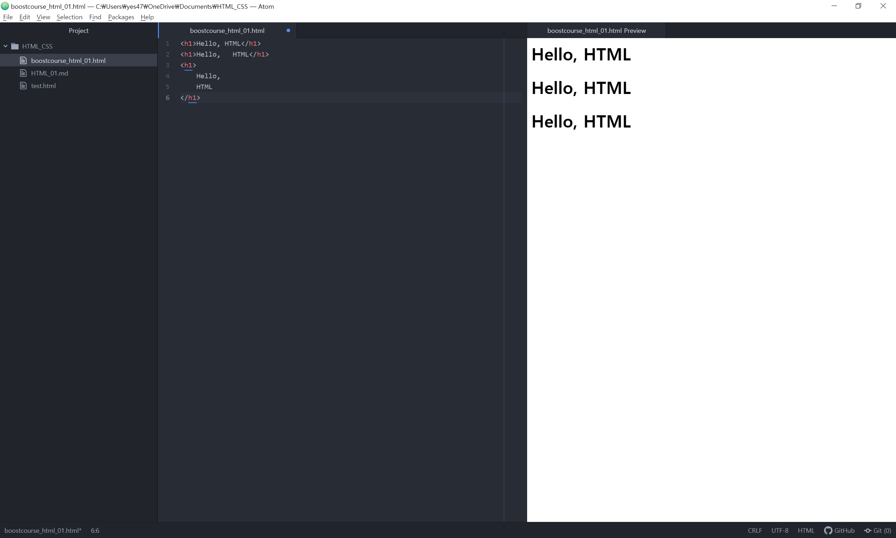

# 01 HTML 이해하기

부스트코스의 '비전공자를 위한 HTML/CSS' 수업 정리

## 1) HTML 소개

- HTML : Hyper Text Markup Language

  - 웹 페이지를 만드는 언어
  - Hyper Text

  ​       : 단순한 텍스트를 넘어서 웹 페이지의 특정 부분과 연결할 수 있는 기능을 가진 텍스트 즉, 링크를 의미

  - Markup Language

  ​       : 프로그래밍 언어의 한 종류로, 정보를 구조적 계층적으로 표현 가능

  - 확장자가 html


## 2) HTML 문법 - 태그

- HTML 문법
  - 태그
  - 속성
  - 태그의 중첩
  - 빈 태그
  - 공백
  - 주석


* 태그란?
  * 무언가를 표시하기 위한 꼬리표, 이름표
* 태극를 사용하는 방법
  * 태그는 <, > 기호로 표현
  * h1 >> 태그 이름
  * `<h1>` : 시작 태그, `<\h1>` : 종료 태그

```html
<h1>Hello, HTML<\h1>
```


* 요소란?
  * 내용을 포함한 태그 전체를 요소 (Element)


## 3) HTML 문법 - 속성

- 속성(ATTRIBUTE)
  - 태그에 추가로 정보를 제공하거나 태그의 동작이나 표현을 제어할 수 있는 설정값


- 속성을 사용하는 방법
  - 속성은 이름, 값으로 이루어짐
  - 시작 태그에서 태그 이름 뒤에 공백으로 구분한 후 속성 `이름='속성값'`으로 표현 (이름='속성값'에 띄어쓰기 X)
  - 속성값은 홑따옴표(''), 쌍따옴표("")로 감싸 표현

```HTML
<h1 id='title'>
    Hello, HTML
</h1>
```


- 여러 속성을 사용하는 방법
  - 의미와 용도에 따라 여러 속성이 존재하며 하나의 태그에 여러 속성을 선언할 수 있다.
  - 여러 속성을 선언할 때는 공백으로 구분해서 사용
  - 속성 선언 순서는 중요하지 않음

```HTML
<h1 id='title' class='main'>
    Hello, HTML
</h1>
```


- 속성은 종류에 따라 모든 태그에서 사용할 수 있는 글로벌 속성과
- 특정 테그에서만 사용할 수 있는 속성으로 구분
- 또한, 선택적으로 쓸 수 있는 속성과 특정 태그에서 필요한 필수 속성으로 구분


## 4) HTML 문법 - 태그 중첩

- 태그의 중첩(NESTING TAGS)
  - 태그 안에 다른 태그를 선언
  - 엇갈리게 중첩되면 안됨

```html
<!--잘못된 태그 선언-->
<h1>
    Hello, <i>HTML
</h1><\i>
```

```html
<!--올바른 태그 선언-->
<h1>
    Hello, <i>HTML</i>
</h1>
```

* `<i>`의 종료 태그를 먼저 선언해준 후 `<h1>`의 종료 태그를 선언해야 함
* 태그 안에서는 중첩이 얼마나 되는지 어떤 태그를 쓰는지는 문제 되지 않음
* 때에 따라 정해진 태그만 중첩할 수 있기도 함


## 5) HTML 문법 - 빈 태그

- 빈 태그란?
  - 태그는 기본적으로 시작 태그와 종료 태그 2개가 1쌍으로 이루어짐, 그 사이에는 내용
  - 그렇지 않은 태그가 존재 >> 빈 태그
  - 빈 태그는 내용이 없어서 종료 태그가 필요하지 않음
  - 빈 태그의 예시

```html
<br>
  <!--이미지의 경로만 전달-->
<input type=''>
```

 

- 빈 태그의 특징
  - 내용만 비어있을 뿐 속성을 통해서 화면에 나타내거나 화면에 표시되지 않더라도 다른 용도로 사용
  - 브라우저가 직접 화면에 내용을 그려줘야 하는 경우
    - -> 브라우저가 내용에 대체한다고 하여 replacement 태그, 대체되는 태그라고 함
  - 빈 태그에 대체되는 태그만 있는 것은 아니며, 실제로 화면에 출력될 내용이 없어 다른 용도로 쓰이는 태그
    - `<br>`의 경우


## 6) HTML 문법 - 공백

- HTML에서의 공백
  - 기본적으로 HTML은 두 칸 이상의 공백을 모두 무시
  - HTML 두 칸 이상의 공백과 개행을 모두 무시하기 때문에 위 세가지 모두 같은 텍스트가 화면에 나타남

```html
<h1> Hello,HTML </h1>
<h1> Hello,   HTML </h1>
<h1>
    Hello,
    HTML
</h1>
```





## 7) HTML 문법 - 주석

- HTML에서의 주석
  - 주석은 화면에 노출되지 않고 메모의 목적으로만 사용하는 것을 의미
  - HTML 파일 내에 주석으로 표시를 해주면 브라우저는 해당 부분을 인식하여 해석하지 않음
  - `<!------->` 로 표시

```html
<!--여기에 작성되는 내용은 모두 주석 처리가 됩니다.->
<!--주석은 여러 줄로 작성할 수도 있습니다.
    <h1>Hello,HTML<\h1>
    위 <h1>태그는 브라우저가 해석하지 않는다
>
```


## 8) 문서의 기본 구조

- HTML의 기본 구조
  - 웹 문서를 작성할 때 반드시 들어가야 하는 기본적인 내용
  - 문서타입 정의와 `<html>`요소로 구분

```html
<!DOCTYPE html>
<html lang="ko">
    <head>
        <meta charset="UTF-8">
        <title>HTML</title>
    </head>
    <body>
        <h1>Hello, HTML</h1>
    </body>
</html>
```


- 문서 타입 정의
  - `<!doctype>`
  - DTD(doctype)라고 부름
  - 이 문서가 어떤 버전으로 작성되었는지 브라우저에 알려주는 선언문, 반드시 문서 내 최상단에 선언되어야 함


- `<html>` 요소

  - 문서 타입 선언 후에는 `<html>`태그가 나와야 하고, 자식으로는 `<head>`태그와 `<body>`태그가 있음

    - `<html>` 태그의 lang 속성은 문서가 어느 언어로 작성되었는지를 의미

    - `<head>`태그에 위치하는 태그들은 브라우저 화면에 표시되지 않음

      대신 문서의 기본 정보 설정이나 외부 스타일 시트 파일 및 js 파일을 연결하는 등의 역할

    - `<meta>`태그의 charset 속성은 문자의 인코딩 방식을 지정

    - `<body>`태그에는 실제 브라우저 화면에 나타나는 내용이 들어가며, 앞으로 우리가 다루는 태그들 대부분이 모두 여기에 해당

  - 위 코드는 가장 기본적인 문서 구조