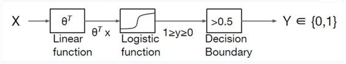
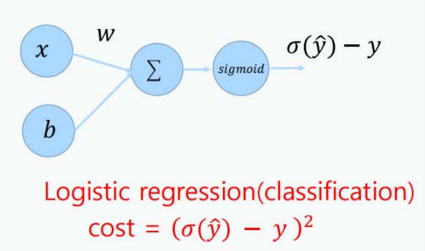
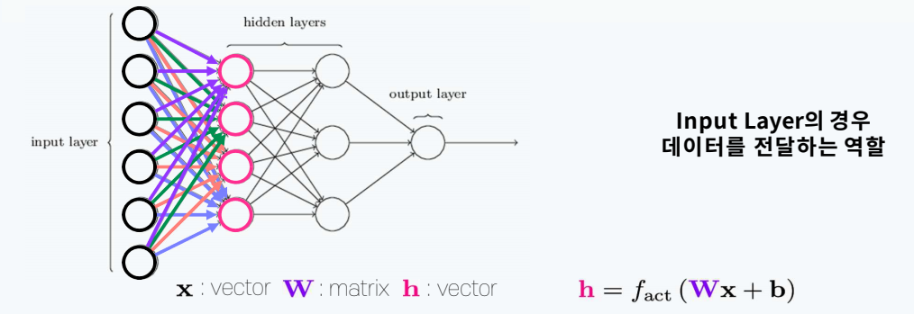
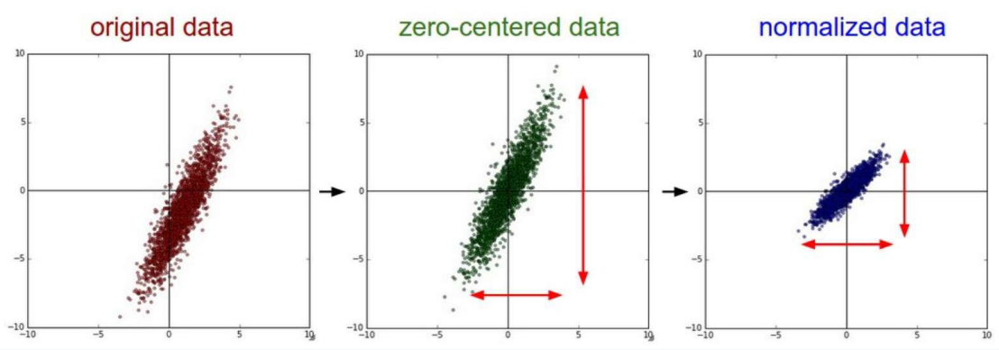
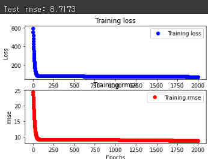
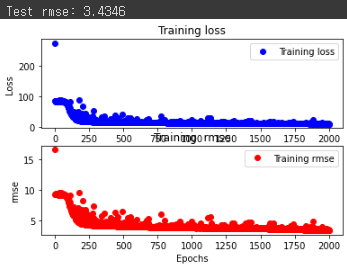

# TIL_DL


## Single neuron model : perception linear regression


```python
import tensorflow as tf

## data 선언
x_data = [[2.,0.,7.], [6.,4.,2.], [5.,2.,4.],[8.,4.,1]]
y_data = [[75], [95], [91], [97]]
test_data=[[5.,5.,5.]]
print(len(x_data),len(x_data[1]))  # 행크기 , 열크기

## tf.keras를 활용한 perceptron 모델 구현.
model = tf.keras.Sequential()   ## 모델 만들기 위해 sequential 매서드를 선언. 이를 통해 모델을 만들 수 있다.
model.add(tf.keras.layers.Dense(1, input_dim=3)) # 선언된 모델에 add를 통해 쌓아감. , 현재는 입력 변수 갯수 3, perceptron 1개.
model.summary() ## 설계한 모델 프린트

```

> ```
> Model: "sequential_1"
> ________________________________________________________________
>  Layer (type)                Output Shape              Param #   
> ================================================================
>  dense_1 (Dense)             (None, 1)                 4         
>                                                                  
> ================================================================
> Total params: 4
> Trainable params: 4
> Non-trainable params: 0
> ________________________________________________________________
> ```
>
> - x_data = [[2.,0.,7.], [6.,4.,2.], [5.,2.,4.],[8.,4.,1]]
>
> - y = wx + wx + wx + b
>
> - **입력변수가 몇 개일까요?**
>
>   - 입력 x는 3개 (x11, x12, x13)
>
> - **x_data의 크기는 몇일까요?**
>
>   - 입력변수 3개로 이루어진  x가 4개가 있음
>
> - **test_data는 모델 입력으로 들어갈까요?**
>
>   - 아니오
>   - test_data는 모델이 잘 예측을 했는지 확인하기 위한 용도
>
> - param = 
>
>   y = wx + wx+ wx+ b
>
>   = 1 + 1 + 1 + 1
>
>   = 1 * 3 + 1
>
>   = 4

<br>

```python
# 모델 loss, 학습 방법 결정하기
optimizer=tf.keras.optimizers.SGD(lr=0.01)       ### 경사 하강법으로 global min 에 찾아가는 최적화 방법 선언.
loss=tf.keras.losses.mse            ## 예측값 과 정답의 오차값 정의. mse는 mean squre error로 (예측값 - 정답)^2 를 의미
metrics=tf.keras.metrics.mae         ### 학습하면서 평가할 메트릭스 선언 mse는 mean_absolute_error |예측값 - 정답| 를 의미

# 모델 컴파일하기
model.compile(loss=loss, optimizer=optimizer, metrics=[metrics])

# 모델 동작하기
model.fit(x_data, y_data, epochs=2000,   batch_size=4)
```

> - **perceptron과 동일한 기능을 하는 layer는?**
>   - `tf.keras.layers.Dense`
>   - 1차 방정식 형식으로 되어 있다
>   - perceptron은 노드 1개
> - **입력변수가 3개일 때, input_dim의 옵션을 어떻게 설정해야할까요?**
>   - input_dim은 3개
>
> - 회귀모델의 평가지표는 mse를 주로 사용한다!
>
> - batch_size : x 데이터 크기 기준


```python
# 결과를 출력합니다.
print(model.weights)
print(" test data [5.,5.,5.] 예측 값 : ", model.predict(test_data))
```

> test data [5.,5.,5.] 예측 값 :  [[124.71855]]


## Single neuron model : perception binary classification

- 바이너리 classification
  - 0 아니면 1 두가지 중 하나로 분류

​    

```python
import tensorflow as tf

## data 선언
x_data = [[0.,0.], [0.,1.], [1.,0.],[1.,1.]]
y_data = [[0.], [1.], [1.], [1.]]
test_data=[[0.8, 0.8]]
```

> x1 컬럼 하나, x2 컬럼 하나로 특징이 이루어져 있음
>
> - perceptron이 2개

```python
## tf.keras를 활용한 perceptron 모델 구현.
model = tf.keras.Sequential()  # 모델 선언
model.add(tf.keras.layers.Dense(1, input_dim=2))
model.summary() ## 설계한 모델 프린트
```

> ```
> Model: "sequential"
> ________________________________________________________________
>  Layer (type)                Output Shape              Param #   
> ================================================================
>  dense (Dense)               (None, 1)                 3         
>                                                                  
> ================================================================
> Total params: 3
> Trainable params: 3
> Non-trainable params: 0
> ________________________________________________________________
> ```
>
> Batch_size = 4
>
> W11, W12, b = params = 3


```python
# 모델 loss, 학습 방법 결정하기
optimizer= tf.keras.optimizers.SGD(lr=0.001) ### 경사 하강법으로 global min 에 찾아가는 최적화 방법 선언.
loss=  tf.keras.losses.mse ## 예측값 과 정답의 오차값 정의. mse는 mean squre error로 (예측값 - 정답)^2 를 의미
metrics= tf.keras.metrics.binary_accuracy ### 학습하면서 평가할 메트릭스 선언

# 모델 컴파일하기
model.compile(loss=loss, optimizer=optimizer, metrics=[metrics])

# 모델 동작하기
model.fit(x_data, y_data, epochs=1000, batch_size=4)
```

> `tf.keras.metrics.binary_accuracy` 


## single neuron model : Logistic Regression


- 0과 1로 나눠진 decision boundary를 linear regression으로 분류를 정확하게 하지 못함
- 그래서 curve fitting으로 threshold를 잡아서 분류 가능
- 선형 -> 비선형

​    


- Activation Function : Linear Activation -> Sigmoid / Logistic

- $$
  S(x) = \frac{1}{1+e^{-x}}
  $$

- `tf.keras(layers.Dense(1, input_dim=1, activation=“sigmoid”)`


```python
import tensorflow as tf

## data 선언
x_data = [[5.], [30.], [95.], [100.], [265.], [270.], [290.], [300.],[365.]]
y_data = [[0.], [0.], [0.], [0.], [1.], [1.], [1.], [1.], [1.]]
test_data= [[7.]]
test_data2= [[80.]]
...
```

> - **입력변수는 몇 개일까요?**
>   - 1개
> - **x_data의 데이터의 크기는 몇일까요?**
>   - 9개
> - test_data도 입력변수 개수를 맞춰 줘야함

```python
## tf.keras를 활용한 perceptron 모델 구현.
model = tf.keras.Sequential() ## 모델 선언
model.add(tf.keras.layers.Dense(1, input_dim=1, activation='sigmoid'))  # 선언된 모델에 add를 통해 쌓아감. 은닉층
model.summary()
```

> - **activation을 추가하지 않으면 어떤 방정식일까요?**
>   - 선형방정식
> - **actiavtion을 주게 되면 어떤 효과가 있나요?**
>   - 비선형으로 바뀌는 효과
> - **loss의 변화가 없는데 무엇을 의미?**
>   - 학습을 못하고 있다!


## Cost/Loss Function for Classification

- loss를 학습하지 못하는 경우 해결 방안 >> `Cross Entropy`

- $$
  Cost(h_0(x),y) =\begin{cases}-log(h_0(x)) & if\ y=1\\ -log(1-h_0(x)) & if \ y=0\end{cases} 
  $$

- Logistic regression (classification)

  - 

  - $$
    cost =( \sigma(\hat{y})-y)^2
    $$

  - `\sigma` -> `activation function`을 나태는 수학적 기호 

- **회귀의 loss는 MSE, 분류의 loss는 cross entropy**


### 코드 흐름**

1. Data 생성 or DATA 읽기

2. DATA의 변수에 따른 차원 확인

3. PERCEPTRON의 입력 차원 맞추고 Layer 완성하기

4. PERCEPTRON 생성 (이 때, Activation 주의!!)

5. PERCEPTRON LOSS 함수 지정

6. 경사하강법 (LOSS 함수의 MIN을 찾기 위한 최적화 방법 선택 )

7. Metric 설정하고 나서, Complie! (Task에 따라서 Metric 선택에 주의)

8. 학습완료에 따른 결과 보기


## XOR Problem

- **<u>MLP (Multi Layer Perceptron)</u>**
  - 퍼셉트론 두 개 이상
- layer 개수에 따라 결정할 수 있는 영역이 달라짐
- layer가 많을수록 복잡한 모델을 잘 결정 할 수 있다.
- <u>**representation**</u> : 학습을 통해서 input 정보로 새로운 공간에 다시 표현하는 것 자체
  - 많은 perceptron을 쌓아서 비선형의 데이터를 선형 분리가 가능하도록 단순화시키자 
  - = 선형 분리가 불가능한 데이터를 선형 분리가 가능하도록 representation하자


## Neural Network




$$
\hat{y} = f(x;w^1, ..., x^L, b^1,...,b^L)\\
= \sigma(w^L\sigma(w^{L-1}...\sigma(w^1x + b^1)...) + b^L)
$$

- activation function: sigmoid function

- $$
  \sigma(x) = \frac{1}{1+e^{-x}}
  $$


- `input layer` - `hidden layer1` - `hidden layer2` - `hidden layer3` - `output layer`
  - **layer수는 몇 개일까요?**
    - 4개
    - hidden layer 3개 + output layer 1개
  - **input layer는 layer일까요?**
    - 아니요
  - output layer는 마지막 task를 <u>분류</u>해주는 역할
  - hidden layer에서는 비선형을 학습시켜주었다면, output lyaer는 선형이 되도록 학습시켜야 함
  - 3개로 분류를 하고 싶다
    - output layer는 output layer는 3개로 하면 된다.
  - **0~9까지의 숫자를 분류하고 싶어요. output layer의 노드 수는 몇 개일까요?**
    - output layer의 노드 수는 10개


### XOR Problem

```python
import tensorflow as tf

x_data = [[0.,0.], [0.,1.], [1.,0.],[1.,1.]]
y_data = [[0.], [1.], [1.], [0.]]  # -> 0 or 1 이진분류!
test_data=[[0.5, 0.5]]
```

> -> 이진 분류 문제
>
> 0 or 1 (범주형 데이터) 분류하는 문제이기 때문

```python
## tf.keras를 활용한 perceptron 모델 구현.
model = tf.keras.Sequential() ## 모델 선언
model.add(tf.keras.layers.Dense(4, input_dim=2, activation='sigmoid'))  # hidden layer
model.add(tf.keras.layers.Dense(5, activation='sigmoid'))  # hidden layer
model.add(tf.keras.layers.Dense(1, activation='sigmoid'))  # output layer -> 분류를 학습하는 레이어
```

> - **이진분류에서 output layer의 노드 수는 몇개로 지정을 해야할까요?**
>
>   - 0 혹은 1로 분류할 수 있게 하는 분류 모델
>
>   - threshold를 0.5로 판단해서 높으면 1 아니면 0으로 output layer  1개만 지정 가능
>
> - **output layer에서 activation의 역할은 무엇일까요?**
>
>   - 분류

```python
# 모델 loss, 학습 방법 결정하기
optimizer=tf.keras.optimizers.SGD(learning_rate=0.5)  # 경사하강법으로 global min
loss=tf.keras.losses.binary_crossentropy # 예측값과 정답의 오차값 정의
metrics=tf.keras.metrics.binary_accuracy ## 학습하면서 평가할 메트릭슨 선언

# 모델 컴파일하기
model.compile(loss=loss, optimizer=optimizer, metrics=[metrics]) 

# 모델 동작하기
model.fit(x_data, y_data, epochs=3000, batch_size=4)
```

> - **분류에서 쓰는 loss는 무엇일까요?**
>   - binary_crossentropy


### Normalization for Neural Network

- 단위가 다르고 값의 편차가 심함 --> 정규화 필요

1. **Min max** : 일정범위(일반적으로 0~1) 사이로 scaling 함
   $$
   X = \frac{x - x_{min}}{x_{max} - x_{min}}
   $$

2. **Standardization** : mean를 빼서 zero-centered를 하고 std로 나누어 주어 데이터가 일정 범위 안에 머무르게 함
   $$
   X = \frac{x- x_{mean}}{s_{std}}
   $$
   





```python
dataset=raw_df.copy()

dataset_stats =dataset.describe()
dataset_stats.pop("MEDV")
dataset_stats = dataset_stats.transpose()

label_data= dataset.pop("MEDV")  # 정답 데이터 추출

def min_max_norm(x):
  return (x-dataset_stats['min'])/(dataset_stats['max']-dataset_stats['min'])

normed_train_data = min_max_norm(dataset) # 0~1사이의 값으로 정규화를 완료
```

> - dataset의 `describe()` 한 후 -> 'MEDV' (y값) 제외한 후 `transpose()` -> `min`, `max` 활용
> - `min_max_norm` : 데이터 정규화 (min max 정규화)

- 정규화 이전 (rmse : 8.7173)



- 정규화 이후 (rmse : 3.4346)
  - rmse가 줄어듬




----------------------

더 공부할 링크

https://wikidocs.net/24958

