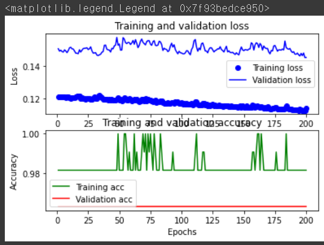
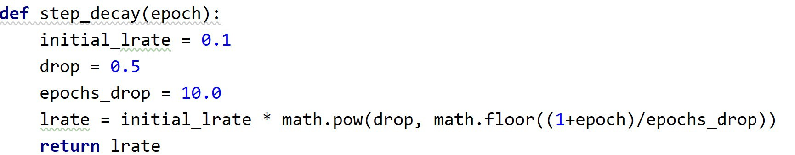
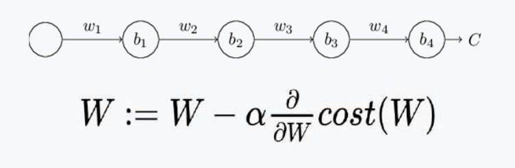
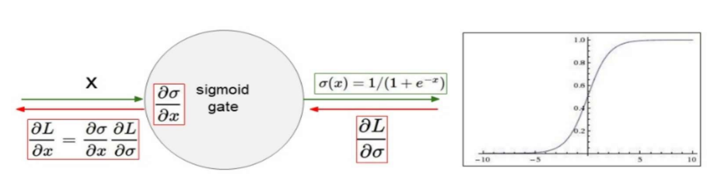
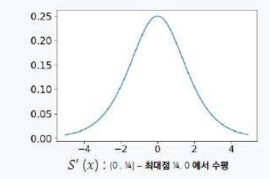

# 딥러닝 DAY3

멀캠 수업 내용 정리


복습 

- Q. perceptron이란 무엇일까요?
  - 레이어 한 층이고 노드 하나 입력 변수 1개


- Q. perceptron의 문제점은 무엇이였나요?
  - 선형 문제만 풀 수 있다 
  - 퍼셉트론 하나 당 activation 한 번 밖에 못함


- Q. 어떻게 해결했을까요~?
  - MLP


- Q. mlp이란 무엇일까요?
  - 다중 퍼셉트론 (레이어 두 개 이상)


- Q. 퍼셉트론만 다중으로 쌓게 되면 퍼셉트론 하나의 효과와 동일하다! 이거를 해결하기 위해서 어떻것을 사용했을까요~?
  - activation function
  - layer 를 거칠 때마다 activation function을 통해 시그모이드 모형으로 만들어 줌으로써 선형 --> 비선형 으로 변환


- Q. activation function을 적용했더니 어떤 문제점이 있을까요?
  - loss function 문제
  - 학습이 잘 안됨


- Q. loss function을 교체해줄 필요성이 생김. mse 어떤 loss function을 사용해서 해결하였을까요?
  - 크로스 엔트로피
  - 분류 모델이 얼마나 잘 수행되는지 측정하기 위한 지표
  - Loss의 목표는 0에 가깝게 만드는 것


regression loss = mse, classifcation loss = cross entropy

회귀 loss는 mse, 분류 loss는 cross entropy


- Q. 데이터  편차가 클경우 성능 좋지 못했습니다. 이럴 때 사용하는 기법은 무엇일까요?
  - min max 정규화


---------------------


## Data Split


- train - validation - test


```
Q 학습과 시험데이터는 보통 몇 대 몇으로 나누나요?
- 7:3, 8:2.. 상관은 없지만 학습 데이터에 비율을 더 주게 됨

Q validation은 어떤 데이터 기준으로 나누게 될까요?
- train 데이터

Q validation을 어떻게 나누면 좋을까요? 
- train 데이터에서 일정한 비율로 validation set을 나눈다
- validation은 에폭이 도는 도중에 오버피팅 여부를 알기 위해 (학습 도중에) 예측을 하는 것. 

Q valid dataset은 훈련할 떄 사용하는 데이터일까요?
- 아니오
- 에폭이 돌 때마다 오버피팅이 됐는지 안됐는지 확인해야 하기 때문에 입력에는 들어가지만 학습에는 사용되지 않는다.
```


```python
X_train1,X_test,Y_train1,Y_test = \
train_test_split(standard_norm_train_data,train_labels,test_size=0.2,shuffle=False)
X_train,X_val,Y_train,Y_val = \
train_test_split(X_train1,Y_train1,test_size=0.2,shuffle=False)
```

> - 정규화된 train data, y값, 8:2 분리, shuffle 여부
>
> - 입력으로 standard_norm_train_data, 입력 라벨 (정답 라벨) 
>
> - shuffle = True 한다면 random_state = 42 이렇게 랜덤성을 고정 시키면 됨
>


------------


## Multi-Class Classification


### one-hot encoding

글자 데이터를 컴퓨터가 알아들을 수 있는 0과 1의 숫자 데이터로 바꿔주는 인코딩

1. Sklearn - LabelEncoder

   ```python
   # case 1) Sklearn
   # Label Encoder는 독립 변수가 아닌 종속 변수(라벨)에 대해 사용한다. 문자열이나 정수로된 라벨 값을  0  ~  K−1 까지의 정수로 변환.
   e = LabelEncoder()
   e.fit(Y_obj) # 텍스트 -> 숫자
   print("Label Class String : {}".format(e.classes_))  # classes_ : 각 인덱스의 매칭을 알려주는 함수
   Y = e.transform(Y_obj)
   print("Label Class Int: {}".format(Y))
   
   Y_encoded = tf.keras.utils.to_categorical(Y) # 정수 -> ont-hot-encoding
   print("case 1 One Hot Label Class : {}".format(Y_encoded))
   print(np.argmax(Y_encoded, axis=1).reshape(-1,1))
   print(Y_encoded.shape)
   ```

   

2. pandas - get_dummies

   ```python
   ## case 2) pandas
   one_hot_label=pd.get_dummies(Y_obj)
   print("case 2 one_hot_label : ", one_hot_label)
   print(one_hot_label.shape)
   ```

   

### softmax함수

- 출력 값들의 합이 1이 되게 하여 확률값처럼 만드는 함수
  $$
  y_k = \frac{e^{a_{k}}}{\sum_{i=1}^ne^{a_{i}}}
  $$

- 모든 출력 값의 합을 1로 맞추어 출력해서 확률 값처럼 변환


### iris data 예제

- 클래스 ("Species") : Iris-setosa , Iris-virginica, Iris-versicolor >> **y값**

[1] y 값을 인코딩

```python
# 문자열을 숫자로 변환
e = LabelEncoder()
e.fit(Y_obj)  # 텍스트 -> 숫자
Y = e.transform(Y_obj)
Y_encoded = tf.keras.utils.to_categorical(Y)  # 정수 -> one-hot-encoding
```

> Q 문자열을 숫자로 변환하는 것은?
>
> - 라벨 인코딩
>
> Q tensorflow에서 제공하는 one-hot encoding으로 변경해주는 함수명은 무엇일까요?
>
> - tf.keras.utils.to_categorical()
> - 문자열이라면 > LabelEncording 후 `to_categorical()`
> - 숫자형이라면 > 바로 `to_categorical()`

<br>

[2] train test 분리

```python
# 전체 데이터에서 학습 데이터와 테스트 데이터(0.1)로 구분
X_train1, X_test, Y_train1, Y_test = train_test_split(X, Y_encoded, test_size=0.1, shuffle=True)  ## shuffle=True로 하면 데이터를 섞어서 나눔
## 학습 셋에서 학습과 검증 데이터(0.2)로 구분
X_train, X_valid, Y_train, Y_valid = train_test_split(X_train1, Y_train1, test_size=0.2, shuffle=True)  ## shuffle=True로 하면 데이터를 섞어서 나눔

```

> X_train.shape : (108,4) >> 4개의 컬럼
>
> Y_train.shape : (108,3) >> 분류해야 하는 대상 3개

<br>

[3] 모델 설계

```python
# 모델의 설정

input_Layer = tf.keras.layers.Input(shape=(4,))
x = tf.keras.layers.Dense(16, activation='sigmoid')(input_Layer)
x = tf.keras.layers.Dense(12, activation='sigmoid')(x)
Out_Layer= tf.keras.layers.Dense(3, activation='softmax')(x) # 다중 분류 = softmax, 이진분류 = sigmoid
model = tf.keras.models.Model(inputs=[input_Layer], outputs=[Out_Layer])
model.summary()
```

> - Input Layer의 변수 개수 : 4
>
> - Hidden Layer : 분석가의 선택에 따라 달라짐
>
>   - 보통 2의 배수를 쓰는 것이 좋음
>
> - Output Layer : node 개수 - 3, activation - softmax
>
>   - 분류해야 하는 대상 3개
>   - 다중 분류이기 때문에 sigmoid가 아닌`softmax`
>
>   ```python
>   Out_Layer= tf.keras.layers.Dense(3, activation='softmax')(x)
>   ```


[4] 모델 loss 함수 및 최적화 함수 할당 후 학습하기

```python
# 모델 컴파일
loss=tf.keras.losses.categorical_crossentropy
optimizer = tf.keras.optimizers.SGD(learning_rate=0.01)  # 경사하강법의 방법
metrics=tf.keras.metrics.categorical_accuracy
model.compile(loss=loss,optimizer=optimizer,metrics=[metrics])

## model fit은 histoy를 반환한다. 훈련중의 발생하는 모든 정보를 담고 있는 딕셔너리.
history=model.fit(X_train, Y_train, epochs=2000, batch_size=50, validation_data=(X_valid,Y_valid)) # validation_data=(X_valid,Y_valid)을 추가하여 학습시 검증을 해줌.

```

> ```
> 이진분류 loss = binary_crossentropy
> 다중분류 loss = categorical_crossentropy
> ```
>
> - Loss 함수 : categorical_crossentropy
>
>   ```python
>   loss=tf.keras.losses.categorical_crossentropy
>   ```
>
> - 학습 중 검증 데이터 사용 `validation_data=(X_valid,Y_valid))`


```
정리

Model : Multi-Class Classification

Example : 해당 이미지는, 강아지일까요? 고양이일까요? 자동차일까요?

(다중 분류)

[Output] Activation Func. : Softmax

Loss Func. : Categorical CrossEntropy

Metric : Categorical Accuracy
```

<br>

<br>

--------------

## 고급 함수 다루기 (모델 저장 및 불러오기)


### Model Save (저장 함수)

`model.save(‘name.h5)` or `model.save(’name.hdf5’)`

H5 vs hdf5 : 파일의 확장자만 다룰 뿐 같으며 성능 또한 차이가 없음(동의어 확장자)

```python
## 학습 완료 후 모델 저장
model.save('iris_multi_model.h5')
```


- Loss와 val_loss 그래프

```python
history.history.keys()
# model fit으로 반환된 history. 훈련 중 발생하는 모든 정보를 담고 있는 딕셔너리.
# history는 딕셔너리이므로 keys()를 통해 출력되는 카테고리를 확인하여 무엇을 받고 있는지 확인
```

> dict_keys(['loss', 'categorical_accuracy', 'val_loss', 'val_categorical_accuracy'])

```python
loss = history.history['loss']
val_loss = history.history['val_loss']

# loss와 val_loss 그래프
epochs = range(1, len(loss)+1)
plt.subplot(211)
plt.plot(epochs, loss, 'b-', label = 'Training loss')
plt.plot(epochs, val_loss, 'r', label = 'Validation loss')
plt.title('Training and validation loss')
plt.xlabel('Epochs')
plt.ylabel('Loss')
plt.legend()

```


<br>

### Model Load / Re-tain (불러오기 함수)

`model.load('name.h5')` or `model.load('name.hdf5')`

<br>

- 모델 불러오기

```
model_path = './iris_multi_model.h5'
jy_model = tf.keras.models.load_model(model_path)
```

- 모델 evaluate

```python
jy_model.evaluate(X_test, Y_test)  # 평가
```

>  loss: 0.1289 - categorical_accuracy: 1.0000

- Q. evaluate의 두가지 값이 반환됩니다. 각각은 무엇을 의미할까요?
  - loss값, 정확도

<Br>

- Retrain
  - Loss가 아래로 향하고 있다면 학습을 하고 있다고 볼 수 있음



<br>

<br>


## 고급 함수 다루기 (Callback)

`Callback`

-  학습 완료 후 저장이 아닌 학습 중에 모델을 저장하고 싶을 떄
- 훈련하는 동안 모델 내부에서 일어나는 일을 조사하고 제어할 수 있는 함수
- 모델 fit() 메서드가 호출될 때 전달되는 객체 
- 훈련하는 동안 모델을 여러 지점에서 callback 호출
- 모델의 상태와 성능에 대한 모든 정보에 접근 하고 훈련정지, 모델저장, 모델 상태 변경 등이 가능

<br>

<br>

### Callback List

<br>

- `Keras.callbacks.ModelCheckpoint` :  모델 체크포인트 저장 ⭐⭐
  - 훈련하는 동안 어떤 지점에서 모델의 현재 가중치 저장
- `Keras.callbacks.EarlyStopping` : 조기 종료 ⭐⭐
  - 검증 손실이 더 이상 향상되지 않을 때 훈련 중지
- `Keras.callbacks.LearningRateScheduler` : 러닝레이트 스케줄
  - 훈련하는 동안 하이퍼 파라미터 값을 동적으로 조정 (optimize 학습률 자동 조정)
- ETC

<br>

```python
model_path = './{epoch:02d}-{val_loss:.4f}.h5'
callbacks_list = [tf.keras.callbacks.EarlyStopping(monitor='val_loss', patience=20),
                  tf.keras.callbacks.ModelCheckpoint(filepath=model_path, moniter='val_loss', verbose=1, save_best_only=True),
                  tf.keras.callbacks.LearningRateScheduler(step_decay, verbose=1)]

```

```markdown
ModelCheckpoint (에포크 마다 현재 가중치 저장
                 filepath : 모델 파일 경로
				 monitor : save_best_only가 True일 때 monitor 지정값을 기준으로 저장
                 save_best_only : val_loss가 줄었을때만 저장
                 verbose : 값 화면 표시)

EarlyStopping(성능 향상이 멈추면 훈련 중지
              monitor : 모델 검증 정확도를 모니터링
              patience : 에포크보다 더 길게 정확도가 향상되지 않으면 훈련 중지 
			  (ex. patience=1이면, 에포크 2가 넘어갔을때))

LearningRateScheduler(하이퍼 파라미터 값을 동적으로 조정
					  step_decay : Learning Rate을 다음의 def step_decay 함수로 조정
					  verbose : 값 화면 표시)
```




```python
history = model.fit(X_train, Y_train, epochs=20000, batch_size=50, 
					validation_data=(X_valid, Y_valid), callbacks=callbacks_list)
```

❗ 꼭 callback 옵션은 **리스트로 저장해서 전달**

<br>

<br>

## 고급 함수 다루기 (Callback_tensorboard)

```python
from datetime import datetime

logdir = "log_dir/scalars/" + datetime.now().strftime("%Y%m%d-%H%M%S") 
file_writer = tf.summary.create_file_writer(logdir + "/metrics")
file_writer.set_as_default()
```

```python
model_path = "./{epoch:02d}-{val_loss:.4f}.h5"
callbacks_list = [tf.keras.callbacks.EarlyStopping(monitor='val_loss', patience=20),
                  tf.keras.callbacks.ModelCheckpoint(filepath=model_path, monitor="val_loss", verbose=1, save_best_only=True),
                  tf.keras.callbacks.LearningRateScheduler(step_decay, verbose=1),
                  tf.keras.callbacks.TensorBoard(log_dir=logdir, histogram_freq=1)
]
```

```
TensorBoard(학습과정을 그래픽적으로 확인할 수 있는 기능
			log_dir : 학습의 과정이 저장되는 폴더이름, 저장파일을 cmd에서 동작
			histogram_freq : 모델 레이어의 활성화 및 가중치 히스토그램 계산 빈도 (에포크 단위)
```


- tensorboard 그래프

```python
%load_ext tensorboard
# logdir가 있는 폴더에가서  tensorboard --logdir=./log_dir/   <http://localhost:6006>
%tensorboard --logdir {logdir}
```

<br>

<br>

------

<br>

<br>


## Neural Network의 문제점

1. Vanishin Gradient
   - Layer를 쌓아서 비선형 문제를 풀 수 있게 하였고 Backpropagation으로 multi-layer를 학습하지만 전파되는 과정에서 기울기 값이 사라져서 학습이 안되는 경우가 있음
2. Local minima
   - Layer가 깊어질수록 curve 피팅 구간이 발생하기 때문에 비선 형의 cost함수에서 가장 작은 cost값을 찾지 못함 (Global Minima를 찾지 못함)
3. Overfitting이 발생
   - 학습할 때는 성능이 잘 나오는데 테스트 할 때는 성능이 나오지 않음

<Br>

### Vanishing Gradient problem : Sigmoid

- 히든 레이어의 activation func.의 sigmoid 특성 때문에 문제가 생김



> 1. x가 입력되면 sigmoid gate를 통과하면서 loss가 나옴
>
> 2. backpropagation을 통해서 미분을 통해 학습하게 됨
>
> 3. 미분을 해서 weight를 업데이트 할 때 0과 1 구간에서 그래프가 그려지는데 미분하게 되면 0 ~ 0.25 사이의 값으로 변환
>
> 4. 최대점이 1/4 으로 줄어들기 때문에 레이어 층을 거치면서 0으로 수렴하여 학습이 불가능
>
>   즉, sigmoid는 vanishing gradient를 유발

<br>

- 미분 전



- 미분 후

      

```
❓ Q. hidden layer에 쓰는 sigmoid는 vanishing gradient를 유발하는 것을 해결하는 actiavtion은 무엇일까요?

- ReLU
- ReLU 양수에서 y=x이기 때문에 미분하면 1이 되기 때문
- Leaky ReLU, ELU도 같은 이유로 써도 무방
```

<br>

<br>

### 해결 → Weight / Bias Initialization ⭐

- 초기 W=0, b=0  →   W*X+b=0
  - w가 0이기 때문에 어떤 데이터 X가 들어와도 항상 0
  - 즉, 여러 Layer들이 쌓여있을 때 전달되는 값이 0
  - 역전파시 기울기 소실 발생 →  학습 어려움

<br>

1. large random value
   - weight가 너무 커서 오버슈팅 (-1과 1에 seturation됨)
   - → sigmoid 미분하면 saturate된 값은 더 많이 0과 곱해지기 때문에 vanishing이 더 가속해서 발생
   - layer 평균과 분산이 균일하지 않음

<br>

2. small random value

   - layer 평균이 균일, 분산이 0으로 수렴

   - X가 작은 값이기 때문에 backpropagate 문제 발생 → 결국 weight가 업데이트가 잘 되지 않음

3. Xavier initialization ⭐

   ```python
   W = np.random.randn(fan_in, fan_out) / np.sqrt(fan_in)  # layer initialization
   ```

   - weight를 random값으로 구하고 sqrt(제곱근)으로 나눈 것

   - 노드의 개수(fan_in)를 normalized

   - 큰 것은 큰 값으로 작은 것은 작은 값으로 나눔

   - 즉, input의 개수가 많아지면 큰 값으로 나누어지므로 값이 작아짐

   - input 개수가 작아지면 작은 값으로 나누어지므로 weight 커짐

<br>

4. He initialization ⭐

   ```python
   W = np.random.randn(fan_in, fan_out) / np.sqrt(fan_in/2)  # layer initialization
   ```

   - 자비어에서 추가적으로 2로 나눔

   - layer 평균, 분산이 균일하지 않으나 0이 아닌 값들임

<br>

<br>

```python
# 딥러닝 구조를 설계합니다.
input_Layer = tf.keras.layers.Input(shape=(17,))
x = tf.keras.layers.Dense(10, activation='relu', kernel_initializer =tf.keras.initializers.glorot_uniform())(x) ## xavier 초기화 방법
x = tf.keras.layers.Dense(10, activation='relu', kernel_initializer =tf.keras.initializers.he_normal())(input_Layer) ## he 초기화 방법
Out_Layer= tf.keras.layers.Dense(1, activation='sigmoid')(x)  # 분류기 역할
model = tf.keras.models.Model(inputs=[input_Layer], outputs=[Out_Layer])
model.summary()

# sigmoid는 vanishing gradient를 유발
# 그래서 sigmoid는 은닉층에서는 사용하지 않음
```