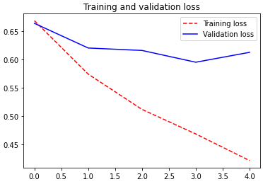
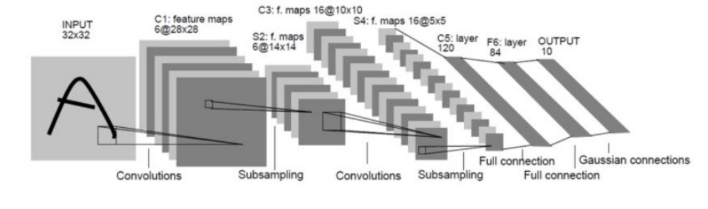
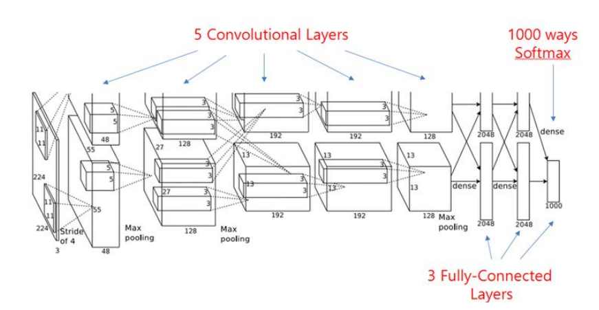
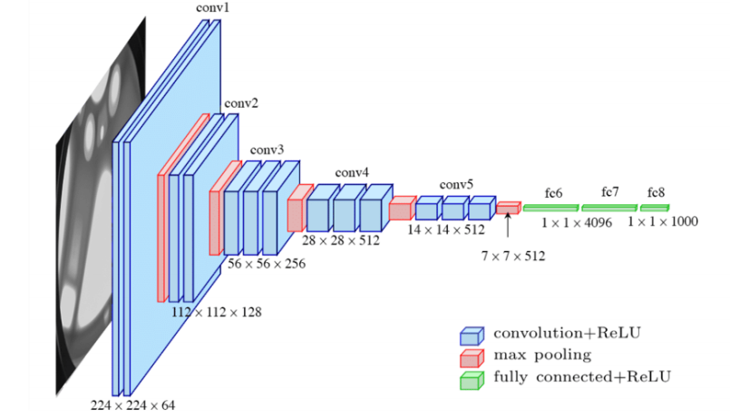
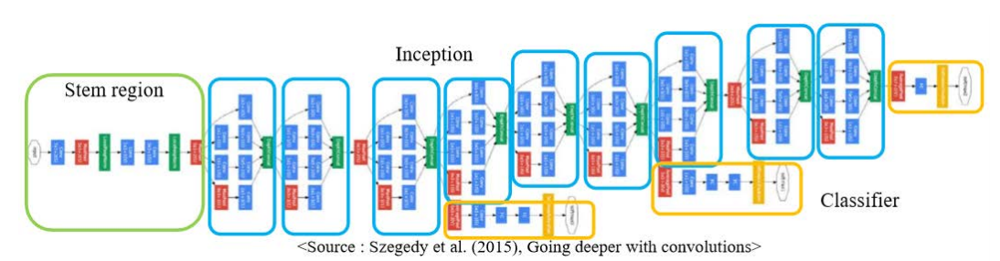
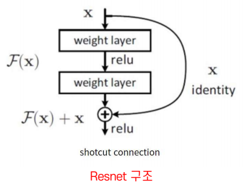

# DL DAY5 TIL

멀캠 수업 내용 정리


## 복습

> :question: 이미지는 몇차원일까요?
>
> - 2차원
>
> :question: 컬러일때 쓸까요? 그레이스케일일때 쓸까요?
>
> - 그레이스스케일
>
> :question: 만약에 그림이 컬러그림이라면? 몇 채널을쓸까요?
>
> - 3채널
>
> :question: 이미지지크기가 32이고, 컬러일때 나타는 이미지의 shape은 무엇일까요?
>
> - (32, 32, 3)
>
> :question: Dense층의 입력은 어떻게 생겼을까요?
>
> - 1차원 배열
>
> :question: 현재 2차원배열이 이미지는 Dense층의 입력으로 들어갈 수 있을까요?
>
> - 아니오
>
> :question: 이차원 이미지를 1차원배열이 입력인 Dense층에 넣기 위하여 어떻게 해결해주었나요?
>
> - reshape
>
> :question: (60000, 28, 28)크기를 가지고 있는 2차원 이미지를 1차원 배열로 바꿔주세요.
>
> - X_train.reshape(60000, -1)
>
> :question: stride는 무엇인가요?
>
> - 보폭
>
> :question: convolution layer를 거칠 수록 이미지가 작아지는데 작아지는것을 방지하기 위한 해결법은 무엇일까요?
>
> - 패딩
>
> :question: convolution layer의 padding의 기본 옵션은 무엇일까요?
>
> - Valid
>
> :question: poolinglayer은 어떤 특징 있을까요?
>
> - 가로, 세로 길이를 1/2로 줄인다
> - depth를 유지한다
> - 중요한 특성을 추출
> - 학습할 파라미터가 없다

<br>

<br>

- 모델 설계

```python
# CNN 모델 설계.
## 모델
input_Layer = tf.keras.layers.Input(shape=(28, 28, 1))  # 딥러닝 모델은 shape을 꼭 알려줘야 함
x = tf.keras.layers.Conv2D(32, (3, 3), strides=1, activation='relu', padding='same')(input_Layer)
x = tf.keras.layers.MaxPool2D((2, 2))(x)
x = tf.keras.layers.Conv2D(64, (3, 3), strides = 1, activation='relu', padding='same')(x)
x = tf.keras.layers.MaxPool2D((2, 2))(x)
x = tf.keras.layers.Flatten()(x)
Out_Layer=tf.keras.layers.Dense(10, activation='softmax')(x)
```

<br>

`conv32` ->`act - relu` -> `Maxpool` -> `conv64` -> `act - relu` -> `Maxpool` -> `Flatten` -> `FC layer` 0~9

<br>

<br>

----

<br>

<br>

## CNN을 이용해서 RGB(컬러) 이미지 다루기


- CNN 입력을 위한 이미지 전처리 단계
  1. 이미지 읽기
  2. RGB 픽셀로 디코딩
  3. 텐서화
  4. 0~255 사이의 값을 가지는 픽셀 값을 [0,1] 사이 값으로 변환

- 이미지 읽기 -> RGB 픽셀로 디코딩 -> 텐서화 -> 모델 입력


- `ImageDataGenerator API` 이용


[1] train, validation, test 경로 지정

```python
# train, validation, test 이미지 들어있는 폴더 경로 지정
train_dir='/content/drive/MyDrive/dataset/cats_and_dogs_small/train'
test_dir='/content/drive/MyDrive/dataset/cats_and_dogs_small/test'
valid_dir = '/content/drive/MyDrive/dataset/cats_and_dogs_small/validation'
```


[2] ImageDataGenerator API 선언

```python
### data
## DATA를 만듬
train_datagen = tf.keras.preprocessing.image.ImageDataGenerator(validation_split = 0.2)  # rgb 픽셀로 디코딩 # 자동으로 validation split
test_datagen = tf.keras.preprocessing.image.ImageDataGenerator()
```


[3] 이미지와 연결 -> generator 생성

```python
## 만든데이터를 불러와서 파씽함.
train_generator = train_datagen.flow_from_directory(
        directory= train_dir,  # 타겟 디렉토리 경로 설정
        target_size=(32,32), # 이미지들을 32x32 로 resizing
        batch_size=20,  # 배치 사이즈
        interpolation='bilinear',  # 이미지가 줄였다 커졌다 하는 과정에서 어떻게 이미지 복원 방법을 어떻게 할거냐
        color_mode ='rgb',  # 컬러 모드 = rgb
        shuffle='True',
        # binary_crossentropy 손실을 사용하기 때문에 이진 레이블이 필요합니다
        class_mode='binary', # binary, categorical , sparse , input
        subset='training') # ImageDataGenerator 옵션에서 지정했던 validation=0.2을 뺀, 0.8만큼의 train data 생성
```

> - `flow_from_directory()`
>   - directory 옵션에 지정된 폴더 안에 분류 되어 있는 이미지 불러옴
>   - 읽어올 때 이미지 사이즈, 배치 사이즈, 컬러 모드 ,셔플, 라벨 모드 지정 가능


```python
## 만든데이터를 불러와서 파씽함.
validation_generator = train_datagen.flow_from_directory(
        directory= train_dir,  # 타겟 디렉토리 경로 설정
        target_size=(32,32),
        batch_size=20,
        interpolation='bilinear',  # 이미지가 줄였다 커졌다 하는 과정에서 어떻게 이미지 복원 방법을 어떻게 할거냐
        color_mode ='rgb',
        shuffle='True',
        # binary_crossentropy 손실을 사용하기 때문에 이진 레이블이 필요합니다
        class_mode='binary', # binary, categorical , sparse , input
        subset='validation') # ImageDataGenerator 옵션에서 지정했던 validation=0.2
        
test_generator = test_datagen.flow_from_directory(
        directory=test_dir,
        target_size=(32,32),
        batch_size=20,
        shuffle='True',
        interpolation='bilinear',
        color_mode='rgb',
        class_mode='binary')
```


```python
## 파씽한 데이터의 배치사이즈 확인하기
for data_batch, labels_batch in train_generator:
    print('배치 데이터 크기:', data_batch.shape)  # (20,32,32,3) >> 32x32 채널을 가진 데이터가 20장있음
    print('배치 레이블 크기:', labels_batch.shape)  # 배치 레이블 크기: (20,)
    print('class :',train_generator.class_indices)  # 클래스 인덱스 확인 # class : {'cats': 0, 'dogs': 1}
    break
```


[4] 모델 설계

```python
## 모델
input_Layer =tf.keras.layers.Input(shape=(32,32,3))
x=tf.keras.layers.Conv2D(32,(3,3), strides=1, activation='relu')(input_Layer)
x=tf.keras.layers.BatchNormalization()(x)
x=tf.keras.layers.MaxPool2D((2,2))(x)
x=tf.keras.layers.Conv2D(64,(3,3), strides=1, activation='relu')(x)
x=tf.keras.layers.MaxPool2D((2,2))(x)
x=tf.keras.layers.Conv2D(128,(3,3), strides=1, activation='relu')(x)
x=tf.keras.layers.MaxPool2D((2,2))(x)
x=tf.keras.layers.Flatten()(x)
x=tf.keras.layers.Dense(512, activation='relu')(x)
Out_Layer= tf.keras.layers.Dense(1, activation='sigmoid')(x)

model = tf.keras.Model(inputs=[input_Layer], outputs=[Out_Layer])
model.summary()

loss_function= tf.keras.losses.binary_crossentropy
optimize=tf.keras.optimizers.Adam(learning_rate=0.0001)
model.compile(loss=loss_function,
              optimizer=optimize,
              metrics=['accuracy'])
```

> ```
> Model: "model_2"
> _________________________________________________________________
>  Layer (type)                Output Shape              Param #   
> =================================================================
>  input_5 (InputLayer)        [(None, 32, 32, 3)]       0         
>                                                                  
>  conv2d_9 (Conv2D)           (None, 30, 30, 32)        896       
>                                                                  
>  batch_normalization_3 (Batc  (None, 30, 30, 32)       128       
>  hNormalization)                                                 
>                                                                  
>  max_pooling2d_9 (MaxPooling  (None, 15, 15, 32)       0         
>  2D)                                                             
>                                                                  
>  conv2d_10 (Conv2D)          (None, 13, 13, 64)        18496     
>                                                                  
>  max_pooling2d_10 (MaxPoolin  (None, 6, 6, 64)         0         
>  g2D)                                                            
>                                                                  
>  conv2d_11 (Conv2D)          (None, 4, 4, 128)         73856     
>                                                                  
>  max_pooling2d_11 (MaxPoolin  (None, 2, 2, 128)        0         
>  g2D)                                                            
>                                                                  
>  flatten_3 (Flatten)         (None, 512)               0         
>                                                                  
>  dense_6 (Dense)             (None, 512)               262656    
>                                                                  
>  dense_7 (Dense)             (None, 1)                 513       
>                                                                  
> =================================================================
> Total params: 356,545
> Trainable params: 356,481
> Non-trainable params: 64
> _________________________________________________________________
> ```
>
> 

| 연산 순서          | 데이터 크기 수식 | 수식 계산 결과 | 데이터 형상        |
| ------------------ | ---------------- | -------------- | ------------------ |
| 초기 이미지        |                  |                | (None, 32, 32, 3)  |
| Conv2D-1           | (32 - 3)/1 + 1   | 30             | (None, 30, 30, 32) |
| BatchNormalization |                  |                |                    |
| MaxPool2D-1        | 30/2             | 15             | (None, 15, 15, 32) |
| Conv2D-2           | (15-3)/1 + 1     | 13             | (None, 13, 13 ,64) |
| MaxPool2D-2        | 13/2             | 6              | (None, 6, 6, 64)   |
| Conv2D-3           | (6-3)/1 +1       | 4              | (None, 4, 4, 128)  |
| MaxPool2D-3        | 4/2              | 2              | (None, 2, 2, 128)  |
| Flatten            | 2x2x128          | 512            | (None, 512)        |
| Dense              |                  |                | (None, 512)        |
| Output - 'sigmoid' |                  |                | (None, 1)          |

> :question: output layer의 unit은 몇일까요? 그 이유는?
>
> - 1
> - 이진분류 acitvation = 'sigmoid' >> 0 또는 1 >> unit은 1


[5] Train Generate를 이용한 Model Training(학습)

```python
## generator는 입력과 타깃의 배치를 끝없이 반환한다.
## 데이터가 끝없이 생성되기 때문에 모델에 하나의 에포크를 정의할때 제너레이터로부터 얼만큼 많은 샘플을 뽑을지 전달해야함
## steps_pr_epoch 가 100이면 위에서 선언된 배치 수만큼의 인풋/아웃풋데이터가 생성되어 학습이 된다.
##즉, 배치가 20이면 20의 배치인 데이터가 100번만큼 생성되어 학습한다. 즉, 20의 배치 데이터를 100번 학습완료하면 1에포크
## 단, 20의 배치데이터를 생성할때마다 랜덤적으로 생성한다.
## 일반적으로 배치사이즈/전체 데이터 길이를 steps_per_epoch로 설정한다.
history = model.fit(train_generator,
                    steps_per_epoch = 100,
                    epochs=5,
                    validation_data = validation_generator,
                    validation_freq = 1
)
```

> - `model.fit()` 사용해 학습
> - fit() 훈련 데이터 셋으로 첫번째 매개변수에 `train_generator`
> - `steps_per_epoch` : 1번의 epoch에서 batch_size 만큼 데이터를 가져와서 몇 번 학습할 것인지 지정
> - `validation_data` : 검증 데이터셋
> - `validation_freq` : 몇 번의 epoch마다 검증할건지 지정


[6] accuracy, loss 시각화

```python
import matplotlib.pyplot as plt

acc = history.history['accuracy']
val_acc = history.history['val_accuracy']
loss = history.history['loss']
val_loss = history.history['val_loss']

epochs = range(len(acc))

plt.plot(epochs, acc, 'r--', label='Training acc')
plt.plot(epochs, val_acc, 'b', label='Validation acc')
plt.title('Training and validation accuracy')
plt.legend()

plt.figure()

plt.plot(epochs, loss, 'r--', label='Training loss')
plt.plot(epochs, val_loss, 'b', label='Validation loss')
plt.title('Training and validation loss')
plt.legend()

plt.show()
```



- training loss와 validation loss 벌어질 수록 오버피팅 될 확률이 높음 
- 오버피팅 막기 위한 방법 중 Data Augmentation (데이터 증강)


## Data Augmentation (데이터 증강)

- overfitting이 발생할 가능성이 줄이기 위해 기존 훈련 데이터로부터 이미지를 랜덤하게 생성하여 데이터 수를 늘림
- train_set에만 적용, validation, test set에는 적용하지 않음

```python
train_datagen = tf.keras.preprocessing.image.ImageDataGenerator( 
    rotation_range = 40, # 회전 범위
    width_shift_range = 0.2,  # 가로로 이동 비율
    height_shift_range = 0.2,  # 세로로 이동 비율
    shear_range = 0.2, # 전단의 강도
    zoom_range = 0.2,  # 확대와 축소 범위 ( 1-0.2 ~ 1+0.2)
    horizontal_flip = True  # 수평기준 플립
 )
test_datagen = tf.keras.preprocessing.image.ImageDataGenerator()
valid_datagen = tf.keras.preprocessing.image.ImageDataGenerator()

```

````markdown
```
tf.keras.preprocessing.image.ImageDataGenerator( 
	rotation_range : 이미지 회전 범위
	width_shift_range, height_shift_range : 수평, 수직 랜덤으로 이동 범위
	shear_range : 기울어지는 변환의 각도 범위
	zoom_range : 확대 비율 ([lower, upper] = [1-zoom_range, 1+zoom_range])
	horizontal_flip : 수평으로 뒤집음, 원본 이미지에 수평 비대칭성이 없을 때 효과적. 즉, 뒤집어도 자연스러울 때 사용하면 좋음
	fill_mode : 이미지를 회전, 이동하거나 축소할 때 생기는 공간을 채우는 방식
```
````

<br>

<br>

--------------

<br>

<br>

## CNN 모델

- 더 깊은 네트워크를 만들면서 성능을 높여가는 것을 목표

### LeNet

<u>CNN 적용</u>, 4 Layer 학습하여 성능 상승



- 구조
  - Convolution Layer : 2개
  - Subsampling Layer : 2개 (= maxpooling 과 같은 역할)
  - Full connection Layer를 거쳐서 10개로 분류
  - Conv Layer 1 - 5x5 filter 6개, stride= 1 => 32x32x1이미지-> `conv` -> 28x28x6
  - Subsampling Layer 2 - 2x2 커널 6개, stride = 2 => 28x28x6 -> `subsmapling` -> (28-2)/2+1 = 14 -> 14x14x6
  - ...
- 특징
  - Layer가 깊어질수록 높이와 폭이 줄어듦. 채널수는 증가
  - 시그모이드, tanh사용

<br>

<br>

### AlexNet

<u>GPU, ReLU 함수 적용</u>하면서 8 Layer 학습하여 성능 상승



- 기존 문제
  - 연산량이 많이 소모
  - 적은 데이터 셋으로 과적합 발생
- 구조
  - 11x11 -> 5x5 필터 이용
  - 2층으로 parallel하게 만듦
  - Convolution Layer : 5개
  - Polling Layer : 3개
  - Local Response Normlaization layer : 2개
  - Fully-connected Layer : 3개
  - Softmax로 분류
- 특징
  - 2개의 GPU 사용
  - 최초로 max pooling 시도
  - Relu 활성화 함수 사용
  - regularization 적용 - Local Response Normalization layer
    - 강한 자극이 약한 자극을 막는 효과 (lateral inhibition)을 모방하여 일반화에 효과적
  - 과적합 방지
    - Data Augmentation
    - Dropout

<br>

<br>

### VGG Net

<u>작은 필터 수(3x3) 규칙적으로 적용</u>하면서, 19 Layer 학습하여 성능 상승



- 기존 문제
  - 더 깊은 네트워크를 형성하기 위해, 단순하고 작은 필터 크기를 적용해야 했다. 그래서 파라미터 수가 줄어들고 학습속도가 향상
  - => 네트워크의 깊이를 깊게 만드는 것이 성능에 어떤 영향을 미치는가 확인하고자 함
- 구조
  - convolution layer : 13개
  - pooling layer : 5개
  - fully-connected layer : 3개
  - 총 layer : 19개
- 특징
  - 3x3 Filter으로 고정
    - 깊이의 영향만을 확인하기 위해 커널 사이즈는 가장 작은 3x3으로 고정
    - 여러 개의 ReLU non-linear를 사용할 수 있음 >> 더 큰 사이즈의 필터보다 더 많은 학습이 가능
    - 학습 해야할 weight 수가 줄어듦 >> 더 큰 사이즈의 필터에 비해 연산량이 줄어듦 (ex. 5x5 filter : 5^2 = 25 / 3x3 filter : 3^2x2=18) (5x5 filter로 한번 볼 때 3x3 filter로 2번 본다고 가정할 때)
  - pretrained model 사용
    - 필요한 파라미터가 과도하게 많음 >> gradient vanishing, overfitting 발생
    - 이를 해결하기 위해 A 모델의 pretrained model로 학습
    - **Pretrained model** : 이전에 이미 학습된 모델을 현재 모델에 사용
    - 먼저 학습한 모델을 이용해서 Deeper Network에 학습할 때 사용
  - 결론, 레이어를 많이 쌓는다고 성능이 좋아지지 않음

<br>

<br>

### GoogLeNet

<u>Inception 모듈 적용하여 효율성 높이면서</u>, 22Layer 학습하여 성능 상승



- 기존 문제
  - CNN 성능을 향상시키기 위해 Layer 수를 늘리면서 필요한 파라미터가 과도하게 많아짐
  - overfitting, 연산량 증가에 따른 gradient vanishing 문제 발생
  - => Inception(1x1 사용) 개념 적용
- 구조
  - 총 Layer : 22개
  - 파라미터 : 500만개
  - AlexNet에 비해 파라미터 1/12개 수준, 연산량 감소
- 특징
  - 향상된 Inception 모듈
    - 기본적인 Inception module : 여러 conv층과 max pooling을 <u>나란히 놓아</u> 다양한 물체의 크기를 추출
    - 이 모듈은 엄청난 Computing Power를 요구
    - GoogLeNet에 적용한 향상된 Inception module은 여기에 1x1 convolution layer를 추가 >> 이를 통해 차원 축소하는 효과를 얻음
    - 비선형 feature와 차원 축소에 대한 장점을 모두 활용
  - Auxiliary Classifier
    - 깊은 네트워크에서 vanishing gradient 문제가 발생하는 것을 해결하기 위해 loss를 중간중간에서 구함 >> 기울기가 역전파가 됨
    - loss를 0.3을 곱해서 지나치게 영향을 주는 것을 방지
    - 테스트하는 과정에서는 auxiliary classifier를 제거하고 softmax만 사용

<br>

<br>

### ResNet

<u>Skip connection을 이용한 Residual Block을 적용하여 기울기소실문제 해결</u>, 152 Layer학습하여 성능 상승



- 기존 문제
  - layer만 깊게 쌓는다고 성능이 좋아지지 않는다. 여전히 overfitting이나 gradient vanishing 문제가 발생
- 특징
  - skip connection 이용 Residual Block
    - 기존 구조 : x를 y로 mapping 하는 함수 H(x)를 찾는 구조
    - residual block 구조 : x를 F(x)+x = H(x) 로 바로 mapping 하는 구조
    - **skip connection** : x를 입력했을 때 입력 x값에 출력 값을 더해 내보냄
    - conv층을 F(x) 모델이다 가정했을 때 F(x) + x 로 내보내는 것
    - conv층 2개를 거치고 나면 vanishing 문제가 발생하는데 다시 x를 더해줌으로써 입력층의 기울기가 살아남 (미분하면 F(x)' + 1 이므로 기울기 1은 항상 존재)
    - 즉, **기울기 소실 해결**

<br>

<br>

---------

<br>

<br>

## Pretrained Feature Extraction 실습

```python
# transfer learning 적용
# pre_trained model 불러오기
base_model = keras.applications.ResNet152V2(  # 이미 학습시킨 모델을 사용
    include_top = False,
    weights="imagenet",  
    input_shape=(32,32,3),
    pooling="avg"  # average pooling
)
```

