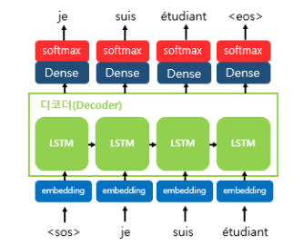
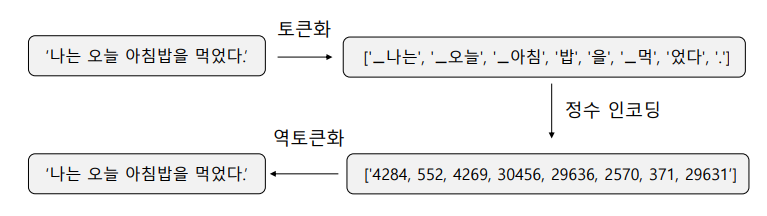

# Seq2Seq

- 서로 다른 두 개의 LSTM 아키텍처를 각각 인코더-디코더 사용

- 입력된 시퀀스로부터 다른 도메인의 시퀀스를 출력

  - Ex) 챗봇, 기계 번역, 텍스트 요약 등

- 인코더는 입력 문장의 모든 단어들을 순차적으로 입력받은 뒤에 마지막에 이 모든 단어 정보들을 압축해서 **컨텍스트 벡터(context vector)**를 만든다.

- 디코더는 컨텍스트 벡터를 받아서 번역된 단어를 한 개씩 순차적으로 출력

  

- <u>인코더의 마지막 은닉 상태를 컨텍스트 벡터</u>라 부름

- 컨텍스트 벡터는 <u>**디코더 RNN 셀의 첫번째 은닉 상태**로 사용</u>된다.

- 인코더와 디코더의 각 시점 입력은 기본적으로 임베딩 벡터

  

- 디코더는 RNN 언어 모델 (RNNLM, RNN Language Model) (Teacher Forcing 사용!)

- `<sos>`는 시작 심볼, `<eos>`는 종료 심볼

- `<sos>` 가 입력되면, 다음에 등장할 확률이 높은 단어를 예측

  

### Teacher forcing

- 훈련 단계에서 Teacher Forcing을 무조건 하는 것이 아니라 비율을 정해서 수행. 이 비율은 하이퍼파라미터.
- 이 비율을 높게 설정할수록 빠른 학습이 가능해지지만 학습 데이터에 과적합(overfititng)이 테스트 단계에서 악영향을 줄 수 있음
- 테스트 단계에서는 Teacher Forcing을 사용하지 않으며 현 시점의 출력을 다음 시점의 입력으로 사용

## Beach Search

### Greedy Decoding

- seq2seq의 디코더는 기본적으로 RNN 언어 모델

- 디코더(RNN 언어 모델)는 매 시점마다 가장 높은 확률을 가지는 단어를 선택

- Greedy Decoding은 매 순간에서의 최적의 선택을 함

- 하지만 전체적으로 봤을 때는 그 순간의 선택이 최적의 선택이 아닐 수 있음

- Greedy Decoding은 순간 잘못된 선택을 했더라도 그 결정을 취소할 수 없음

  

- :point_right: Greed Decoding 대신 Beam Search라는 알고리즘을 사용
  - Beam Search Decoding : 몇 가지 가설을 세우고 최적의 선택지를 고르는 것
  - 매 시점마다 가장 확률이 높은 k개의 다음 단어를 선택 후, 다음 시점 단어들의 확률 예측
  - k * Vocab-size 개의 후보군 중에서 가장 확률이 높은 k개의 후보군만을 유지
  - Beam Search Decoding 또한 항상 최적해를 보장하지는 않지만 Exhaustive search (모든 가능한 조합의 경우를 전부 생성해보고 가장 확률이 높은 문장르 선택) 보다 효율적

### Beam Search Decoding (k=3)

- 디코더의 매 스텝마다, 정답일 확률이 높은 k개의 선택지를 추적 (= 가설)

- k는 보통 5~10의 크기를 사용

- `<start>` (=`<SOS>`, `<s>`, `<GO>` ) 토큰이 입력되면 -> 디코더는 출력층에서 가장 확률이 높은 k개의 단어를 고름 -> 선택된 k개의 단어 각각에 대해서 다음 시점에서 또 다시 가장 높은 확률의 k개의 단어를 고름 -> 선택된 k개의 단어 각각에 대해서 다음 시점에서 또 다시 가장 높은 확률의 k개의 단어를 고름. 해당 시점에서 누적 확률 순으로 상위 k개를 선택 -> 선택된 k개의 단어 각각에 대해서 다음 시점에서 또 다시 가장 높은 확률의 k개의 단어를 고름

- `<eos>` 을 만난 경우가 k개가 될 때까지 반복

  

## subword Tokenization

### OOV(Out-Of-Vocabulary) 문제

### Byte Pair Encoding (BPE)

- BPE : 데이터 압축 알고리즘. (NLP 알고리즘 아님)

  - 자주 등장하는 Byte Pair는 새로운 하나의 Byte가 됨
  - 이를 단어 분리(Word segmentation)에 도입 (=> NLP 알고리즘)
  - 데이터 모든 글자 단위(character) 단위의 유니그램 단어 사전에서 시작
  - 자주 등장하는 바이그램을 유니그램으로 통합
  - 모든 바이그램이 선택되거나 정해진 단어 집합의 크기에 도달할 때까지 반복!

- 

  - Iteration 1 : e, s의 pair는 9의 빈도수 => es로 병합

  - Iteration 2 : es, t의 pair는 9의 빈도수 => est로 병합

  - Iteration 3 : l, o의 pair는 7의 빈도수 => lo로 병합

  - Iteration 4 : lo, w의 pair는 7의 빈도수 => low로 병합

  - Iteration 5 : n, e의 pair는 6의 빈도수 => ne로 병합

  - Iteration 6 : ne, w의 pair는 6의 빈도수 => new로 병합

  - Iteration 7 : new, est의 pair는 6의 빈도수 => newest로 병합

  - Iteration 8 : w, i의 pair는 6의 빈도수 => wi로 병합

  - Iteration 9 : wi, d의 pair는 6의 빈도수 => wid로 병합

  - Iteration 10 : wid, est의 pair는 6의 빈도수 => widest로 병합

    

- 자주 등장하는 바이그램은 그 자체가 단어로 취급됨
- 희귀 단어, OOV에 강건해짐

### 한국어에서 SentencePiece vs Mecab

- SentecePiece 
  - 아주 빠름
  - Subword의 빈도에 기반하기에 unknown token 처리 가능
  - 의미 단위로 잘 나눠지지 않을 수 있음
- Mecab
  - SentencePiece만큼은 아니지만 충분히 빠름
  - 형태소 분석을 기반으로 하기 때문에 의미 단위를 잘 포착
  - 신조어나 오타에 취약

#### SentencePiece의 Detokenization

- 서브 워드 토크나이저의 경우, 분리 시에 서브워드로 분리하므로 이게 기존의 단어인지 서브워드인지 표시하면서 분리하는데, 단어의 시작에 _를 붙이는 것

  

- 서브워드로 분리된 것을 다시 원문으로 복원하는 것을 Detokenization이라 함.

- 단어의 시작에 _를 붙였으므로 이를 참고하여 기존의 원문으로 자연스럽게 다시 복원

  

## BLEU

### BLEU score

- 한 개의 문장에도 다양한 번역이 나올 수 있음 => 번역의 품질을 평가하는 score

  

### Unigram Precison

- 번역기가 번역한 문장 (Candidate, Ca) vs 사람이 번역한 문장 (실제 정답, Reference, Ref)

- 유니그램 정밀도(Unigram Precision)
  - Candidate의 모든 단어의 카운트 합. 즉, Ca에서의 총 단어의 수를 카운트
  - Unigram Precision = Ref들 중에서 존재하는 Ca의 단어의 수 / Ca의 총 단어 수
- 말도 안 되는 번역인데 정밀도가 좋게 나오는 경우 발생
  - :point_right: 중복을 제거해서 보정

### Modified Unigram Precision

- 유니그램이 하나의 Reference에서 최대 몇 번 등장했는지 카운트 : `Max_Ref_Count`
  $$
  Count_{clip} = min(Count,\ MaxRefCount)
  $$
  

- Ca1의 모든 단어의 순서를 랜덤으로 뒤바꾼 Ca3을 추가했을 때 Unigram Precision이 동일 (단어의 순서를 고려하지 않음!)

### N-gram Precision (N=2)

- Unigram이 아닌 N-gram으로 Precision으로 구함

  

- BLEU는 보통 Modified 1-Gram, 2-Gram, 3-Gram, 4-Gram 사용

  

  