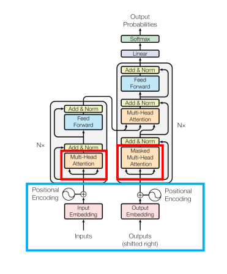

# GPT-2


## Summary

1. 더욱 범용적인 LM

   - Fine-tuning 없이 적용
     - 기존에는 pre-training과 supervised fine-tuning의 결합으로 만들어짐
     - 이는 transfer과 더불어 긴 역사를 가짐
     - 하지만, 지도 학습이 없는 상태로 만들어진다면 일반 상식 추로 등의 다양하게 범용적으로 사용 가능

   - Zero shot learning
     - model이 바로 downstream task에 적용함


2. 새로운 dataset 구성
   - WebText 활용
     - Reddit 데이터 활용


3. Auto Regressive
   - 이전의 output이 다음의 input으로 들어감


Transformer

Positional Encoding + Multi Self-Attention


GPT & Bert

Positional Encoding + Multi Self-Attention


## Text metrics

1. BLEU (Bilingual evaluation understudy)
2. ROUGE
3. METEOR


attention score (이전 문장의 단어가 임베딩된 벡터 h_i, 번역할 단어의 임베딩 벡터 h'_j)
$$
score(h'_j) = [h_1^Th_j', h_2^Th_j',...,h_N^Th_j']
$$

## Transformer



- 입력 방법 : Positional Encoding
  - 기존의 RNN 에서는 가능 했던 순서처리가 안되는 Transforemr
- 핵심 모듈 : (Masked) Multi head attention
  - Self-attention 메커니즘을 이용한 자연어 처리 향상 모듈
  - Mask : 뒤에 답이 안보이게 함


- 성능 향상 1 : Skip Connection
  - multi-head attention의 output이 input과 같아야함
- 성능 향상 2 : Layer Normalization


t : position

주기


인코딩만 떼서 하는 것이 Bert

전체과정이 GPT

-----


## Architecture : GPT-2 구조

### Byte Pair Encoding (BPE)

- 서브워드를 분리하는 알고리즘으로, 빈도수에 따라 문자를 병합하여 서브워드 구성
- 단어를 문자(char) 단위로 쪼갠 뒤, 가장 빈도수가 높은 쌍을 하나로 통합하는 과정을 반복해서 토큰 딕셔너리를 만듦


### Input encoding

- 문장의 시작을 알리는 start token과 문장의 끝을 알리는 end token이 각 문장마다 붙어있다고 가정
- 임베딩 행렬을 받을 때 Positional Encoding 추가적으로 거쳐야 함


#### Positional Encoding

- 각 단어에 순서 정보를 추가하는 것
- 즉, 문장 내 단어의 순서들을 넘겨주는 것
- Input token = embedded token + positional encoding


```python
def positional_encoding(max_position, d_model, min_freq=1e-4):
    position = np.arrange(max_position)  # token의 최대 길이
    freqs = min_freq**(2*(np.arrange(d_model)//2)/d_model)
    pos_enc = position.reshape(-1,1)*freqs.reshape(1,-1)
    pos_enc[:,::2] = np.cos(pos_enc[:,::2])  # 짝수
    pos_enc[:,1::2] = np.sin(pos_enc[:,1::2]) # 홀수
    return pos_enc
```


### Decoder Stacks

- 입력 벡터는 각 디코더셀의 self-attention 과정을 거친 뒤, 신경망 레이어를 지남. 
- 스택에 있는 디코더셀, transformer block의 개수만큼 진행됨


### Multi-head Self-attention

#### Attention

- 언어의 이해를 위해 맥락 정보를 학습

- Process of Composition

  1. Lexical component + Grammatical meaning + Syntactic structure = Compositional meaning (one or more)
  2. Fix referent (by context)
  3. Disambiguation (by context)
  4. Meaning shift to fit context

- **Query와 비슷한 값을 가진 Key를 찾아 그것의 Value를 얻는 방식**

  - Attention(Q, K, V) = Attention Value
    $$
    x'_k = \sum_{i=1} similarity(querry_k, key_i)\ value_i\\
    query_k \leftarrow x_kQ\\
    value_k \leftarrow x_kV\\
    key_k \leftarrow x_kK
    $$

    $$
    Attention(Q,K,V) = softmax(\frac{QK^T}{\sqrt{d_k}})V
    $$

  ```python
  def attention(Query):
      weights = [cos_sim(key, Query) for key in dic.keys()]
      weights = softmax(weights)
      
      attention_value=0 # 가중합
      
      for weight, value in zip(weights, dic.values()):
          attention_value += weight * value
          
      return attention_value
  ```

  1. Query에 대해서 모든 Key와의 유사도 (weight)구함
  2. 유사도(weight)를 key와 맵핑되어있는 Value에 반영
  3. 유사도가 반영될 Value를 모두 더해서 return


- 처음 쿼리의 차원수가 head의 개수만큼 나눠주기 때문에 최종적으로 입력의 차원수와 같게 됨


## Layer normalization

- Batch norm : sample 들의 feature 별 평균과 분산 -> batch size에 따라서 성능 변화가 심함
- Layer norm : 각 batch에 대해서 feature 들의 평균과 분산


## 요약(Summarization)

요약(Summarization)은 첫번째 decoder-only transformer가 학습된 task 입니다. 즉, (목차 앞쪽의 서두 부분을 제외하고) 위키피디아 아티클을 읽고 요약하도록 학습했습니다. 실제 서두 부분은 학습 dataset에서 레이블로 사용되었습니다:


이 논문에서는 위키피디아 아티클에 대해 모델을 학습시켰고, 학습된 모델은 아티클을 요약할 수 있었습니다:


### 전이 학습(Transfer Learning)

[Sample Efficient Text Summarization Using a Single Pre-Trained Transformer](https://arxiv.org/abs/1905.08836) 논문에서, decoder-only transformer는 먼저 language model에 대해 pre-train 하고, 요약(summary)에 대해 finetuning 했습니다. 이 것은 제한된 data 설정에서 encoder-decoder transformer를 pre-train하는 것 보다 더 좋은 결과를 보였습니다.

 

GPT2 논문도 language modeling에 대해 pre-train한 뒤에 요약(summary) task의 결과를 보여줍니다.
