# Dall-e


## 1. Introduction

- DALL-E : Zero-Shot Text-to-Image Generation 

  - 120억 개의 파라미터를 가진 Transformer 기반의 GPT-3의 확장 형태의 모델로 2.5억 개의 데이터(텍스트, 이미지) 쌍으로 학습

  - Computer Vision과 NLP 기술을 결합하여 만든 Text-to-Image Task를 Auto-regressive하게 모델링

  - 복잡한 아키텍처나 추가적인 레이블 정보 없이 매우 우수한 성능을 보임

  - 잘 학습된 DALL-E를 이용하여, zero-shot 상황에서도 매우 우수한 성능을 보임

    - zero-shot : 특정한 데이터셋이 존재할 때 학습 데이터셋에는 접근하지 못하는 상황에서 한 번도 본 적 없는 테스트 데이터셋에 대해서도 좋은 성능을 내는 것

  - 사물을 의인화하는 것이 가능하고, 서로 관련이 없는 두 개의 컨셉을 합치는 것 또한 가능함

    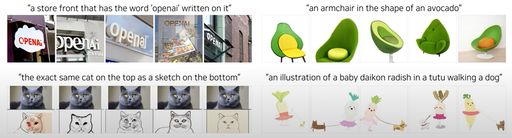


## 2. Background

1) 선행 연구

   - 2015년 DRAW Generative model을 시작으로 본격적으로 연구됨

     -> Image caption 조건 아래 Novel visual scene 생성

   - 2016년 Recurrent VAE를 대신하여 GAN 이용

     -> Image 정확도 향상, 준수한 Zero-shot 일반화 가능성을 보여줌

   - StackGAN : Multi-scale generate 사용 (2017)

   - AttnGAN : Integrating attention and auxiliary losses (2018)

   - Text 외 추가적인 조건 활용 : Object location, Pre-generated semantic layout, Mouse trace

   - Pretrained-cross-modal masked language  model 활용한 연구

   - 한계점 : 물체 왜곡, 실재할 수 없는 물체의 위치, 배경과 어우러지지 못하는 물체

     -> Suggest text to image generative by using large-scale dataset

     

2. Transformer : Attention is All You Need (NIPS 2017)

   - 전통적인 트랜스포머에서는 마지막 인코더 레이어의 출력이 모든 디코더 레이어에 입력됨
     - 레이어 개수가 4개일 때의 트랜스포머 아키텍처 예시는 다음과 같음
     - ex. 기계번역
       - 입력 : "I am a teacher" -> encoder를 거쳐서 적절한 semantic information을 추출 -> decoder에서 이러한 정보의 attention을 수행해서 결과적으로 어떤 토큰이 나와야하는지 하나씩 결과를 알려줌

   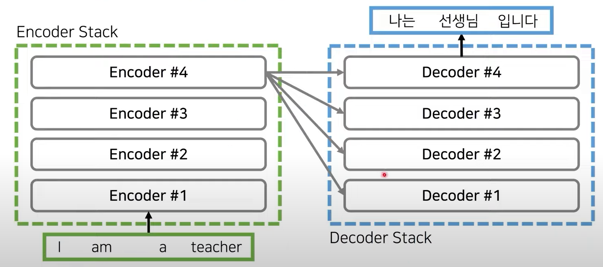


3. GPT-2 (<- Dall-e 1) (OpenAI 2019)

   - 트랜스포머의 decoder 기반의 아키텍처로, 대규모 데이터 세트로 학습된 대용량 언어 모델
     - 기계 번역 목적이 아니므로, decoder만 사용해도 우수한 성능을 낼 수 있음
     - 특정한 문장이 주어졌을 때 다음으로 등장할 단어가 무엇인지 예측하는 방식
   - autoregressively models the text tokens as a single steam of data
   - 토큰(단어) sequence를 입력으로 넣으면 하나의 토큰이 출력되며, 이를 다시 입력 sequence에 추가

   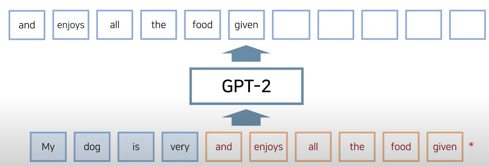


4. 언어 모델 (Language Model)

   - 생성 모델

   - 여러 토큰에 대한 시퀀스에 대해서 확률 값 예측하는 방식으로 동작

   - $$
     Pr(x_1, x_2, ..., x_n)
     $$

     - x_1, x_2..., x_n : 토큰의 sequence

   - 확률론의 chain rule 이용

     - 베이즈 정리 확장하여 복수의 사건 x1, x2... xn에 대한 조건부 확률을 다음처럼 쓰는 것

     - $$
       Pr(x_1, x_2, ..., x_n) = Pr(x_1) * Pr(x_2|x_1) * Pr(x_3|x_1, x_2),...,*Pr(x_n|x_1,x_2,...,x_{n-1})\\
       = \prod_{i=1}^n Pr(x_i|x_1,x_2,...,x_{i-1})
       $$

   - 새로운 단어를 i+1번지에 단어를 sampling (예측)함으로써 다음 단어가 무엇인지 생성하는 것

   - 추측할 때는 확률값이 가장 높은 것 선택
     $$
     \widehat{x}_{i+1} \sim f_\theta (f_{i+1}|x_1, x_2, ..., x_i)
     $$

   - 그 후 예측한 단어를 다음 단어에 다시 넣어서 예측
     $$
     \widehat{x}_{i+2} \sim f_\theta (f_{i+1}|x_1, x_2, ..., \widehat{x}_{i+1})
     $$

   - 중지 조건(eos 토큰(end of sequence)) 이 나올 때 까지 반복하는 등으로 전체 문장을 생성할 때까지 반복

   - sampling 방법 : 'greedy' sampling, top-n sampling 등이 있음

   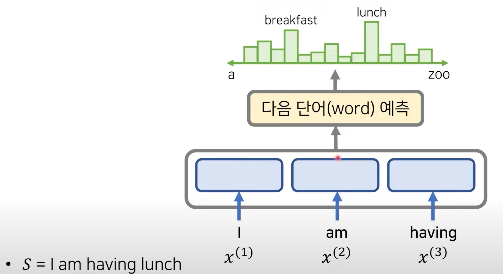

   - [연쇄 법칙] P(S) = P(I) x P(am|I) x P(having|I am) x P(lunch|I am having)


5. 오토 인코더(Auto-Encoder)

   - 데이터 인코딩 (data encoding)을 효율적으로 학습할 수 있는 뉴럴 네트워크
     - 학습할 때는 <u>입력 데이터와 출력 데이터를 동일하게 설정</u>
     - Encoder -> z (latent vecotr)로 압축되었다가 -> Decoder에서 다시 복원되는 형태로 학습
   - 모든 입력 이미지는 bottleneck에 해당하는 중간 **latent vector z**로 변환되었다가 복원됨
     - 입력 이미지는 압축된 정보(latent code)로 표현될 수 있다는 장점이 있음

   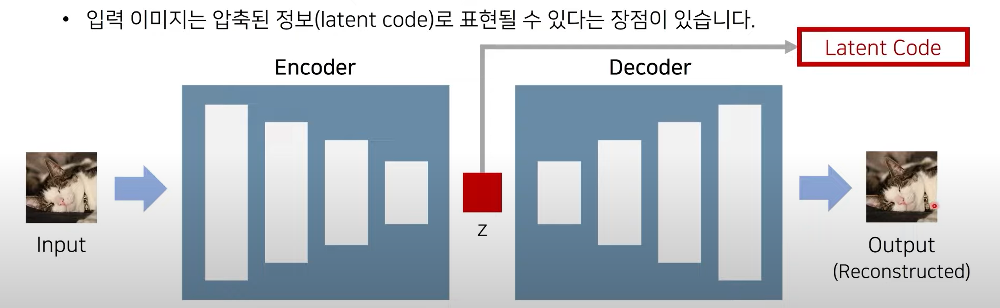

   - 일반적으로 픽셀 공간에서 두 이미지를 선형 보간하면 중간 이미지의 sementic information이 부자연스러움

     - ```
       선형 보간법은 1차원 직선상에서 두 점의 값이 주어졌을 때 그 사이의 값을 추정하기 위해 직선 거리에 따라 선형적으로 계산(비례식)하는 방법
       ```

   - 잠재 공간의 두 벡터를 선형 보간하면 학습된 manifold 위에서 상대적으로 자연스러운 이미지 변환이 이루어짐

     - 두 latent vector 사이에서 학습된 mainfold 위에서 linear interpolation를 수행
     - 오토 인코더는 <u>저차원으로 데이터를 압축</u>하므로, data manifold를 학습하는 역할을 수행


6. VAE (Variational Auto-Encoder) 

   - VAE의 decoder는 <span style="color:crimson">latent code</span>가 <span style="color:Cornflowerblue">사전에 정해 놓은 분포(Gaussian 등)</span>을 따른다고 가정
   - mean과 variation으로 구성된 distribution에서 latent vector를 sampling해서 decoder에 들어갔을 때 원본 이미지가 복원될 수 있도록 함

   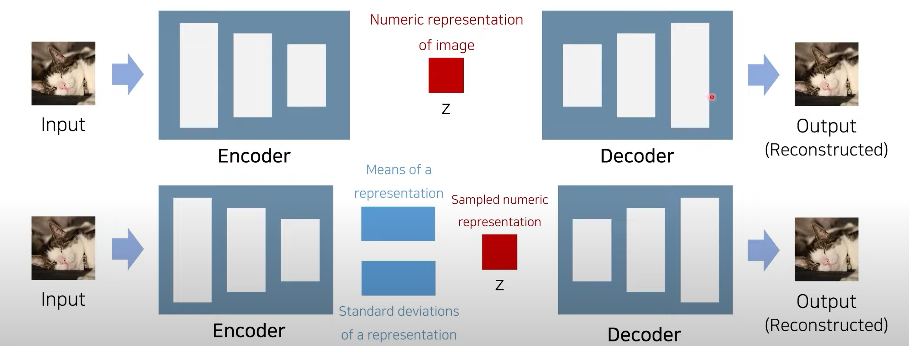

   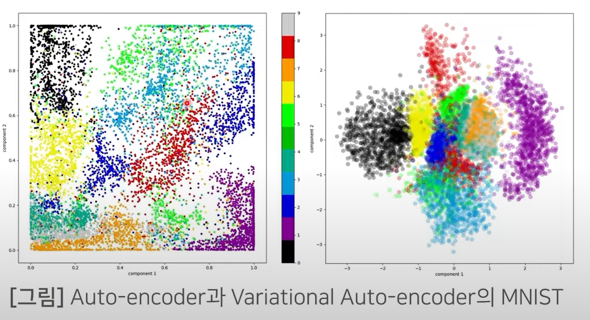

   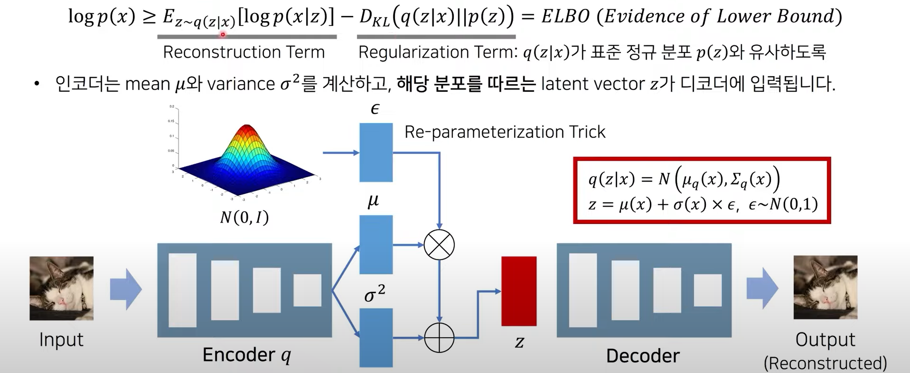

   - Reconstruction Term, Regularization Term 두개로 구성해서 roll bound를 최대화
   - 입력 이미지 x가 들어왔을 떄 latent vector인 z를 sampling 하는 것이 목적
   - 그래서 x가 입력되었을 때 encoder에서 mean과 variance를 내보내고 이것을 따르는 latente vector를 sampling 하기 위해 적절한 gradient를 구할 수 있도록 Re-parameterization Trick을 사용
   - 별도의 가우시안  분포에서 랜덤하게 입실론 벡터를 추출해서 이것에 mean을 곱해주고 variation 값을 더해줘서 latent vector z를 구함 그것이 decoder에 들어갈 수 있도록 함
   - **D_KL(Regularization Term)** 은 q(z|x)가 표준 정규 분포를 따를 수 있도록 제약 조건을 걸어주는 것
   - **E(Reconstruction Term)**는 x가 입력되었을 때 latent vector z를 구한 뒤 다시 원래 이미지가 나올 수 있도록 하는 것


7. VQ-VAE : Vector Quantised-Variational AutoEncoder (NIPS 2017)

   - The encoder network outputs **discrete**, rather than continuous, codes; and the prior is **learnt** rather than static (인코더 네트워크는 연속적인 코드가 아닌 이산적인 코드를 출력합니다. 그리고 사전은 정적인 것보다 학습된 것입니다.)
   - CNN을 거친 결과를 H * W개이 그리드로 나누고 (각 위치마다 D차원), 각 위치마다 e_1부터 e_k까지 중에서 가까운 1개로 변환

   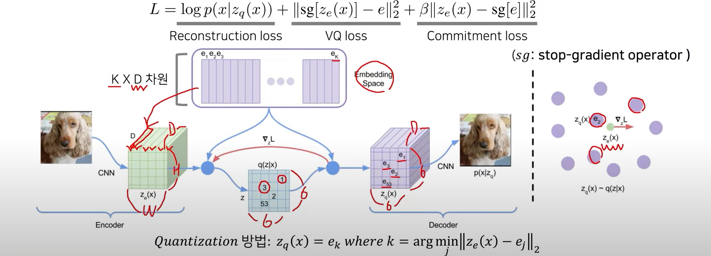

   - 인코딩 수행 결과가 있을때 (z_e(x)) representation이 되고 가장 까운 코드북 vector를 찾아서 (e_j) 그 인덱스를 k라고 해서 k번째 인덱스의 코드북 vector가 실질적으로 decoder에 입력으로 들어갈 수 있도록 하는 것
   - loss는 reconstruction loss는 입력 이미지 x가 있을 때  encoder에 넣고 quantization을 수행해서 나온 tensor를 입력으로 받아서 다시 원본 이미지가 나올 수 있도록 하는 것
   - VQ loss와 commitment loss 함께 사용해서 codebook과 encoder 전반에 걸쳐서 학습이 수행될 수 있도록 함
     - 이때 sg는 stop gradient, vq loss에서 코드 북 vector인 e만 수행될 수 있도록 함

   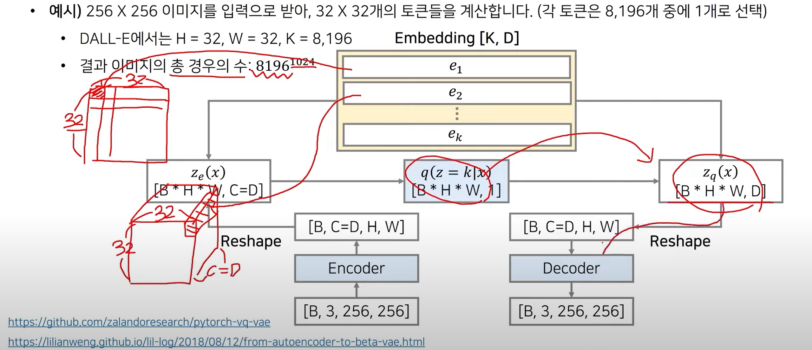


8. Generating Diverse High-Fidelity Images with VQ-VAE 2 (NIPS 2019)

   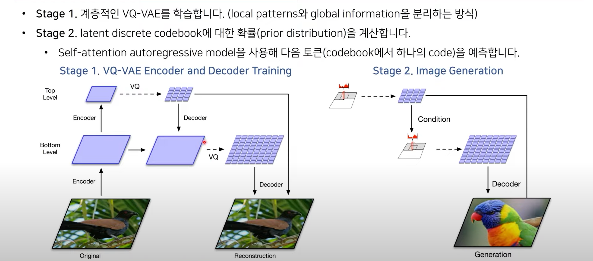

   - 


2. GPT-3 : Generative Pre-trained Transformer 3 (<- Dall-e 2)

   - Auto-regressive 병합으로 학습하는 unsupervised pretrained lauguage model

   - Model & Architecture는 GPT-2와 동일

   - 15억개 파라미터 -> 1750억 개의 parameter 확장

   - Full self-attention -> sparse self-attention으로 변경

     


3. AttnGAN

   - Fine-grained text to image generative with attentional generative adversarial networks

     

## 3. Methodology

- 목표 : "Attention is all you need"에서 제안된 Autoregressive Transformer 학습

  -> Text & Image token을 Single stream으로 Modeling

- Issues

  1. Memory issue : 고해상도의 Image를 Pixel 단위에서 직접적으로 사용
  2. Short-range dependece : Likelihood를 Object function으로 사용하는 Model들은 Pixel 간의 Short-range dependence를 우선 (High-frequency detail을 위해 Capacity 사용)

- Solution : 2-Stage Training


---

### Overview


- Satge1

  - Discrete VAE를 이용하여 256 x 256 RGB Image

    -> 32 x 32 Image Token으로 압축

  - 각 Token은 8192가지의 값을 가질 수 있음

  - Context size 192배로 줄일 수 있음 (8 x 8 x 3)

- Stage2

  - 최대 256 BPE-encoded text tokens을 32x32 Image token과 Concatenate
  - Text & Image token의 결합 분포 Modeling하는 Autoregressive transformer 학습


- 먼저 text token들이 최대 256개 들어가고, 이어서 image token들이 최대  1,024개 입력될 수 있음

- 모델을 사용할 때는 text만 넣거나 text + image(rectangular region)를 넣어서 결과 이미지를 생성할 수 있음

  


- 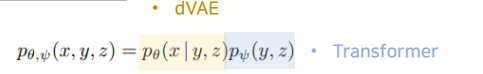

  - x : Images, y : Captions, z : Encoded RGB Image 의 token

- 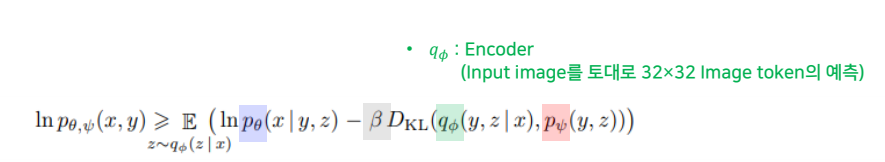

  - 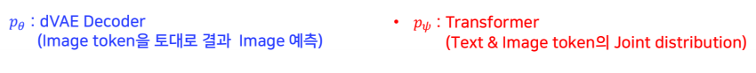

  - 𝑝𝜃 : dVAE 디코더 (이미지 토큰을 토대로 결과 이미지 예측)
  - q : dVAE 인코더 (입력 이미지를 토대로 이미지 토큰 예측)
  - 𝑝𝜓 : Transformer (텍스트와 이미지 토큰에 대한 joint distribution 예측)


----

### DALLE-E 학습 과정

- **two-stage** training procedure 사용
  1. 256 x 256 이미지를 32 x 32 grid의 이미지 토큰들로 압축 (각 토큰은 8,192개의 code 중 1개로 배정)
     - 이로써 <u>큰 qulity 손실 없이</u> transformer의 context size를 8 x 8 x 3배만큼 적게 만들 수 있음
     - 픽셀 하나씩 연달아 생성하는 것보다 훨씬 효율적임
  2. 256개의 BPE-encoded text token 들과 1,024개의 image token들이 연속적으로 입력될 수 있음
     - Autoregressive transformer를 학습하여 text tokens과 image tokens의 joint distribution을 모델링
     - 예를 들어 픽셀을 일일이 하나씩 연달아 예측(계산) 하는 경우 픽셀 개수만큼 예측을 수행해야 하므로, 연산이 비효율적 (긴 sequence)


### DALL-E 동작 원리

- 먼저 text token들이 최대 256개 들어가고, 이어서 image token들이 최대 1,024개 입력될 수 있음

- 모델을 사용할 때는 text만 넣거나 text+image(rectangular region)를 넣어서 결과 이미지를 생성할 수 있다

  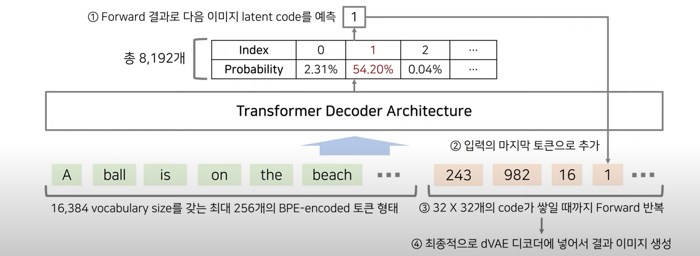

  - 문장으로 넣거나, 문장+이미지를 넣을 수 있음
  - 이미지 토큰은 1,024개 까지 입력 가능
  - 디코더는 각 8,912개 codebook vector 중 확률값을 구해주는 역할
  - latent code를 다음 토큰에 추가해서 다음 문장이 무엇일지 예측하는 방식으로 총 1,024개의 코드가 쌓일 때까지 반복 -> 그 후 텐서로 묶어서 dVAE 디코더에 넣어서 이미지 생성


### DALL-E 학습 과정

- 전체 학습 과정은 joint likelihood에 대한 ELBO(Evidence Lower Bound)를 maximizing 하는 것으로 볼 수 있음

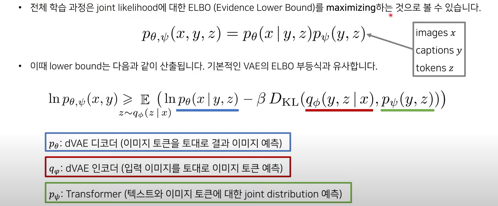


1. Stage 1  : Learning the Visual Codebook

   - 먼저 transformer를 고정한 상태로 **dVAE 인코더 *qφ* 와 dVAE 디코더 *p*𝜃 를 학습** (K= 8,192 codebook vectors)
     - 이때 초기 prior transformer 𝑝𝜓 는 uniform categorical distribution으로 설정

   - 

     - 고양이 털, 상점 글자, 일러스트에서의 얇은 글자와 같이 디테일은 때때로 손실되지만, main feature들은 일반적으로 여전히 인식이 가능함. 본 논문에서는 이러한 문제를 완화하기 위해 8,192 크기의 큰 vocabulary size를 사용함 (codebook vector의 개수)

   - DALL-E에서는 discrete problem을 **gumbel softmax relaxation**을 이용해 해결

   - 단순히 argmax를 이용해 codebook vector 중에 (가장 가까운) 하나의 인덱스를 구하게 되면 gradient를 계산할 수 없음

     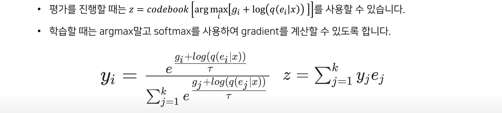

     - (tau)*τ* 의 값이 0에 가까워질 수록 hard한 distribution이 만들어짐. -> 타이트해짐

   - 결과적으로 argmax 대신에 이렇게 계산된 sampled latent vector z를 사용해 학습함

     - The relaxation become tight as the temperature *τ* -> 0.

   

2. Stage two: Learning the Prior

   - 이후에 dVAE 인코더  *qφ* 와 dVAE 디코더 *p𝜃* 를 고정한 상태로 the prior distribution (transformer)  𝑝𝜓 를 학습
     - 120억 개의 파라미터를 가진 sparse transformer 아키텍처를 사용
   - 이미지 토큰은 dVAE 인코더의 결과 logits에서부터 argmax sampling을 진행하여 생성
   - 모든 텍스트 토큰에 대하여 항상 attention 하는 방식으로, 다양한 attention mask들을 활용

   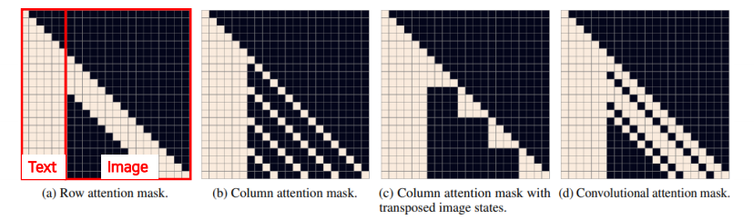


3. 결과 이미지 분석
   - 학습을 마친 뒤에서 하나의 text에 대하여 N개의 다양한 이미지를 생성할 수 있음
   - 생성한 뒤에서는 우수한 결과를 고르기 위해 CLIP (OpenAI 2021)을 사용해 주어진 text와 k번째로 similarity가 높은 이미지를 선택할 수 있음 (현재 k=1)


4. 성능 비교

   - StackGAN, AttnGAN, DF-GAN, DM-GAN

   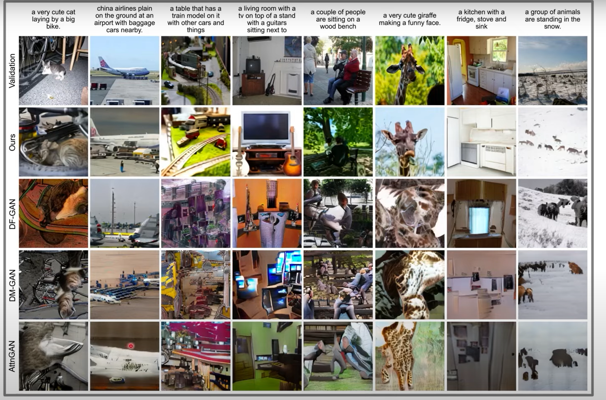


5. Zero-Shot Visual Reasoning : Image-to-Image Translation

   - 매우 많은 개수의 데이터로 학습되었기 때문에, 특정 task에 대하여 데이터 세트에 대하여 학습 데이터를 전혀 사용하지 않고, 데이터 세트에 대하여 바로 동작하도록 해도 꽤 높은 성능이 나올 수 있음

   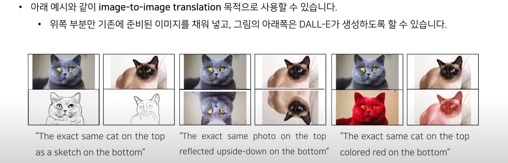


-----

Stage 1  : Learning the Visual Codebook

1.  𝜃와 𝜙에 대해 ELB를 Maximizing (Image에 대해 dVAE 학습하는 Step, Only Image)
   - Initial prior 𝑝𝜓 : Codebook vector (K=8192)에 대한 Uniform categorical distribution 설정
   -  𝑞𝜙 : 8192개의 logit에 의해 parameterize 되는 categorical distribution 설정
     (dVAE Encoder output = 32 x 32, 각 Point마다 8192개의 값을 가질 수 있기 때문)
2. → Optimize가 어려움 (𝑞𝜓: Discrete distribution, Reparameterization gradient 사용 불가능)
   → Gumbel-softmax relaxation을 통해 해결 (기대값 대체 : 𝑞𝜙→ 𝑞𝜙
   Τ , Τ → 0 일수록 Relaxation tight)
   → Likelihood for 𝑝𝜃 : Log-laplace distribution을 활용하여 Evaluate

3. Reparameterization gradient 
   - Gradient estimates computed via the Reparameterization trick
   -  Stochastic node = Stochastic + Deterministic (Backpropagation) : 미분 가능, Continuous 해야함

4.  Gumbel-softmax relaxation
   - Gumbel-max : Categorical variable을 Reparameterization 
   -  Gumbel-softmax : argmax term을 softmax로 근사 (미분 가능)
   -  Temperature 𝜏 : 0 – One-hot, ∞ - Uniform distribution 


5. Annealing schedule for relaxation temperature and step size
   - Temperature 𝜏 를 1/16으로 Annealing 하면 Relaxed validation ELB ≈ 실제 Validation ELB

6. Using 1x1 Convolutions at the end of Encoder & the beginning of Decoder
   - Relaxation 주변의 Convolution에서 Receptive field의 크기를 줄였을 때, 실제 ELB로 더 잘 일반화

7. Multiplying a small constant to the outgoing activations of Encoder & Decoder
   - 초기 학습 부분의 안정성을 보장해 줄 수 있음 

8. KL Weight 𝛽 = 6.6으로 설정했을  때, Codebook의 효율을 높이고 Reconstruction Error가 줄여 줌


Stage 2 : Learning the Prior

- 𝜃와 𝜙를 고정시킨 후 𝜓에 대한 ELB를 Maximizing (Text와 Image token의  Prior distribution 학습)
  - Initial prior 𝑝𝜓 : 130억 개의 Parameter를 갖는 Sparse transformer에 해당
  - Text : Caption을 소문자화 한 후 16384개의 Voca를 사용하여 BPE-encoding (최대 256 Tokens)
  -  Image : 32 x 32 = 1024 Token으로 Encoding (Voca size는 8192개)
    dVAE Encoder logit에서 Argmax sampling을 통해 Image token을 얻음
  -  최종적으로 Text & Image token을 Concatenate하여 Single stream of data로서
    Autoagressive하게 Modeling


-  Transformer : Decoder-only model
  -  Text-to-text attention : Standard casual mask 적용
  -  Image-to-image attention : Row/Col/Convolutional attention mask 적용 가능


- Transformer Embedding Scheme


- GPU Efficiency

  - Mixed-Precision Training

    - GPU Memory 효율성 향상을 위해 16-bit 
      precision을 사용
    - Standard loss scaling 대신 Per-resblock
      gradient scaling 방법 이용

    

  -  Distributed Optimization

    - 120억 개의 Parameter model 은 16-bit 
      precision 시 24GB 메모리 차지

    - PowerSGD를 이용하여 Gradient 압축

      

-----

## CLIP

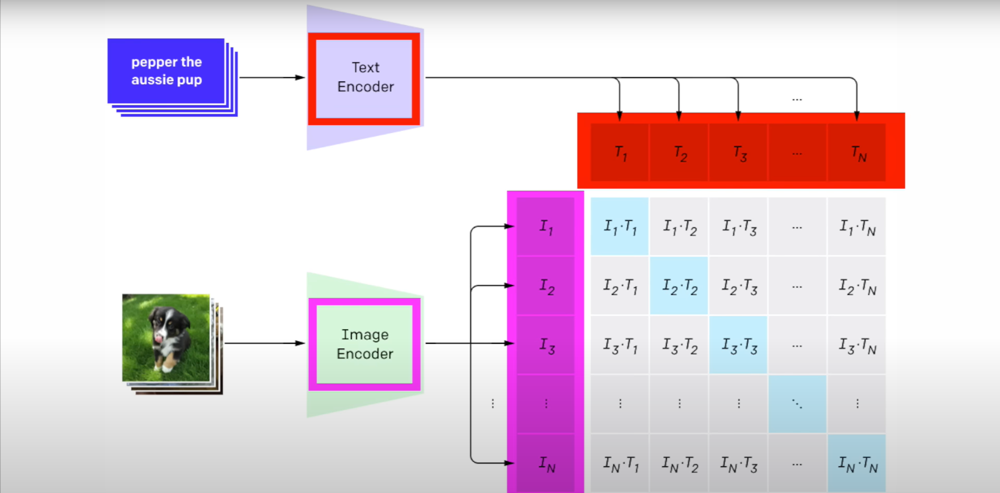


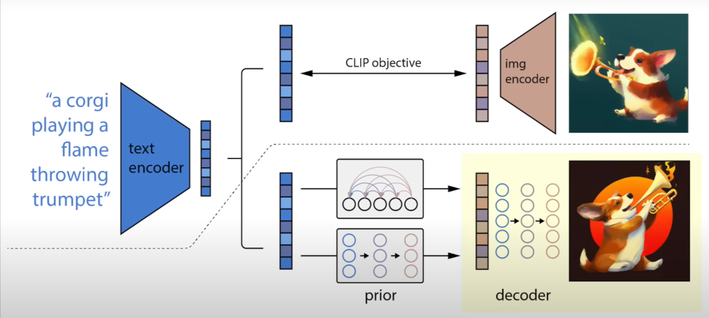

----

## CODE ver. pytorch

1. DALLE 2를 훈련시키는 것은 3단계 과정. CLIP 훈련이 가장 중요
   - CLIP 훈련시킬 때 x-clip 패키지를 이용

```python
import torch
from dalle2_pytorch import CLIP

clip = CLIP(
    dim_text = 512,
    dim_image = 512,
    dim_latent = 512,
    num_text_tokens = 49408,
    text_enc_depth = 1,
    text_seq_len = 256,
    text_heads = 8,
    visual_enc_depth = 1,
    visual_image_size = 256,
    visual_patch_size = 32,
    visual_heads = 8,
    use_all_token_embeds = True,            # whether to use fine-grained contrastive learning (FILIP)
    decoupled_contrastive_learning = True,  # use decoupled contrastive learning (DCL) objective function, removing positive pairs from the denominator of the InfoNCE loss (CLOOB + DCL)
    extra_latent_projection = True,         # whether to use separate projections for text-to-image vs image-to-text comparisons (CLOOB)
    use_visual_ssl = True,                  # whether to do self supervised learning on images
    visual_ssl_type = 'simclr',             # can be either 'simclr' or 'simsiam', depending on using DeCLIP or SLIP
    use_mlm = False,                        # use masked language learning (MLM) on text (DeCLIP)
    text_ssl_loss_weight = 0.05,            # weight for text MLM loss
    image_ssl_loss_weight = 0.05            # weight for image self-supervised learning loss
).cuda()

# mock data

text = torch.randint(0, 49408, (4, 256)).cuda()
images = torch.randn(4, 3, 256, 256).cuda()

# train

loss = clip(
    text,
    images,
    return_loss = True              # needs to be set to True to return contrastive loss
)

loss.backward()

# do the above with as many texts and images as possible in a loop
```


---


## Summary

- Autoregressive transformer 기반 Text-to-image generation task를 위한 접근법 제안
- 120억 개의 Parameter로 이루어진 Large scale Model로써 GPT-3의 Image 확장 형태
- Zero-shot performance와 Single generative model 등의 관점에서 훌륭한 수준의 일반화 성능을 보임
- Caption에 사물이 많이 포함되면(복잡할수록) 조합해서 그리지 않고, 사물을 그대로 그리려는 한계점을 지님
  (ex. “파란 딸기 이미지가 있는 스테인드글라스 창” 이라는 Caption이 들어오면, 조합한 결과가 아닌 각각의
  사물을 그대로 그린 결과를 보임)
- Text2Art : VQGAN+CLIP