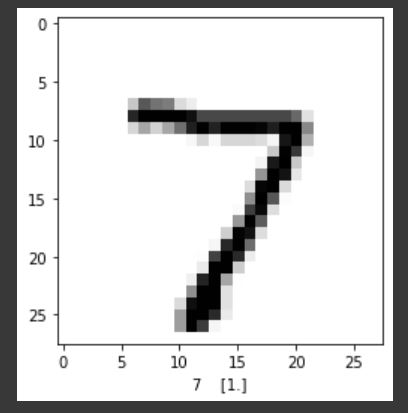
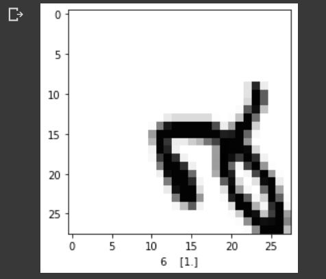
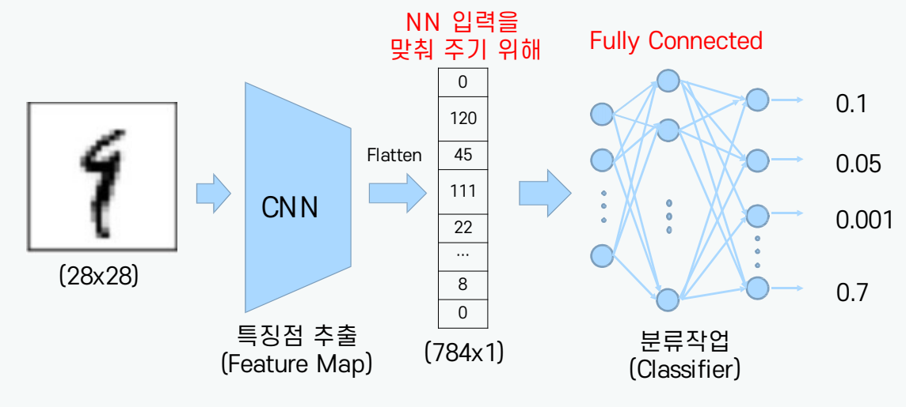
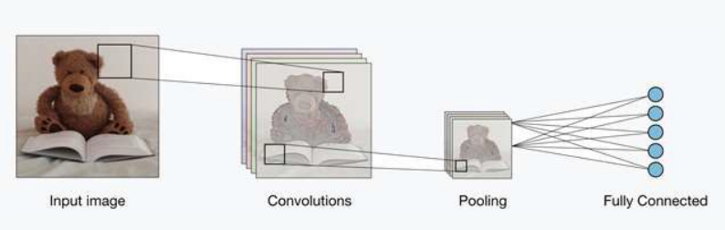
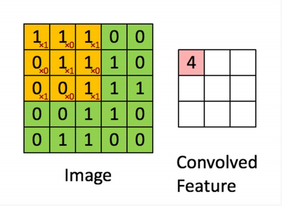
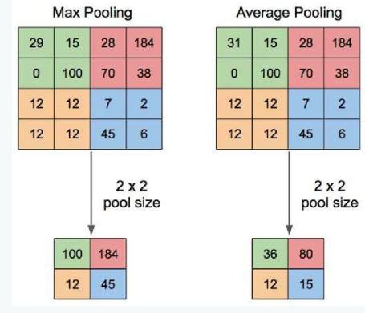

# DL DAY4 TIL

멀캠 수업 내용 정리

## 1. Neural Network의 문제점

### 2) Local Minima

- 경사하강법을 통해 Cost function의 최소값을 찾도록 하는데 Global minimum(극소점)에 도달하지 못하고, 기울기가 0이 되는 다른 지점인 local minimum에 수렴
- 이렇게 local minimum으로 빠지는 것을 방지하기 위한 방법으로 다양한 optimize 기법이 있음


- Optimizer
  1. SGD(Stocatic Gradient Descent)
     - 데이터 전체를 활용하지 않고 일부분을 활용하면서 업데이트
     - Local minima에 빠지더라도 다른 데이터 셋이 사용되었을 때, 빠져나올 수 있다는 장점을 가지고 있음
     - 기존에는 스무스하게 찾아갔다면, 이는 지그재그 형식으로 global minima를 찾아가게 됨


### 3) Overfitting

- high variance 모델
- 너무 디테일한 특성까지 학습되어져서 학습된 것은 잘 예측하는데, 실제 테스트 데이터에서는 적용이 안됨
- 판별법 : Loss or Accuracy 그래프를 통해 판단
- -> 학습 중 epoch가 도는 중간에도 Tensorboard를 확인하면서 학습해야 함
- 비율을 나눌 때 고르게 나눠주는 **stratify 옵션**을 통해 분포를 고르게 하면 약간의 성능 개선 효과를 볼 수 있다.


- Overfitting 방지법
  1. DropOut
     - 은닉층에 드롭아웃을 확률 p로 적용하는 경우, 은닉 유닛들을 p 확률로 제거하는 것
     - 출력층을 계산할 때 은닉층 어느 하나에 전적으로 의존하지 않게 됨
  2. DATA Augmentation
     - 데이터를 증강시키는 것
  3. Early Stopping
  4. 모델 간소화
     - Lyaer 수를 줄이고 은닉층 수를 줄여서 모델을 간소화 시키는 방법
  5. L1, L2 Reglarization
     - 큰 coefficient . weight에 패널티를 주는 것
  6. Batch Normalization
     - covariate shift
       - 공변량 변화
       - 매 스텝마다 히든 레이어에 들어오는 데이터의 분포가 달라지는 것
       - 레이어가 깊어지면 깊어질 수록 심화


#### L1, L2 Regularization

- lambda가 weight에다가 얼마만큼 패널티를 줄지 정의를 해주는 것

L1 규제
$$
cost = \sum_{i=1}^n (y_i - f(x_i)^2 + \frac{\lambda}{2}|w|
$$

- 가중치의 절대값

L2 규제
$$
cost = \sum_{i=1}^n (y_i - f(x_i)^2 + \frac{\lambda}{2}|w|^2
$$


- 모든 가중치를 균등하게 작게 유지


#### Batch Normalization

- 학습에서 불안정화가 일어나는 이유 : 'Internal Covariance Shift'라는 주장
  - 네트워크의 각 레이어나 Activation 마다 입력값의 분산이 달라지는 현상
  - Covariate Shift : 매 스탭마다 히든 레이어에 들어오는 데이터의 분포가 달라지는 것. 레이어가 깊어질수록 심화
  - Internal Covariance Shift : 레이어를 통과할 때 마다 Covariate Shift 가 일어나면서 입려그이 분포가 약간씩 변하는 현상
- 평균과 분산을 조정하는 과정을 신경망 안에 포함하여 학습 시 평균과 분산을 조절
  - 미니배치의 평균과 분산을이용해서 정규화한 뒤에, scale 및 shift를 감마, 베타 값을 통해 실행.
  - Backpropagation을 통해서 학습


Gradient Vanishing 방지법

1. activation function을 변경 (sigmoid -> ReLU)
2. 가중치 초기화를 잘 해야 한다
3. Small learning rate


------------


## MLP로 minst 이미지 분류하기


[1] keras에서 data 가져오기

```python
# MNIST데이터셋 불러오기
(X_train, Y_train), (X_test, Y_test) = tf.keras.datasets.mnist.load_data()
print(X_train.shape) # (60000, 28, 28) >> 28x28 이미지가 60000장 
print(X_test.shape)
print(Y_train.shape)  # (60000, 10)  >> 정답이 10개로 분류하는 것 (0~9)
print(X_test.shape)
```

> - X_train.shape : (60000, 28, 28) >> 28x28 이미지가 60000장
> - Y_train.shape : (60000, 10)

[2] 그래프로 확인

```python
# 그래프로 확인
import matplotlib.pyplot as plt
plt.imshow(X_train[10], cmap='Greys')
plt.show()
```


[3] 코드로 확인

```python
# 코드로 확인
for x in X_train[0]:
    for i in x:
        sys.stdout.write('%d\t' % i)
    sys.stdout.write('\n')
```


[4] 차원 변환

```python
# 차원 변환 과정
X_train = X_train.reshape(X_train.shape[0], 784)  # (60000 x 28 x 28) -> (60000 x 784 ) 60000은 이미지의 총 갯수. 배치사이즈를 의미한다.
# reshape(X_train.shape[0], -1) >> 자동 계산됨
```


[5] 정규화

```python
X_train = X_train.astype('float64')  ## types를 float 64로 변환
X_train = X_train / 255  ## 0~ 255 값을 0~1 값으로 노말라이즈 해주기

X_test = X_test.reshape(X_test.shape[0], 784).astype('float64') / 255
```

> min-max normalization 효과


[6] 클래스 값 확인

```python
# 클래스 값 확인
print("class : %d " % (Y_class_train[10])) ## 이미지 하나 확인하는게 [0]이므로 여기서도 [0]를 가져온다.
```

> Y_class_train shape : (60000, )
>
> -> 정답 개수 -> 1차원 -> 첫번째 정답 값 가져오기


[7] one-hot encording

```python
# 바이너리화 과정 0 ->[1 0 0 0 0 0 0 0 0 ]
Y_train = tf.keras.utils.to_categorical(Y_train)
Y_test = tf.keras.utils.to_categorical(Y_test)
print(Y_train[10])

```

> `to_categorical` : 원핫-인코딩


> :question: `to_categorical`의 기능은 무엇인가요?
>
> - 원핫 인코딩
>
> :question: 원핫 인코딩에 쓰는 loss는?
>
> - categorical crossentropy
>
> :question: `y_class_train`은 어떤 형식으로 저장이 되어 있나요?
>
> - 0~9의 정수
>
> :question: 어떤 loss를 써야 하나?
>
> - sparse categorical crossentropy


- 픽셀은 0~255 로 되어 있음

  픽셀값이 0일때는 하얀색, 255로 갈수록 검은색


------


- MLP (Multi Layer Perceptron)

- activaition : ReLU (Rectified Linear Unit)

- optimizer : Adam (Adaptive Gradient Descent Momentum)

- loss : categorical_crossentropy

  - $$
    -\frac{1}{N}\sum Y_i log\hat{Y_i} = -\frac{1}{N}\sum_i\sum_k y_{ik}\ log\ {\hat{y}_{ik}}
    $$

  - label : y, prediction : \hat{y}, dimension : k
  - Y : vector

- metric : accuracy


- 입력층을 전달받아서 은닉층에서는 비선형을 representation하게 되고 출력층에서는 각각의 확률을 따져봄

- Output의 **Activation Function =** `softmax`, **Loss Function =** `categorical crossentropy`


[train / test 분리]

```python
X_train = X_train.reshape(X_train.shape[0], 784).astype('float32')  # 1차원 배열로 reshape
# X_train = X_train.reshape(X_train.shape[0], -1).astype('float32')
X_test = X_test.reshape(X_test.shape[0], 784).astype('float32')

Y_train = tf.keras.utils.to_categorical(Y_train)  # 정수 --> one-hot
Y_test = tf.keras.utils.to_categorical(Y_test)

```

> - `reshape()`를 통해 N차원 -> 1차원으로 변환
> - Dense층의 shape : 784 (= 28*28)

<br>

[모델 설계]

```python
#모델 설계
# method 1
input_Layer = tf.keras.layers.Input(shape=(784,))  # 데이터 입력
x = tf.keras.layers.Dense(512, activation='relu')(input_Layer)  # hidden layer1
x = tf.keras.layers.Dense(512, activation='relu')(x)  # hidden layer2
Out_Layer=tf.keras.layers.Dense(10, activation='softmax')(x)

model = tf.keras.Model(inputs=[input_Layer], outputs=[Out_Layer])
model.summary()
```

> - 은닉층의 activation = `relu`
> - Output의 activation = `softmax`
>   - softmax : 총 합이 1

<br>

[모델 컴파일]

```python
# 모델 컴파일
loss= tf.keras.losses.categorical_crossentropy
optimizer = tf.keras.optimizers.Adam(lr=0.001)
metric= ['accuracy']
model.compile(loss=loss,
             optimizer=optimizer,
             metrics=metric)
```

> :question: one-hot encoding변경 그리고 다중분류에는 어떤 loss를 써야할까요?
>
> - `categorical crossentropy`
>
> 
>
> - optimizer : `Adam`
> - metric : `accuracy`


    


----


Visual로 확인하기

```python
## TEST할 이미지 선택
test_image = X_test[0]

## NN 입력 차원을 이차원으로 데이터를 넣어주어야 해서 1x784 형태로 reshape하고 필요하면 노말라이제이션
test_image_reshape = test_image.reshape(1,784).astype('float64')
 ### (28x28)이미지 를 784 개로 reshape 앞에 1이라는 숫자는 데이터 1개다. batch size의미.
```

> - 2D -> 1D로 변환하여 nn으로 전달

```python
## 모델 불러오기
model = tf.keras.models.load_model('30-0.4093.hdf5') 
# 모델을 새로 불러옴
```

```python
# 불러온 모델로 값 예측하기.
Y_prediction = model.predict(test_image_reshape)
## Y_prediction = [[ 0.1 0.1 .... 0.7 0.1 ]] 1개의 이미지의 결과를  10개의 값 으로 예측
# 10개는 각 perceptron의 예측 값.
```

```python
## 10개의 class가 각 확률 값으로 나오기 때문에 가장 높은값을 출력하는 인덱스를 추출. 그럼 이것이 결국 class임.
### np.argmax는 들어온 행렬에서 가장 높은값이 있는 index를 반환해주는 함수.
index=np.argmax(Y_prediction)
vlaue=Y_prediction[:, index]
plt.imshow(test_image, cmap='Greys')
plt.xlabel(str(index)+"    " +str(vlaue))
plt.show()
```

    

<br>

<br>

cv2로 이미지 회전 시키기

- $$
  \begin{pmatrix} \acute{x}  \\\acute{y} \\ 1\end{pmatrix} =  \begin{bmatrix}cos \theta  & -sin \theta & tx\\ sin \theta & cos \theta & ty \\ 0 & 0 & 1\end{bmatrix} \begin{pmatrix} x  \\ y \\ 1\end{pmatrix}
  $$

- 

```python
## 이미지 회전 시키기.
M = cv2.getRotationMatrix2D((28/2, 28/2), 90, 1)  # Matrix 생성  28/2, 28/2 센터를 맞추는 것
M[0,2] = M[0,2] + 5
M[1,2] = M[1,2] + 5
test_image = cv2.warpAffine(X_train[5], M, (28,28))  # image에 Matrix 곱   (28, 28)크기로 
```

> - cv2.getRotationMatrix2D(`center_x`,`center_y`, `회전`, `크기`)
>   - 중앙을 기준으로 회전시켜주는 함수
> - cv2.warpAffine(`변환하고싶은 이미지`, `변환 행렬`, `출력 사이즈`)
>   - Affine 변환 행렬
>   - 크기를 축소하거나, 영상의 위치를 이동시키거나, 회전을 시켜야 할 때 사용


```python
print(Y_prediction)
# 1.0000000e+00  6번째 인덱스가 가장 큰 값
```

> [[8.6530346e-36 2.4065279e-23 2.2210169e-13 1.1917964e-28 1.0715250e-10  1.3977579e-30 1.0000000e+00 0.0000000e+00 2.1701147e-23 1.2412862e-23]]
>
> - 1.0000000e+00 6번째 인덱스가 가장 큼
>
> - ```python
>   index = np.argmax(Y_prediction)
>   ```
>
> - :question: Y-Prediction에서 제일 큰 값의 인덱스?
>
>   - 6

     


:point_right: 성능이 저하되거나 잘못 분류되는 문제 발생

**그 이유는?**

- Fully connected layers(= mlp = Dense)의 단점
  - 데이터 형상 무시
  - 이미지의 공간적 (spatial) 한 정보 무시
  - 학습해야 할 가중치(W)가 많음

**해결방법**

- 특징을 추출해내서 변화에 대응할 수 있도록 해야 한다

- -> CNN 모델

  


-----


## CNN (Convolution Neural Network)



<br>

- 이미지의 특징을 검출해서 분류하는 것
- 특징을 찾는 레이어와 분류를 하는 레이어로 구성




- Feature 추출 영역은 Convolution Layer와 Pooling Layer를 여러 겹 쌓는 형태로 구성
- convolution : 선언된 크기의 filter를 이미지에 override 하면서 **feature 추출**
- pooling : 도드라지는 중요한 정보를 찾는다
- 특칭 추출 부분과 이미지 분류 부분 사이에 데이터를 배열 형태로 만드는 Flatten Layer
- fully connected 최종 추출된 feature를 분류한다


### Convolution Layer


RGB 이미지 (3차원)

- height x width x channel의 3차원 텐서로 표현

- 분류자가 잘 분류할 수 있는 특징값들이 모여있는 activation map(= feature map)을 만들 수 있도록 하는 filter(=kernal)의 w값으로 학습으로 찾는 것이 목표



> :question: convolution은 어떤 특징이 있나요?
>
> - 이미지의 크기가 4 x 4에서 2 x 2로 줄어듦
>
> - 학습시킨 커널을 이미지에 override하면서 feature를 추출


- <u>다양한 필터를 이용해 특징을 추출 (Filter = Kernel)</u>
- 하나의 convolution 계층에는 입력되는 이미지 채널 개수만큼 필터 존재
- 입력 데이터를 지정된 간격으로 순회하며 채널별로 합성곱을 하고 모든 채널의 합성곱의 합을 Feature Map으로 만듦
- 지정된 간격(움직이는 보폭) = `Stride`


> :bulb: Feature Map의 이미지 크기 구하는 공식 (stride=1?)
>
> ​	`n - f + 1`
>
> ​	n : 입력 이미지 크기
>
> ​	f : 커널 (= 필터) 크기


- Activation map의 채널 개수는 필터의 개수와 동일 :star:

- 5 x 5 fiilter 6개를 거치면 -> 6개의 피처 맵 생성

  (32, 32, 3) -> (28, 28, 6)

  n - f + 1 = 32 - 5 + 1 = 28


> :bulb: Feature Map의 이미지 크기
>
> ​	` (N-F) / stride + 1`


> :question: 이미지 크기가 13이고, filter수가 5, stride 2일때 feature map의 이미지 크기는 몇일까요?
>
> - (13 – 5) / 2 + 1 = 5


> :bulb: Feature Map의 이미지 크기
>
> ​	`(N - F + 2padding) / stride + 1`


> :question: 이미지크기 : (32, 32, 3)
>
> ​	필터의 크기 (5, 5, 10)
>
> ​	stride 1
>
> ​	padding 2
>
> ​	featuremap 크기는 몇일까요?
>
> - (32 - 5 + 2 x 2) / 1 + 1 = 32
> - `filter의 채널 수 = feature map의 채널 수`
> - (32, 32, 10)


#### Stride

- 이미지에 대해 필터를 적용할 때, 필터의 이동량


#### Padding

- <u>합성곱 연산 전 입력 데이터 주변에 특정 값을 채우는 것</u>
- 입력 이미지에 대해 합성곱을 수행하면 출력 이미지의 크기는 작아짐
- 4 x 4 입력 이미지 -> 2 x 2 출력 이미지
- 합성곱 계층을 거치면서 이미지의 크기는 점점 작아지고, 이미지의 가장자리에 위치한 픽셀들의 정보는 점점 사라짐

<br>

**Padding = 'valid' (default)**

- 패딩을 따로 설정하지 않은 상태 = Valid Padding
- 합성곱 연산시 입력데이터의 모든 원소가 같은 비율로 사용되지 않음
- 모서리의 중요한 정보들은 잘 전달되지 않아 과소평가 되는 문제가 발생

<br>

**Padding = 'same'**

- 출력 크기와 입력 크기를 동일하게 유지해서 이미지 손실을 방지
- 입력 데이터 주변에 0으로 패딩 -> 실제 값은 0으로 채워져 있기 때문에 계산에 영향을 미치지 않음
- 즉, 모서리의 중요한 정보를 여러번 볼 수 있어 모든 원소가 같은 비율로 연산에 참여할 수 있게 됨


> :star: padding=valid 입력크기가 줄어든다.
>
> ​	  padding=same 입력크기와 특성맵 크기가 동일하다


-----


### Pooling Layer

- 이미지의 크기를 유지한다면 학습할 parameter가 굉장히 많기 때문에 연산량이 크게 증가하므로 overfitting 가능성이 커짐
- <u>적당히 크기도 줄이고, 특정 feature를 강조</u>하기 위해 Pooling layer 설정




#### Average Pooling

- Feature Map에서 **평균적인 특징값**을 추출하여 새로운 Feature Map을 만드는 과정
- Global Average Pooling으로 주로 사용
- Fully Connected 대신 분류 역할기 대체방법 중 하나로 쓰임


#### Max Pooling

- <u>구간별로 강한 특징만 뽑기 위함</u>

- 해당 영역에서 **제일 큰 값(중요한 값)**을 Feature Map에 저장
- padding = 'same' 의 경우 maxpooling하면 가로 세로를 반 씩 줄임 -> channel 수 유지, depth 층(=channel) 그대로 유지

- override 되지 않는 특징을 가지고 있기 때문에 filter 수와 stride 수는 같음
- CNN이 처리해야 하는 이미지 크기가 줄어들기 때문에 parameter가 크게 감소
- 학습 시간을 단축시키므로 오버피팅 문제를 억제할 수 있다


> :question: Max Pooling 의 특징은 무엇인가요?
>
> - 학습할 파라미터가 없다 (parameter = 0)
> - override가 되지 않아 filter 수와 stride 수가 같다
> - 채널이 유지된다
> - 구간별로 강한 특징만 뽑는다
> - 오버피팅이 방지된다


> :bulb: 1x1filter는 가로세로 유지, depth조절에 사용
>
> ​	 maxpooling layer는 가로세로 줄임, depth유지


-----


### Fully Connected Layer

- 이미지 특징을 추출한 후 어떤 데이터인지 분류하는 Layer
- Flatten Layer와 Output Layer (activation func : softmax)로 이루어짐


```python
x = tf.keras.layers.Flatten()(x)
Out_Layer= tf.keras.layers.Dense(10, activation='softmax')(x)
```

- `flatten()` : 1차원 배열로 펴주는 역할. Output Layer에 입력되게 하기 위해 shape 변경 수행
- `tf.keras.layers.Dense(10, activation='softmax')`
  - 숫자 데이터 0~9로 총 10개로 분류


-----


## CNN으로 MNIST 이미지 분류하기


[1] 차원변환 & 원핫인코딩

```python
# 데이터 불러오기
(X_train, Y_train), (X_test, Y_test) = tf.keras.datasets.mnist.load_data()
## 데이터를 (배치사이즈 x 28 x 28 x 1)로 이미지를 변환해줌. -> 그레이스케일이므로 채널은 1
X_train = X_train.reshape(X_train.shape[0], 28,28,1).astype('float32')
X_test = X_test.reshape(X_test.shape[0], 28,28,1).astype('float32')

## 정답을 바이너리화 함.
Y_train = tf.keras.utils.to_categorical(Y_train)
Y_test = tf.keras.utils.to_categorical(Y_test)
```

> - `reshape(X_train.shape[0], 28,28,1)` 
>   - 배치사이즈 x 28 x 28 x 1


[2] 모델 설계

```python
# CNN 모델 설계.
## 모델
input_Layer = tf.keras.layers.Input(shape=(28, 28, 1))
x = tf.keras.layers.Conv2D(32, (3, 3), strides=1, activation='relu', padding='same')(input_Layer)
x = tf.keras.layers.MaxPool2D((2, 2))(x)
x = tf.keras.layers.Conv2D(64, (3, 3), strides = 1, activation='relu')(x)
x = tf.keras.layers.MaxPool2D((2, 2))(x)
x = tf.keras.layers.Flatten()(x)
Out_Layer=tf.keras.layers.Dense(10, activation='softmax')(x)

model = tf.keras.Model(inputs=[input_Layer], outputs=[Out_Layer])
model.summary()

```

> ```
> Model: "model_1"
> _________________________________________________________________
>  Layer (type)                Output Shape              Param #   
> =================================================================
>  input_2 (InputLayer)        [(None, 28, 28, 1)]       0         
>                                                                  
>  conv2d_2 (Conv2D)           (None, 28, 28, 32)        320       
>                                                                  
>  max_pooling2d_2 (MaxPooling  (None, 14, 14, 32)       0         
>  2D)                                                             
>                                                                  
>  conv2d_3 (Conv2D)           (None, 12, 12, 64)        18496     
>                                                                  
>  max_pooling2d_3 (MaxPooling  (None, 6, 6, 64)         0         
>  2D)                                                             
>                                                                  
>  flatten_1 (Flatten)         (None, 2304)              0         
>                                                                  
>  dense_1 (Dense)             (None, 10)                23050     
>                                                                  
> =================================================================
> Total params: 41,866
> Trainable params: 41,866
> Non-trainable params: 0
> _________________________________________________________________
> ```
>
> - `Conv2D(32, (3, 3), strides=1, activation='relu', padding='same')`
>   - Conv2D(filtes. kernel_size, activation = 'relu', padding = 'same')
>   - (28,28,1) -> (28,28,32)  (filter 수가 32) 
> - `MaxPool2D((2, 2))`
>   - maxpooling으로 (28, 28, 32) -> (14, 14, 32)로 반으로 줄어듦
> - `Conv2D(64, (3, 3), strides = 1, activation='relu')(x)`
>   - (14, 14, 32) -> (12, 12 , 64) (filter 수가 64)
>   - padding = 'valid'여서 반으로 줄어듦
> - `MaxPool2D((2, 2))` -> (6, 6, 64)
> - `Flatten()` ->  (None, 2304) ( = 6 x 6 x 64)


```python
# Sequential API CNN 모델 설계
model = tf.keras.models.Sequential()
model.add(tf.keras.layers.Conv2D(32, (3, 3), activation='relu', strides=1, padding='same', input_shape=(28, 28, 1)))
model.add(tf.keras.layers.MaxPool2D(2,2))
model.add(tf.keras.layers.Conv2D(64, (3,3), activation='relu', strides=1, padding='same'))
model.add(tf.keras.layers.MaxPool2D(2,2))
model.add(tf.keras.layers.Flatten())
model.add(tf.keras.layers.Dense(10, activation='softmax'))
model.summary()
```


```python
from tensorflow.keras import models
from tensorflow.keras.layers import Conv2D, Dense, Flatten, MaxPool2D
model = tf.keras.models.Sequential()
model.add(Conv2D(32, (3,3), activation='relu', strides=1, padding='same', input_shape=(28,28,1)))
model.add(MaxPool2D(2,2))
model.add(Conv2D(64, (3,3), activation='relu', strides=1, padding='same'))
model.add(MaxPool2D(2,2))
model.add(Flatten())
model.add(Dense(10, activation='softmax'))
model.summary()
```


---

이미지 출처

https://ardino.tistory.com/41?category=1094784