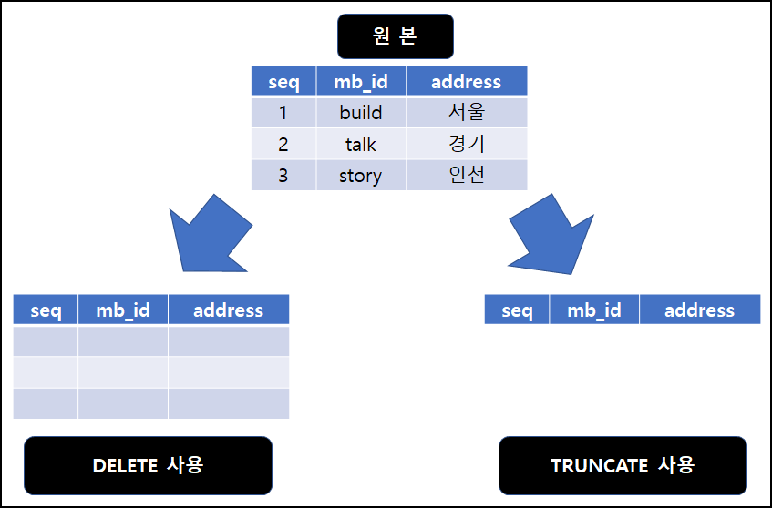
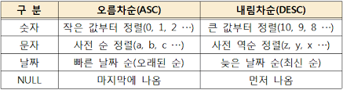

# SQL 문법

## DB 다루기 구문


```sql
-- 데이터베이스 보기
show database;

-- 만약 sqlDB가 존재하면 우선 지운다.
drop database if exists sqlDB;

-- 데이터베이스 생성
create database sqlDB;

-- 데이터베이스 선택
use sqlDB;
```

> :bulb: TIP
> - 유닉스 환경의 MySQL에서는 데이터베이스 이름의 대소문자를 구분합니다.
> - 그러나 윈도우 환경의 MySQL에서는 데이터베이스의 이름에 대소문자를 구분하지 않습니다.
> - 하지만 될 수 있으면 언제나 데이터베이스의 이름은 대소문자를 구분하여 사용하는 것이 가독성 측면에서도 좋습니다.


## 테이블 생성

```sql
CREATE TABLE db명.테이블명 (
    컬럼명1 INT PRIMARY KEY AUTO_INCREMENT, -- 기본키 숫자 자동 증가 설정
    컬럼명2 CHAR(15) NOT NULL,
    컬럼명3 INT,
    
    PRIMARY KEY(컬럼명1),
    FOREIGN KEY(컬럼명2) REFERENCES 테이블명(컬럼명) -- 자기자신 외래키 참조
    FOREIGN KEY(컬럼명3) REFERENCES 다른테이블명(컬럼명A) -- 다른 테이블 외래키 참조
);
```

```sql
-- 테이블 이름을 띄어쓰기 하고싶으면 ``를 반드시 넣어야 한다.
create table `my testTBL`(id InT);
```


### 테이블 제약 조건

- `NOT NULL` : 해당 필드는 NULL 값을 저장할 수 없게 됩니다.
- `UNIQUE` : 해당 필드는 서로 다른 값을 가져야만 합니다.
- `PRIMARY KEY` : 해당 필드가 NOT NULL과 UNIQUE 제약 조건의 특징을 모두 가지게 됩니다.
- `FOREIGN KEY` : 하나의 테이블을 다른 테이블에 의존하게 만듭니다.
- `DEFALUT` : 해당 필드의 기본값을 설정합니다.
- `AUTO_INCREMENT` : 해당 필드의 값을 1부터 시작하여 새로운 레코드가 추가될 때마다 1씩 증가된 값을 저장합니다.

```sql
create table userTbl
(
    userID char(8) primary key,
    name varchar(10) not null unique, -- 만일 기본기지정을 안했으면 not null 유니크가 기본키가 됨
    birthYear int not null,
    addr char(2) not null,
    mobile char(3),
    mdate date
)
```

```sql
create table buyTbl
(
    num int auto_increment not null primary key, -- 자동으로 숫자 순서대로 증가
    userID char(8) not null,
    price int not null default 80, -- 값이 입력되지 않을 때 기본값
    
    constraint 외래키이름 foreign key (userID) references userTbl(userID) on update cascade
    -- 외래키 지정. constraint쓰면 외래키이름 지정, 안쓰면 필드값 자체가 이름이 됨.
    -- 만일 부모키가 변경할 경우 같이 외래키값도 변경
)
```


[userTbl]

| userID | name | birthYear | addr | mobile | mdate |
| ------ | ---- | --------- | ---- | ------ | ----- |
| ...    | ...  | ...       | ...  | ...    | ...   |


[buyTbl]

| num  | userID (userTbl의 userID와 연결되어 있음) | price |
| ---- | ----------------------------------------- | ----- |
| ...  | ...                                       | ...   |


----


## 테이블 조회

```sql
show tables
 
show table STATUS -- 더 자세히
```

- Name : 테이블 이름
- Type : 테이블 타입
- Row_format : 열 저장 형태 (Fixed, Dynamic, Compressed)
- Rows : 열의 수
- Avg_row_length : 열의 평균 길이
- Data_length : 데이타파일의 길이
- Max_data_length : 데이타파일의 최대길이
- Index_length : 인덱스 파일의 길이
- Data_free : 사용되지않는 bytes 에 할당된 수
- Auto_increment : 다음 자동증가 변수
- Create_time : 테이블이 생성된 시간
- Update_time : 데이타파일의 마지막 UPDATE 시간
- Check_time : 테이블의 마지막 체크시간
- Create_options : 테이블 생성시의 기타옵션
- Comment : 테이블 생성시의 명령어


----


## 테이블 구성도

```sql
show columns from 테이블명
describe 테이블명
desc 테이블명
```


----


## 테이블 데이터 조회

```sql

SELECT 컬럼명, 집계함수 as 별명   ----------------- (5)
FROM 테이블명                     ----------------- (1)
WHERE 테이블 조건                 ----------------- (2)
GROUP BY 컬럼명                   ----------------- (3)
HAVING 그룹 조건                  ----------------- (4)
ORDER BY 컬럼명                   ----------------- (6)
```

1. **FROM** : SQL은 구문이 들어오면 테이블을 가장 먼저 확인합니다. 테이블이 없는데 다른 것들을 먼저 조회하면 헛수고니까요!
2. **WHERE** : 테이블명을 확인했으니, 테이블에서 주어진 조건에 맞는 데이터들을 추출해줍니다.
3. **GROUP BY** : 조건에 맞는 데이터가 추출되었으니, 공통적인 데이터들끼리 묶어 그룹을 만들어줍니다.
4. **HAVING** : 공통적인 데이터들이 묶여진 그룹 중, 주어진 주건에 맞는 그룹들을 추출해줍니다.
5. **SELECT** : 최종적으로 추출된 데이터들을 (또 함수로 묶어 계산결과를) 조회합니다.
6. **ORDER BY** : 추출된 데이터들을 정렬해줍니다.


```sql
select 필드1, 필드2, sum(필드명) as 별명
from 테이블명
where 필드명1=값 (조건)
group by 필드명1
having 별명 > 100 (그룹 조건)
order by 필드명2 desc (정렬)
```

 **#5. select 필드(열)들과 집계함수 결과값을 선택하고 as 로 별명을 지정**

 **#1. from 어느 테이블에서**

 **#2. where 어느 조건을 만족하는 것만 (select문에 집계함수가 있든없든 무조건 ==where조건부터 맞추고 집계==한다.)**

 **#3. group 그룹핑**

 **#4. having 집계용 조건**

 **#6. order 정렬**


### 그룹핑 추가 정리

- 그룹핑은 뭔가 sum()이나 avg()같은 **묶음데이터들을 통계** 낼때 사용하는 편입니다.
- 분담하고 싶은 필드를 정하고 그룹핑 해주면, 각 필드들의 값들이 임시로 묶음 처리 되어, 이 **임시로 묶음 처리** 됩니다.
  다만 이 묶음 처리된 데이터를 테이블 구조로 표현할수없으니 빈칸으로 보여지게 되지만, 사실 안에는 **여러 데이터들이 뭉쳐**있습니다.
- 그래서 이 데이터들을 이용해 sum()을 쓰면 값들을 더하고 avg()를 쓰면 평균을 구하게 되는 원리가 그룹핑 정의 입니다.
- 다만 그룹화 한 것들은 특별해서, 따로 **조건** 줄땐 where가 아닌 having으로 써야합니다.
  - where은 그룹핑 전 테이블을 제어
  - having은 그룹핑 후 테이블을 제어


-----


## 테이블 구조 수정

### 필드 추가 (add)

```sql
ALTER TABLE 테이블이름 ADD 필드이름 필드타입
 
-- 컬럼을 추가하는데 어느 필드 after 이후에 추가하는지 위치를 지정해 줄 수 있다.
ALTER TABLE 테이블이름 ADD 필드이름 필드타입 AFTER 기존필드명
```


### 필드 제거 (drop)

```sql
ALTER TABLE 테이블이름 DROP 필드이름
```


### 필드 수정 (change)

```sql
ALTER TABLE 테이블이름 change 필드명 새필드명 새필드타입
```


### 필드 타입만 수정 (modify)

```sql
ALTER TABLE 테이블이름 modify 필드명 새필드타입
```


### 키 추가 (add ...key)

```sql
ALTER TABLE 테이블이름 add constraint 기본키명 primary key (필드값)
 
ALTER table 테이블이름 add FOREIGN KEY(columnName) REFERENCES 참조테이블(참조컬럼);
```


### 키 제거 (drop ...key)

```sql
ALTER TABLE 테이블이름 drop foreign key 외래키명
```


### 테이블 이름 변경 (rename)

```sql
ALTER TABLE table_name1 RENAME table_name2;
```


------


## 테이블 데이터 수정 (업데이트)

```sql
UPDATE 테이블이름
SET 필드이름1=데이터값1, 필드이름2=데이터값2, ...
WHERE 필드이름=데이터값; -- 조건식을 안쓰면 테이블 전체 레코드가 싹 바뀜 !!!
```

> :bulb: Tip
>
> * alter은 테이블 구조 타입 추가 및 수정
> * update는 테이블 데이터값만을 수정


------


## 테이블 삽입

```sql
-- 필드 몇개만 정하여 넣을 때
INSERT INTO 테이블이름(필드이름1, 필드이름2, 필드이름3, ...)
VALUES (데이터값1, 데이터값2, 데이터값3, ...)
 
-- 필드 전체를 넣을때 (필드명 생략 가능)
INSERT INTO 테이블이름
VALUES (데이터값1, 데이터값2, 데이터값3, ...)
```

> :bulb: Tip
>
> 추가하는 레코드가 반드시 모든 필드의 값을 가져야 할 필요는 없습니다. 빈 값은 자동으로 NULL로 채워 집니다.


------


## 테이블 삭제

```sql
drop table 테이블명
 
DROP DATABASE IF EXISTS Hotel; -- 에러 방지를 위해 if문 추가
DROP TABLE IF EXISTS Reservation;
```


------


## 테이블 데이터 삭제





 

### 휴지통 (DELETE)

- 트랜잭션 로그를 기록해서 **속도가 느림**.
- 지운거 **복구가능**.
- 테이블 자체 용량은 안줄어들음. **휴지통 개념**.

```sql
DELETE FROM 테이블이름
WHERE 필드이름=데이터값
```

> :bulb: Tip
>
> \* 만약 WHERE 절을 생략하면, 해당 테이블에 저장된 모든 데이터가 삭제됩니다.

 

### 영구 삭제 (TRUNCATE)

- 테이블 구조는 남기고 데이터값만 삭제, 
- **복구 불가**

```sql
truncate table 테이블명
```


------


## 레코드 정렬

- 오름차순(default) : ASC
- 내림차순 : DESC





```sql
-- 기본 오름차순
SELECT [column_names] FROM [table_name] ORDER BY [column_name];
 
-- 각각 컬럼을 따로따로씩 정렬 설정이 가능하다
SELECT [column_names] FROM [table_name] ORDER BY [column_name] DESC, [column_name2] ASC ;
```

 

**문제 ex)**

동물 보호소에 들어온 모든 동물의 아이디와 이름, 보호 시작일을 **이름 순으로 조회**하는 SQL문을 작성해주세요.

단, **이름이 같은 동물 중에서는 보호를 나중에 시작한 동물을 먼저 보여**줘야 합니다.

```sql
-- 먼저 name을 정렬하는데 동명이인이 있을경우 datetime에 따라서 순서를 결정
SELECT animal_id, name, datetime 
from animal_ins 
order by name asc, datetime desc
```


------


## 테이블 별칭

```sql
SELECT col1 from Eployee as E
--> 테이블 별칭 E.col1
 
SELECT col1 AS '성명', col2 AS '국어점수' FROM grade;
--> 필드명을 보기좋게 한글로 별명
```


------


## 중복 비허용

- 해당 컬럼의 중복된 값을 합쳐서 보여줌.
- 어떤 데이터들이 있는지 확일할때

```sql
select distinct 컬럼명 from 테이블명
```


**ex) 학교에 재학생 이름들 수 (단 동명이인은 하나로 친다)**

```sql
select count(distinct name) from animal_ins
```


------


## 널값 검색

```sql
-- = null 이 아닌 is null
select name
from usertbl
where mobile1 is null;
```